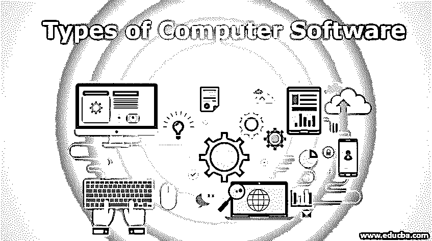
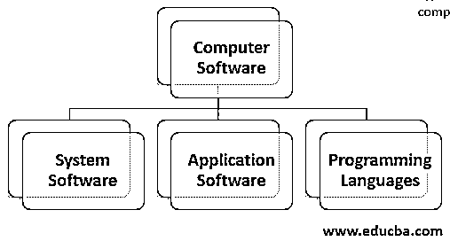

# 计算机软件的类型

> 原文：<https://www.educba.com/types-of-computer-software/>

## 计算机软件导论

在本文中，我们将看到计算机软件类型的概述。软件可以被认为是计算机的语言。软件可以被认为是一组指令，用来执行任何特定任务的程序。用户不能触摸软件，但可以透过 [GUI](https://www.educba.com/what-is-gui/) 看到。软件可以看作是系统的可变部分，而硬件可以看作是计算机的不变部分。正如人类语言有多种类型一样，计算机语言也是如此。市场上有不同的[类型的计算机语言](https://www.educba.com/types-of-computer-language/)。有三种类型的软件系统，应用程序和 p [编程语言软件](https://www.educba.com/best-programming-languages/)。

### 计算机软件的类型

以下是计算机软件的类型:

<small>网页开发、编程语言、软件测试&其他</small>

#### 1.系统软件

*   系统软件是一种设计用于运行计算机硬件部分和应用程序的计算机软件。它是提供给计算机系统的平台，其他计算机程序可以在该平台上执行。系统软件充当用户应用程序和硬件之间的中间层。操作系统是系统软件的类型。操作系统用于管理计算机上安装的所有其他程序。
*   系统软件的另一个目的是翻译从其他来源接收的输入，并将它们转换成机器能够理解的语言。BIOS(基本输入/输出系统)是另一种类型的系统软件，它在计算机系统启动时工作，用于管理硬件设备(视频适配器、鼠标、键盘和打印机)和操作系统之间的数据。系统软件为用户提供了使用设备驱动程序直接使用硬件的功能。
*   引导程序是系统软件程序，它将操作系统加载到计算机的主内存中，也可以加载到随机存取存储器(ram)中。系统软件的另一个例子是汇编程序，它具有将计算机指令作为输入，然后将其转换成位的功能，这样处理器就可以读取该位并执行计算机操作。
*   系统软件的另一个例子是设备驱动程序，它用于控制一些连接到计算机系统的特定设备，如鼠标或键盘。设备驱动软件用于将操作系统的输入/输出指令转换为消息，以便设备能够阅读和理解。系统软件可以在后台运行，也可以由用户直接执行。

#### 2.应用软件

*   另一类软件是应用软件，它是为用户执行某些特定任务而设计的，如写信、听音乐或看视频。对于所有这些要求，每种类型都需要一种特定的软件，而为某种特定目的而设计的特定软件被称为应用软件。操作软件在计算机系统中运行应用软件。
*   系统软件和应用软件的区别在于用户界面的不同。在系统软件中，没有用户界面，而在应用软件中，每个软件都有用户界面，这样用户可以很容易地使用软件。用户不能像操作系统一样看到系统软件，并且不能在系统软件中工作，但是在应用中，软件用户可以使用图形用户界面看到应用软件，并且还可以在应用软件中工作。用户还可以选择创建自己编写的软件，并将该软件用于个人用途。
*   用户可以使用这些模板来创建用户编写的程序。应用软件可以捆绑在一起，该捆绑称为应用套件。应用程序套件的一个例子是[微软 Office](https://www.educba.com/microsoft-office-application/) 。文字处理软件是通过将各种小程序组合成一个单独的程序来设计的，该程序可用于编写文本、创建电子表格或创建演示文稿。另一类应用软件是 Mozilla Firefox，即 internet explorer。这些类型的应用软件可以用于搜索任何文章、网页上的文本以及与外界进行交互。

#### 3.编程语言

*   编程语言是第三类计算机软件，程序员用它来编写他们的程序、脚本和可由计算机执行的指令。编程语言的另一个名字是计算机语言，可以用来创建一些通用标准。编程语言可以被认为是一块砖，可以用来构造计算机程序和操作系统。编程语言的例子有 [JAVA](https://www.educba.com/what-is-java/) ，C，C++和其他语言。
*   编程语言之间总是有一些相似之处，唯一的不同是编程语言的语法，这使得它们不同。程序员使用编程语言的语法和规则来编写他们的程序。一旦程序员在 IDE(集成开发环境)中编写了源代码，程序员就用计算机可以理解的机器语言来编译这些代码。编程语言用于开发网站、应用程序和许多其他程序。
*   编程语言可以大致分为两大部分:语法和语义。编程语言遵循一定的操作顺序，这样就可以实现期望的输出。编程语言也被称为高级语言，因为程序员编写的程序易于阅读和理解。JAVA、C、C++编程语言被认为是高级语言。另一类编程语言是低级语言。
*   低级语言包括[机器语言和汇编语言。](https://www.educba.com/assembly-language-vs-machine-language/)[汇编语言](https://www.educba.com/what-is-assembly-language/)包含一系列不易阅读和理解的指令。机器语言包含可以被 CPU 直接读取的二进制代码，而不是以人类可读的形式出现。语言的低级可以直接被计算机硬件理解。

### 结论

如上所述，软件是在计算机系统上执行的程序、脚本。正如我们所讨论的，大体上有三种类型的软件，即系统软件、应用软件和编程语言软件。每种类型的软件都有其功能，并在计算机系统上运行。

### 推荐文章

这是一份计算机软件类型指南。在这里，我们讨论了计算机软件的简要概述以及不同的类型，如系统、应用程序等。您也可以浏览我们推荐的其他文章，了解更多信息——

1.  [开源软件](https://www.educba.com/open-source-software/)
2.  [计算机病毒的种类](https://www.educba.com/types-of-computer-virus/)
3.  [电脑键盘的种类](https://www.educba.com/types-of-computer-keyboard/)
4.  [什么是桌面软件？](https://www.educba.com/what-is-desktop-software/)

