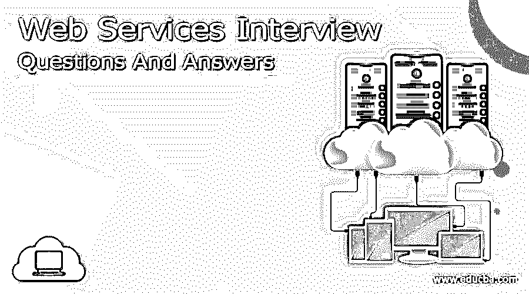

# Web 服务面试问题和答案

> 原文：<https://www.educba.com/web-services-interview-questions/>

## Web 服务介绍面试问题和答案

web 服务是通过互联网访问的应用程序。它支持两个应用程序之间的通信或信息交换。它以客户机-服务器模式工作，客户机可以很容易地通过互联网访问它。Web 服务使用 XML，它在互联网和私有网络上都很容易获得。他们的架构包括 SOAP(简单对象访问协议)、WSDL(Web 服务描述语言)、RESTful web 服务等。

**让我们来看看 Web Services 面试问题:**

<small>网页开发、编程语言、软件测试&其他</small>

So you have finally found your dream job in Web Services but are wondering how to crack the Web Services Interview and what could be the probable Web Services Interview Questions. Every interview is different and the scope of a job is different too. Keeping this in mind we have designed the most common Web Services Interview Questions and Answers to help you get success in your interview. This list is divided into two parts:

### 第 1 部分 Web 服务面试问题(基础)

第一部分涵盖了基本的 Web 服务面试问题和答案

**1。定义 web 服务并解释它的不同组件？**

答案:
这是面试中常见的 Web 服务面试问题。web 服务是可通过互联网访问的应用程序，它支持两个应用程序之间的通信或信息交换。它们通常工作在客户机-服务器模型上，客户机可以通过网络轻松地访问它们。XML 主要用于这个目的。web 服务的主要组件是:

*   **SOAP-**T2】简单对象访问协议
*   **UDDI-** 通用描述、发现和集成
*   **WSDL-** Web 服务描述语言
*   **RDF-** 资源描述框架
*   **XML-**T2】可扩展标记语言

**2。什么是 UDDI，它有什么特点？**

答:
UDDI 是协议栈服务发现层中基于 XML 的标准的一部分。它使用被称为 WSDL(Web 服务描述语言)的语言来工作。它发现 web 服务并在 web 上发布这些服务，就像从目录中完成一样。它的主要特点是:
1)它就像一个包含所有 WSDL 文件的数据库。
2)用于通信的各种协议有 SOAP、COBRA 和 Java RMI。它是一个开放的框架，独立于平台，可以在任何操作系统上使用。
它使各种各样的企业能够通过互联网相互识别和交流。

**3。解释开发基于 SOAP 网络服务的方法？**

答案:
开发基于 SOAP 的 web 服务有两种方法。
1) **契约优先方法:**当用户使用这种方法时，他们需要首先定义 XML 和 WSDL，然后需要在契约中派生 java 类。
2) **契约最后一种方法:**当使用这种方法时，用户必须首先定义 java 类，然后应该生成契约，该契约通常具有来自 Java 类的 WSDL 文件。

让我们转到下一个 Web 服务面试问题

**4。为了让用户获得安全的 RESTful web 服务，应该遵循哪些实践？**

答:
为了有一个安全的服务，HTTP URL 路径被用作 RESTful 服务的一部分。为了获得最安全的服务，用户必须遵循以下实践:
1)使用 GET、POST、PUT、DELETE 等方法。有适当的限制。他们应该在那些限制下被执行。
2)每当产生错误时，就应该调用适当的 HTTP 错误消息。
3)当发出会话请求时，必须执行基于用户的认证。
4)应该对来自[服务器的所有输入进行 SQL](https://www.educba.com/careers-in-sql-server/) 注入攻击验证。
5)始终通过 POST 方法发送敏感数据，如用户名、会话密码等。他们永远不应该

**5。定义 SOA 架构？**

答:
SOA 代表面向服务的架构，它被定义为由各种服务组成的模式。这种通信包括各种服务之间的数据交换和协调。SOA 的基本原则如下:
1)所有使用的服务应该是无状态的，并且应该具有可发现的特性。
2)所有的服务都应该是可重用的，并且可以用于不同类型的应用程序。
3)合同应以合同中规定的标准方式描述所有服务。
4)应该遵循服务抽象规则，该规则规定服务不应该公开功能的执行方式。

### 第 2 部分 Web 服务面试问题(高级)

现在让我们看看高级 Web 服务面试问题。

**6。列出在 WSDL 使用的操作类型及其响应？**

答:
WSDL 定义了四种运行类型响应。它们如下:

*   **一种方式:**它收到消息，但不返回任何响应。
*   **请求-响应:**接收请求，返回响应。
*   **Solicit-response:** 它发送请求并等待响应。
*   **通知:**发送消息，但不发送任何响应。

**7。如何在 Java 框架中对 XML 文档进行编组和解组？举例说明？**

答:
封送处理被认为是将 XML 文档转换成 Java 可读格式的过程，而解封处理是这个过程的逆过程。让我们看看 Java 如何解组一个 XML 文档，然后再解组一次。

`JAXBContext jc= JAXBContext.newInstance (“com.acme.foo”);
// unmarshal from foo.xml
Unmarshaller u = jc.createUnmarshaller () ;
FooObject fooObj=
(FooObject)u.unmarshal (new File (“foo.xml”) );
// marshal to sytem.out
Marshaller m = jc.createMarshaller ();
m.marshal (fooObj, System.out);`

让我们转到下一个 Web 服务面试问题

**8。解释 SOAP 消息的元素？**

答案:
SOAP 有以下元素:

*   **信封:**这是必需的根元素。它有助于确定 SOAP 消息的开始和结束，并翻译 XML 文档。
*   **Header:** 该元素构成包含应用信息的消息的报头属性。该元素出现多次，并增加了新的特性和功能。
*   **Body:** 它被定义为包含来自 XML 的派生数据的信封的子元素，可以作为 SOAP 消息的一部分进行交换。这个块是强制性的，它包含所有的呼叫和响应消息。
*   **故障单元:**如果在消息处理过程中出现错误，则由该故障单元处理。如果有错误，那么这个元素将作为主体的一部分出现。

**9。登记 XML 数字签名 API 中可用的包？**

答:
一个[数字签名](https://www.educba.com/digital-signature-softwares/)中存在的 API 是:

*   秘密党员
*   加密. DSI
*   crypto.dsig.keyinfo
*   crypto.dsig.spec
*   crypto.dom
*   crypto.dsig.dom

10。解释委托识别、授权和隐私服务？

答:
委托识别服务提供安全能力以确保安全交易。使用该公司可以允许和控制被委托执行 web 交易的身份。这些是在 web 服务面试中最有用的 Web 服务面试问题。
委托授权服务帮助您验证试图访问 web 服务的服务。隐私服务确保[数据加密](https://www.educba.com/encryption-process/)，这样只有相关方才能访问所需数据。它确保了所发送消息的机密性和安全性。

### 推荐文章

这是 Web 服务面试问题和答案列表的指南。这里我们列出了 10 个最佳面试问题，这样求职者就可以轻松地通过面试。您也可以阅读以下文章，了解更多信息——

1.  [詹金斯面试问题](https://www.educba.com/jenkins-interview-questions/)
2.  [Hadoop 管理员面试问题](https://www.educba.com/hadoop-admin-interview-questions/)
3.  [Python 面试问题](https://www.educba.com/python-interview-questions/)
4.  [控制系统面试问题](https://www.educba.com/control-system-interview-questions/)

