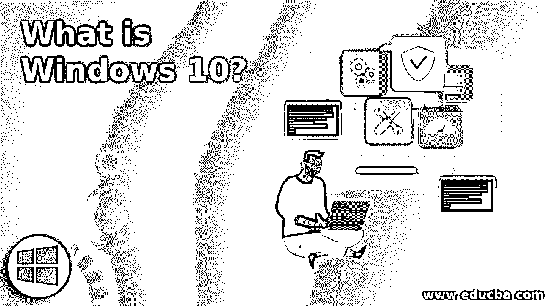

# 什么是 Windows 10？

> 原文：<https://www.educba.com/what-is-windows-10/>

## Windows 10 简介

微软在个人和商业电脑操作系统上拥有数十年的权力和影响力，其当前发布的版本，Windows 10 已经成功地主导了这一市场控制。Windows 10 是微软生产的一系列微软操作系统，最初于 2015 年 7 月 29 日发布，用于个人电脑、平板电脑、嵌入式设备和物联网设备。如果任何人正在采用 Windows 10，可以直接将其计算机从 Windows 7 或 Windows 8 升级到 Windows 10，而无需重新安装或执行重新映像以及耗时的系统恢复/擦除和补丁升级程序。Windows 10 mobile 是一个专门为智能手机设备设计的版本。

### 什么是 Windows？

Windows 10 可能是 2015 年公历月 29 日发布的微软 Windows 软件的主要版本。它是在 Windows 国家信任内核上设计的，并遵循 Windows 8。微软决定将 2015 年称为“释放 Windows 10”(并跳过“Windows 9”)的部分原因是，该软件旨在成为一个品牌，Windows 10 的首要目标之一是在多种设备上统一 Windows 专业知识，如台式电脑、平板电脑和智能手机。作为这一努力的一部分，微软为 Windows Phone 开发了 Windows ten 移动操作系统——微软之前的移动操作系统。Windows ten 还集成了其他微软服务，如 Xbox Live 和 Cortana 语音识别助手。虽然 Windows 10 包括几个新选项，但它额外带回了诞生于 Windows 8 的开始菜单。

<small>网页开发、编程语言、软件测试&其他</small>

新的和改进的开始菜单提供了对设置、文件夹和程序的快速访问，此外还包括来自 Windows 界面的标题。非常便宜的 Windows ten begin 菜单包括一个探索栏，使您能够查看每台本机笔记本电脑，从而查看网络。Windows ten 的另一项重大修改是引入了“Edge”应用程序，该程序旨在切换网络浏览器(IE)。然而操作系统仍然包括 Edge，这是 Windows 10 的默认浏览器。可选的新选项包括时间，它机械地优化了计算机程序，查看您是否是护理外部键盘或触摸屏的受害者，以及类似于操作系统中通知栏的行动中心。

此外，Windows ten 还支持镜像投射、VDI(虚拟桌面基础架构)、一台显示器上的多个桌面，并提供(多个级联)辅助功能，该功能有助于在屏幕上组织窗口。Windows 10 和以前版本的 Windows 之间最大的差异之一是，Windows 10 升级免费提供给 Windows 7 和 Windows 8 用户。然而，微软仍然对新电脑附带的 Windows 10 副本和非升级购买收取许可费。Windows 10 家庭版的总价格为 130 美元，Windows 10 专业版的价格为 210 美元(价格可能会根据时间表而有所不同)。

### Windows 10 的重要性

下面给出的是 Windows 10 的重要性:

*   任务栏可以按时成为 windows 10 的一部分，即使假设大多数用户无法意识到它是否存在。那些确实实现了一些巨大的生产力提升的人。
*   任务应用视图图标就在你的任务栏上，就在 Cortana 搜索栏的右边。它看起来有点像电影胶片。
*   当你点击它时，你会看到所有打开的应用程序的清单，如果你向下滚动，你甚至会看到所有你之前打开过的文件和应用程序。您只需在任务视图中点击任何打开的(或之前打开的)应用程序或文件，即可切换到它们。
*   如果您希望将您的工作效率提升到一个全新的水平，请将任何打开的应用程序拖放到任务视图顶部的新桌面图标上，作为一个独立的虚拟桌面。
*   这将临时创建一个全新的虚拟定制桌面会话，您可以切换到该会话并专注于手头的任务。这对于创建一个用于社交媒体或网络浏览的会话，以及另一个完全以工作为中心的桌面是很好的。
*   有时，我们需要在命令提示符下查看您在屏幕上输入的命令的效果，您可以通过使命令提示符窗口透明来实现这一点。

**使命令提示符透明的步骤:**

*   单击“开始”菜单后，通过键入 cmd 打开命令提示符。
*   右键单击标题栏，然后单击属性。
*   在“属性”窗口提示中，单击“颜色”选项卡。
*   使不透明度水平为 60%左右。

### Windows 10 的优势

下面是提到的优点:

*   Windows 10 功能具有内置功能并支持第三方应用，允许企业 IT 部门使用移动设备管理(MDM)和其他应用软件来保护和控制运行该操作系统的设备。此外，组织可以使用传统的桌面管理服务软件来满足通用要求，如 Microsoft Configuration Manager、Microsoft office。
*   Windows 10 移动版是微软操作系统的特别发布版本，专为智能手机设计。
*   windows 操作系统的开始菜单出现了很长时间，微软在 Windows 8 中用 Windows 10 中的 Live Tiles 取代了它。用户仍然可以从“开始”菜单右侧的面板访问实时磁贴和以触摸为中心的 Metro 界面。
*   如果我们在 android 智能手机上安装 windows 10 launcher 应用程序，它会开辟一套有吸引力的方法，让我们可以将 Android 智能手机与我们的个人 windows 10 电脑同步和集成。

**通过安装此应用程序，我们可以:**

*   查看照片并与 windows 应用程序同步。
*   使用 Windows 10 电脑从手机发送短信。
*   在手机上查看 windows 10 时间线。
*   与智能手机/电视共享 Windows 10 屏幕镜像。
*   使用 windows 10 桌面应用程序共享和发送网站链接。

### 结论

众所周知，微软的 Windows 操作系统到目前为止占据了桌面系统 95%以上的市场份额。随着 windows 10 市场份额的不断上升，微软在 Windows 10 首次发布期间的免费升级策略现在正在取得回报。

### 推荐文章

这是一本什么是 Windows 10 的指南？这里我们讨论什么是 windows，windows 10 的重要性和各自的优势。您也可以看看以下文章，了解更多信息–

1.  [什么是 Windows？](https://www.educba.com/what-is-windows/)
2.  [JavaScript 窗口事件](https://www.educba.com/javascript-window-events/)
3.  [适用于 Windows 8 的 Adobe Illustrator】](https://www.educba.com/adobe-illustrator-for-windows-8/)
4.  [Windows 替代品](https://www.educba.com/windows-alternatives/)

