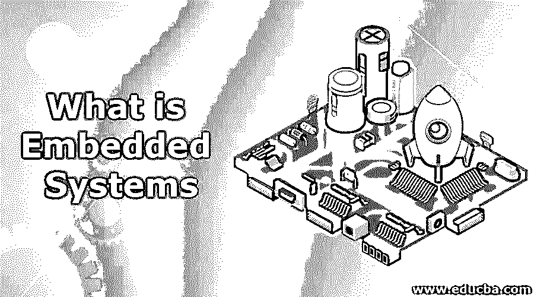

# 什么是嵌入式系统？

> 原文：<https://www.educba.com/what-is-embedded-systems/>

## 嵌入式系统简介

以下文章概述了什么是嵌入式系统？根据维基百科，“一个插卡上的嵌入式系统，具有处理器、内存、电源和外部接口。嵌入式是由实时操作系统(RTOS)编程和控制的控制器，在较大的机械或电气系统中具有专用功能，通常具有实时计算限制。”它是在一个单元中不同任务的安排。它是一个基于微控制器或微处理器的系统，旨在以更好的方式执行特定的任务。可以是独立的，也可以是大系统的一部分。这是一种在计算机硬件中嵌入专用软件的产品。

### 谅解

系统示例如下:

<small>网页开发、编程语言、软件测试&其他</small>

*   电话
*   机顶盒
*   手机
*   电视
*   洗衣机
*   掌上游戏机(SONY 推出的掌上娱乐平台)
*   Mp3 播放器
*   数字手表
*   自动贩卖机
*   家用电器
*   微波

等等。，我们还有更多。就目前而言，我们生活在一个嵌入式的世界。

### 嵌入式系统如何让工作变得如此简单？

嵌入式意味着它是一些大型系统的永久组成部分。

例如，我们可以考虑机顶盒。现在每家都有机顶盒。名为解码器的功能被嵌入到机顶盒中以读取信号。根据这些信号，我们可以看到我们的电视。

### 概念

以下是嵌入式的一些概念:

#### 1.什么是系统？

这个系统是按照一套预先定义的规则运行的。这是一种完成一项或多项任务的方式。每个单元嵌入其中，形成一个更大的功能系统。

**例如:**手表、洗衣机

**2。什么是嵌入式系统？**

众所周知，嵌入式系统的定义(嵌入软件的硬件)。它[由硬件和软件](https://www.educba.com/hardware-vs-software/)组成。

#### 3.嵌入式系统的类型

*   小规模
*   中等规模
*   复杂的

### 使用嵌入式系统

嵌入式的工作原理是将一个坚固的计算机板放入一个带有相关 I/O 的工业外壳中，以实现嵌入式环境中的功能。计算元件是 CPU 中的嵌入式主板，它是功能齐全的小型设备；处理器是嵌入式系统的心脏。

#### 1.通用处理器(GPP)

*   嵌入式处理器
*   数字信号处理器
*   微处理器
*   媒体处理器
*   微控制器

#### 2.专用系统处理器(ASSP)

专用指令处理器(ASIPs)、专用集成电路(ASIC)或超大规模集成电路(VLSI)上的 GPP 核或 ASIP 核。

嵌入式的基本结构:

### 优势

下面是提到的优点:

*   易于批量生产。
*   这个系统对日常生活非常可靠。
*   它的相互联系很少。
*   这个系统体积很小。
*   它们很便宜。
*   它操作起来很快。
*   它提高了产品质量和性能。
*   它优化了可用的系统资源。
*   它具有低功耗和高效率。
*   它们不容易出错。

### 所需技能

*   深入了解软件架构。
*   能够阅读和理解原理图。
*   扎实的编程语言知识，如 C 和 C++。
*   微处理器设计和体系结构的概念。
*   了解十六进制、二进制、十进制、八进制数字的内部存储结构。
*   首要的是嵌入式软件，它决定了嵌入式系统的功能。嵌入式 C 语言是最常用的微控制器编程语言。

### 我们为什么要使用嵌入式系统？

这种用途真的不可胜数，因为每天都有新产品上市，以不同的方式使用嵌入式计算机。最近，微处理器、微控制器和 FPGA 芯片变得更加便宜。任何人都可以实现他们的想法和发射。这是一种非常灵活的技术。

### 范围

嵌入式系统没有发展空间:

*   **消费应用:**洗衣机、遥控玩具、娱乐(音频/视频)、钟表、手表、游戏、玩具。
*   **通信应用:**无线(寻呼机、手机)、电话、应答机、网络(ATM、信用卡、以太网)、[全球定位系统](https://www.educba.com/global-positioning-systems/) (GPS)。
*   **汽车应用:**电机控制(点火、排气)、电动车窗、安全(安全气囊、ABS)、电梯。
*   **军事应用:**目标识别、制导、导航、飞行器。
*   **工业应用:**交通控制、机器人、生产、库存和库存管理、化工厂和核电站。
*   **医疗应用:**心脏监护仪、治疗、修复、透析机、起搏器等。

### 为什么我们需要嵌入式系统？

由于嵌入式系统专用于特定任务，设计工程师可以对其进行优化，以降低产品的尺寸和成本。通过增加可靠性和性能，一些系统被大量生产；这在很大程度上有助于经济领域。我们更关注这些嵌入式系统的技术。

### 谁是学习嵌入式系统的合适受众？

学习任何东西都没有标准，但我们必须选择正确的道路来成长。

*   你至少要懂一门编程语言，比如 C 或者 C++。
*   电子学的基本知识。
*   学习[微控制器](https://www.educba.com/what-is-microcontroller/)概念
*   对电子和计算机感兴趣的人倾向于学习这个概念。
*   任何渴望深入了解这个概念的人。

### 这项技术将如何帮助你的职业发展？

嵌入式系统工程师被强烈推荐为一项重要的资源。它包括国防、机器人、通信、消费电子、家用电器和航空。如果你正在考虑一个好的职业，并且你在学术和学习方面都很优秀，那么你一定更喜欢将嵌入式系统作为任何大开发的核心部分。

### 结论

我们希望您对嵌入式系统这个话题感到好奇。这很理论化，但是当你真正开始得到东西的时候，你会更加清楚这其中的神奇之处。总结这个系统是任何技术的核心部分。如果你真的想用一套硬件和软件来构建一些东西，你应该把嵌入式系统作为一个学习目标。

### 推荐文章

这是什么是嵌入式系统的指南？这里我们讨论了嵌入式系统的定义、范围、技能、工作方式和优势。您也可以浏览我们推荐的其他文章，了解更多信息——

1.  [Linux 中的 Docker 是什么？](https://www.educba.com/what-is-docker-in-linux/)
2.  [什么是人工智能？](https://www.educba.com/what-is-artificial-intelligence/)
3.  [JavaScript 是什么？](https://www.educba.com/what-is-javascript/)
4.  [PowerShell 是什么？](https://www.educba.com/what-is-powershell/)

