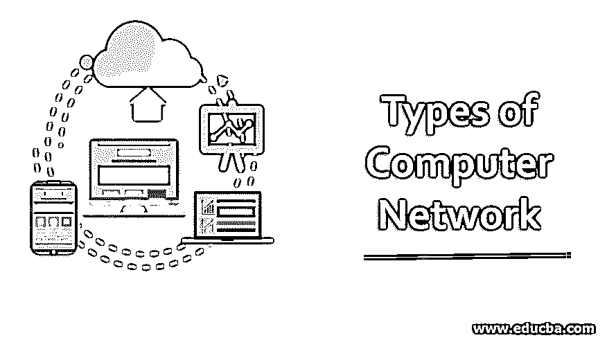
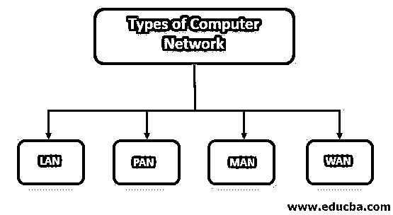
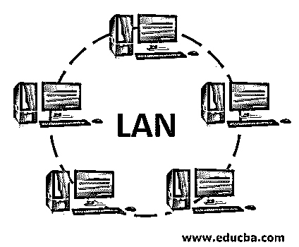
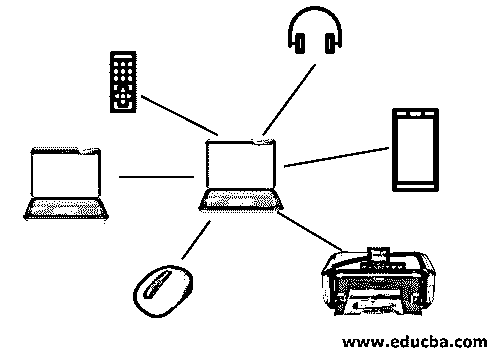
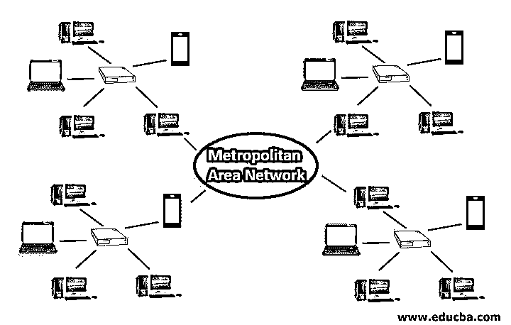
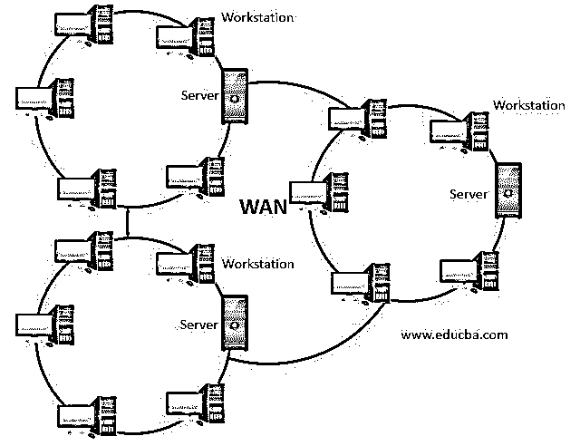

# 计算机网络的类型

> 原文：<https://www.educba.com/types-of-computer-network/>

## 计算机网络类型介绍

允许共享数据、资源和应用程序的两台或多台计算机连接在一起，称为计算机网络。重要的计算机网络根据其规模和功能分为四种类型。他们是兰、满、潘和万。这里 LAN 代表局域网，MAN 代表城域网，个人区域网缩写为 PAN，而 WAN 扩展为广域网。PAN 又分为有线个人区域网和无线个人区域网。有许多基于计算机网络的应用，并且每一个广泛划分的网络都具有独特的特征，这些特征被相应地应用以达到有效的目的。

### 计算机网络的类型

计算机网络可以按其规模来分类。计算机网络主要有四种类型:

<small>网页开发、编程语言、软件测试&其他</small>

*   局域网
*   个人区域网络
*   城域网
*   广域网

这四种类型解释如下:

#### 1.局域网

LAN 扩展为局域网，其中计算机池在有限的范围内(如公寓和办公室)相互连接。该计算机网络通过通信设备(如同轴电缆、路由器、交换机和双绞线)连接计算机池。

它的成本很低，由廉价的硬件组成，如以太网电缆、网络适配器和集线器。这里的数据传输速率很高，响应时间最短。这是一个高度安全的网络，不容易被黑客攻击和数据丢失。

#### 2.个人区域网络

随着个人区域网络被配置在大约十米范围内的个人中，PAN 被扩展，并且主要用于连接个人使用的互联网范围。它的覆盖范围达到 30 米。个人设备包括台式机、笔记本电脑、智能手机、游戏机、电子产品和音乐播放器。

个人区域网络有两种类型:

*   无线个人区域网
*   有线个人区域网络

**无线个人区域网:**无线个人区域网基于无线[技术，如蓝牙](https://www.educba.com/what-is-bluetooth/)和 Wi-Fi，属于有限范围的网络。

**有线个人局域网:**有线个人局域网使用 USB 部署。

**个人区域网的例子**

**1。体域网:**体域网像智能手机或手表随人移动一样随人移动。他还可以与其他人连接，将该设备互连起来以共享数据。

**2。离线网络:**离线网络可以部署在房屋内部，也称为家庭网络。计划与无法接入互联网的电视、打印机连接。

**3。小型家庭办公室:**小型家庭办公室用于通过虚拟专用网 VPN 将设备连接到网络空间。

#### 3.城域网

城域网被称为 MAN，它通过将各种局域网连接起来形成一个大的网络，覆盖了巨大的地理区域。政府利用城域网通过网站或应用程序将私营企业和个人联系起来。在城域网中，不同的局域网通过电话通信技术相互连接。

在这里，大部分电话线被用来连接局域网和城域网。在城域网中广泛应用的协议有帧中继、ISDN、ATM、ADSL 和 RS-232。城域网主要部署在机票预订和建立城市银行部门之间的通信。它也被部署在军事靶场，用于有效的通信。它也可以部署在城镇内的拼贴里。

#### 4.广域网

无线区域网络为用户提供服务，使用远程或公共或私有访问连接到无线网络。连接建立在一个巨大的地理范围内，就像一个完整的城市，使用移动运营商的当前网络结构。WAN 始于 802.20 标准，目标是实现移动宽带无线接入的优化，这被称为 MBWA。这种 802.20 标准是 2.5 和 3G 经典模式的强劲竞争对手。

WWAN 成功地使表面语音传输成为可能。它也在 GPS 是全球定位系统中测量，通用分组无线业务被称为 GPRS，EDGE 是全球演进的增强数据速率的缩写，通用移动电信系统被称为 UMTS，HSUPA 是高速上行链路分组，HSPDA 是高速下行链路分组接入。

### 计算机网络的例子

*   不同的无线网络提供互联网连接。如果用户在该范围内，则到网络的互联网连接非常快，并且提供对邮箱、文件下载、存储、网站加载等的快速访问。要强调的典型差异是覆盖范围，而一个是在家中建立的，另一个是在城镇上建立的。由于这一重大差异，无线广域网无法与无线局域网在相同的技术上运行。
*   诸如 Wi-Fi 之类的 LAN 的范围有限，并且需要许多节点来覆盖广阔的区域。广域网采用电信方式，适应更广的覆盖范围。由于广域网覆盖的范围更广，同时它也实现了安全协议。采用的安全协议是 WPA 和 WEP。即使它是先进的，也不是一个有保证的选择。但是仍然很少有人使用它作为不安全的网络，因为它们容易受到加密的攻击。但是即使使用不安全的网络，它们也能接收信号
*   简而言之，WAN 和 MAN 使用电信，而 LAN 和 PAN 不使用电信进行操作。LAN 和 PAN 在安全的条件下工作，而 WAN 则不那么安全。PAN 和 LAN 都比它的覆盖范围要快。兰因其有效的用法而拥有。如果用户想在家里建立互联网连接，他可以选择 p an 或 LAN，如果他想成为互联网服务提供商的商人，则他必须选择 WAN。每种都有其独特的功能，并可根据其要求进行调整
*   PAN 或 LAN 的有效性能比 WAN 更重要。因为范围有限，所以覆盖人群少，侧重于高性能的运行速度。但它与网络连接无关，网络连接的速度受到局域网或广域网的限制。PAN 或 LAN 适用于将文件从一个设备或系统移动和托管到另一个设备或系统以及相关应用程序。

### 推荐文章

这是一个计算机网络类型的指南。这里我们讨论介绍计算机网络的类型，计算机网络的例子。您也可以浏览我们推荐的其他文章，了解更多信息——

1.  [网络攻击的类型](https://www.educba.com/types-of-network-attacks/)
2.  [云联网](https://www.educba.com/cloud-networking/)
3.  [恶意软件的类型](https://www.educba.com/types-of-malware/)
4.  [网络拓扑类型](https://www.educba.com/types-of-network-topology/)

