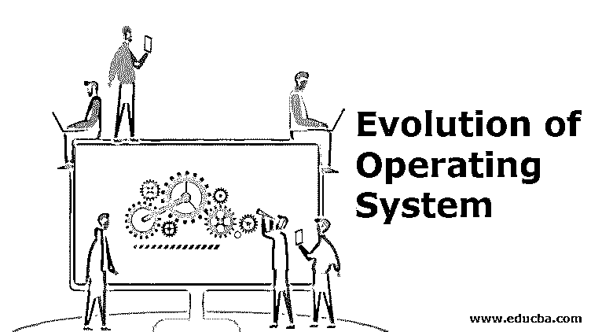
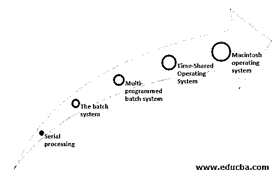

# 操作系统的演变

> 原文：<https://www.educba.com/evolution-of-operating-system/>

## 操作系统进化简介

计算机网络有许多资源，如软件和硬件，是完成任务所必需的。一般需要的资源有文件存储、CPU、内存、输入输出设备等等。操作系统充当所有上述资源的控制器，并为它们分配执行任务的特定程序。因此，操作系统是一个资源管理器，它将资源作为用户视图和系统视图来处理。操作系统的演变标志着从穿孔卡的编程到训练机器说话和翻译任何语言。

### 操作系统的各种演变

下面给出了操作系统各种演变:

<small>网页开发、编程语言、软件测试&其他</small>

#### 1.串行处理

它是由 1940 年到 1950 年的程序员开发的，由硬件组件合并而成，无需操作系统的实现。这里的问题是调度和设置时间。用户通过浪费计算时间来登录机器。加载编译器、保存编译后的程序、源程序、链接和缓冲都涉及到设置时间。如果出现任何中间错误，该过程将重新开始。

#### 2.批处理系统

通过提高计算机的利用率和应用来使用。作业被安排在卡片和磁带上提交。然后用作业控制语言在监视器上顺序执行。第一批计算机被用于批处理操作过程，使得计算机批处理作业没有任何停顿或停止。程序写在穿孔卡片上，然后复制到磁带的处理单元。当计算机完成一项作业时，它会立即开始磁带上的下一项任务。专业操作人员接受培训，与用户放下工作并在工作执行后取回结果的机器进行交流。

尽管这对用户来说是不舒服的，但是通过运行一个杠杆化的作业流来保持昂贵的计算机的忙碌。内存保护不允许包含监视器的内存区域被更改，计时器保护作业不独占系统。当输入和输出设备因 CPU 时间利用率低而被占用时，处理器保持空闲状态。

#### 3.多程序批处理系统

它通常有几个作业要执行，这些作业应该保存在主存中。作业调度是由处理器来决定执行哪个程序。

#### 4.分时操作系统

用于开发替代批量系统。用户通过像电子电传打字机一样的打印端口与计算机直接交流。很少有用户会即时共享电脑，在开始下一项工作之前，花几分之一秒的时间完成每一项工作。fast 服务器可以在用户全神贯注时，通过创建迭代来立即作用于许多用户的流程。多个程序使用分时系统，通过交互地共享系统来应用于计算机系统。

多程序设计用于管理多个通信作业。处理器的时间由多个用户共享，许多用户可以通过终端同时访问系统。使用命令行用户界面编程所需的打印端口，用户可以在该界面上对提示或命令做出响应。交互像一卷纸一样向下滚动。

视频终端取代了显示固定大小字符的打印终端。有些用于在屏幕上显示表格，但许多通常是像玻璃电传打字机那样滚动显示。个人电脑在 20 世纪 70 年代中期变得适应性很强。商业上可行的个人电脑是 Altair 8800，它的上市震撼了商业价值。牛郎星没有[操作系统](https://www.educba.com/functions-of-operating-system/)，因为它只有发光二极管和输入输出拨动开关。于是人们开始使用软盘和连接终端。

数字研究在 1976 年为 Altair 和类似的计算机实现了 CP/M 操作系统。后来的 DOS 和 CP/M 有了类似于分时操作系统的命令行界面。这些电脑只供单个用户使用，不适用于共享用户。

硬件价格的下降增加了使用位图管理单个像素的个人电脑的使用。它使得拥有图形用户界面的个人电脑成为可能。1984 年推出的苹果麦金塔电脑被认为是第一次商业成功。它最初推动了硬件艺术的发展，并被限制在一个微型的单色显示器上。随着硬件的不断发展，更大尺寸的彩色 MAC 被开发出来，微软也实现了基于图形用户界面操作系统的 Windows。

#### 5.麦金塔操作系统

它依赖于几十年来对面向图形的个人计算机操作系统和应用程序的研究。在 1960 年，照片显示了萨瑟兰先锋计划画板是通过使用现代图形用户界面的许多特征开发的，但硬件组件占据了一个房间，花费了大约数百万美元。

在许多研究空白之后，大型计算机项目和硬件的改进使得麦金塔在商业上和经济上都可行。诸如画板之类的研究原型仍在许多研究实验室中进行。它构成了预期产品的基础。

### 趋势中的操作系统

当前的操作系统提供程序执行、I/O 操作、通信、文件系统操作、错误检测、资源分配、记帐和保护。

*   CP 的衍生产品有 CP-VM、CP/M、CP/M-86、DOS、DR-DOS 和 FreeDOS。
*   微软视窗操作系统是视窗 3.x、视窗 95/98、视窗 XP、视窗 Vista、视窗 7、视窗 8。
*   MULTICS 的衍生产品有 UNIX、Xenix、Linux、QNX、VSTa、RISC iX、Mac OSX 等。
*   虚拟机的衍生产品有 OS/2、React OS、KeyKOS、OS/360 和 OS/400。

实时操作系统是一种高级多功能操作系统，适用于对数据流或处理器操作有严格时间要求的情况。分布式操作系统是两个或多个节点之间的互连，但处理器不共享任何内存。它也被称为松散包装系统。

### 推荐文章

这是操作系统进化的指南。在这里我们讨论操作系统的介绍、各种演变和趋势。您也可以浏览我们的其他相关文章，了解更多信息——

1.  [操作系统中的多线程](https://www.educba.com/multithreading-in-operating-system/)
2.  [操作系统中的线程](https://www.educba.com/threads-in-operating-system/)
3.  [安卓操作系统](https://www.educba.com/android-operating-system/)
4.  [操作系统的特性](https://www.educba.com/features-of-operating-system/)

