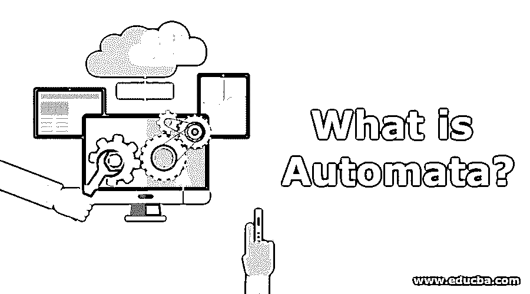

# 什么是自动机？

> 原文：<https://www.educba.com/what-is-automata/>

## 自动机导论

自动机是一种现象，其中一系列过程或活动由自动化的逻辑方法操作和控制。因为它涉及较少的人工贡献，所以它不需要太多的编程技能，需要较少的人工努力，对于执行单调的任务流更有效，并且可以应用于来自各种商业领域的任何种类的产品。另一方面，它也有自己的缺点，例如，中间一点的故障会阻塞整个自动机流程，实现和维护成本较高，并且不像传统方法那样安全。

### 为什么我们需要自动机？

自动机通过使低技能和可重复的过程更容易和更有效而提高了效率，同时提高了生产率、质量和周转时间并降低了成本。自动化在工业制造和装配过程的几乎每个方面都有广泛的应用，从发电到钢铁制造，从汽车装配线到食品和农业。

<small>网页开发、编程语言、软件测试&其他</small>

通过减少人工参与和创建标准化流程，自动化在所有这些行业中都有应用。自动化减少了由人工参与导致的生产线错误。认知自动化是基于认知计算的一部分，旨在自动化文书工作，包括结构化非结构化数据、文档制作、文档合成、自然语言搜索、人工验证、系统生成的电子邮件通信和合同管理(van der Aalst，Bichler 和 Heinzl，2018)。

### 自动机的工作

自动机可以作为离散的开关控制系统工作，通常用于家用电器，如恒温器，它通过反馈控制机制工作，以适应更复杂的工业应用。计算机辅助技术是利用数学创建复杂逻辑系统的组织工具的基础。

CAx 系统包括计算机辅助设计和计算机辅助制造软件，可以改进设计和制造过程。信息技术与工业机器人和过程结合使用，以创建控制系统，其中可编程逻辑控制器、PIC 与计算机同步，并接收来自物理传感器的输入。特殊的微处理器和程序使计算机能够通过由仪器、控制器和传感器组成的网络来分析和处理数据，以使用数学计算基于多个输入来执行单独的动作或复杂的控制系统。

这种自动化可以创建实时图形，使用数据分析报告，并执行复杂的数学和逻辑计算，以承担与各种工业和家庭应用相关的不同任务。基于人工智能的应用和控制系统等程序根据计算机和传感器网络系统的输入执行复杂的任务(Royakkers & van Est，2015)。

### 自动机的优缺点

下面是自动机的优点和缺点:

#### 优势

*   自动化提高了工业生产率，加快了商品生产。
*   它提高了产品的质量和一致性。产品变得更好，没有任何制造缺陷。
*   它减少了劳动力支出，提高了生产过程的一致性。
*   它缩短了操作周期，提高了需要单调和艰苦体力劳动的操作的准确性和一致性。
*   自动化机器人已经在危险的工作环境中取代了人类，例如核电站、腐蚀性环境和危险材料处理。
*   它减少了单调工作中的人工劳动，解放了可以在自动化系统的监督和维护岗位上工作的劳动力。

#### 不足之处

*   自动化的缺点是自动化系统的故障会导致安全威胁和来自网络攻击的漏洞[，从而导致系统崩溃。如果不停止，系统会增加错误。](https://www.educba.com/what-is-cyber-attack/)
*   自动化会导致高开发和维护成本。在现有框架中整合机器人和自动化系统也很昂贵。
*   自动化有可能取代工人的工作(戈麦斯和帕拉德尔斯，2010 年)。
*   自动化系统缺乏完全的自主控制，无法在编程之外做出复杂的逻辑决策。

### 自动化的范围

*   自动机的一般范围是在重复单调任务的领域。自动化也在危险环境和工作条件中找到了一席之地，如采矿、消防安全系统、危险工业生产过程，如机器人取代人类的汽车装配厂。工业自动化加快了生产流程，提高了生产能力，减少了生产时间(Manyika，2017)。
*   [基于](https://www.educba.com/what-is-robotics/)自动化编程的机器人技术可用于执行极其精细的任务，如电路板组装、精密加工和自动焊接，这些任务要求生产中的误差可以忽略不计。基于人工智能的自动化也在航空和航天工业中得到应用，例如自动驾驶汽车和卫星，它们可以通过复杂的计算机算法做出独立的决定，并解决困难的情况问题。他们有内置的逻辑决策系统。
*   自动化还可以通过使用遥感、自主车辆、自主无人机和旨在让士兵脱离危险的机器人来改变战场。自动化零售运营，如智能助理在商店和应用程序中使用机器人，帮助处理在线交易，并推广零售店自助结账的概念。
*   自动视频监控系统，如视觉监视和监测(VSAM)计划，有助于交通管制，高速公路也正在成为自动化使用自动信号控制系统。无人驾驶汽车和卡车等自动驾驶汽车也可以缓解交通拥堵，提高道路安全(Arntz，Gregory 和 Zierahn，2016 年)。业务流程也可以使用机器人流程自动化(RPA 或 RPAAI 用于自引导 RPA 2.0，BPA 使用基于人工智能的应用程序)实现自动化。
*   家庭自动化包括建立一个智能家庭，它拥有自主电器和安全系统，在智能能源网上运行。实验室医疗应用使生产过程自动化，并使用逻辑模型来计算医疗试验的结果。机器人辅助手术和远程医疗也使用自动控制系统(Kehoe，Patil，Abbeel 和 Goldberg，2015 年)。

### 结论

自动机有可能使工作过程更有效率并降低成本。它有可能使工作更容易、更安全，并使人类远离危险。随着基于人工智能的编程和机器学习等技术进步，自动化已经取得了很大进展，这些技术有可能改善数据驱动的决策过程。随着新的计算技术和编程的进步，自动化可以接管人类生活的方方面面。

### 推荐文章

这是一个什么是自动机的指南？在这里，我们讨论了自动机的必要性、工作原理、优点和缺点。您也可以看看以下文章，了解更多信息–

1.  什么是自动化测试？
2.  [詹金斯 vs 哈德森](https://www.educba.com/jenkins-vs-hudson/)
3.  [C 语言中的 Goto 语句](https://www.educba.com/goto-statement-in-c/)
4.  [DevOps 自动化](https://www.educba.com/devops-automation/)

