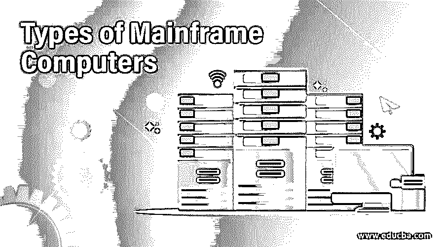

# 大型计算机的类型

> 原文：<https://www.educba.com/types-of-mainframe-computers/>

## 大型计算机简介

大型机是一种具有高性能的计算机，可用于对普通计算机无法完成的操作进行密集处理。大型计算机主要用于银行部门、公司部门和政府机构，因为总是需要安全的系统，以便可以以安全的方式进行交易，并且可以保护数据免受外部世界的影响。根据操作系统、数据代码集和制造商，可以区分出不同类型的大型机。一些大型计算机是 ASCC UNIVAC 的 ENIAC 公司的。

### 各种类型的大型计算机

大型计算机具有某些特征，这些特征使得系统彼此不同。一些特征是操作系统、大小和成本。在市场上，有几种类型的大型计算机，根据用户的要求用于不同的部门。

<small>网页开发、编程语言、软件测试&其他</small>

在下面的部分中，一些[主机](https://www.educba.com/what-is-mainframe/)计算机描述如下:

#### 1.电子数字积分器和计算器

ENIAC 大型计算机用于开发原子弹，也是开发这种大型计算机的主要原因。在这个系统中，有三十个独立的单元，一个内置在系统和电源中的空气冷却系统。ENIAC 系统的重量约为 30 吨，还包含不同的组件，如电容器和电阻器。耗电量也很大，约为 2000 千瓦。

#### 2.UNIVAC

UNIAC 大型计算机是 ENIAC 大型计算机系统的继承者，因为该大型计算机的处理速度得到了提高，而且与 ENIAC 大型计算机系统相比，该系统的规模较小。使用 UNIAC 系统是因为其准确性，因为该系统给出的结果非常准确，并用于各个部门。

#### 3.ASCC(自动顺序控制计算机)

ASCC 大型计算机是在 1944 年开发的。开发 ASCC 计算机的主要目的是解决加法和乘法问题，不需要时间，可以在几秒钟内解决。

### 大型计算机的优点和缺点

大型计算机的一些优点和缺点。

#### 优势

大型计算机被广泛应用于不同的部门，因为它们有几个优点。其中一些提到如下:

*   **高计算能力:**大型计算机本身具有处理海量数据的能力，也能支持复杂的应用程序以高计算速度运行。复杂的应用程序可以在大型机上开发和运行。
*   **可扩展性:**主机可兼容大功率类型的处理器，可在主机中添加其他超功率处理器，以提高运算速度。大型计算机还支持增加存储设备的大小，以便可以轻松处理大量数据。
*   **虚拟化系统:**大型计算机使用虚拟化的概念，将整个系统划分为微小的逻辑段，以便解决内存限制问题，并提高大型计算机的计算性能。
*   **可靠性:**大型计算机非常可靠，因为在这种类型的计算机中可以很容易地识别出错误和威胁，并且可以在不使用任何嵌入式资源的情况下自行恢复。大型计算机非常可靠，可以运行 40-50 年而不需要任何维护。
*   **自我可维护性:**由于大型计算机本质上是可靠的，因此它能够自我识别威胁和缺陷，然后从缺陷中自我恢复。大型计算机不允许在很短的时间内降低性能并从错误中恢复。
*   **保护:**大型组织使用大型计算机，因为需要保护机密数据和信息不受外界影响。大型计算机使用高级身份验证系统，为大型组织提供额外保护，他们可以轻松使用大型计算机。
*   **灵活定制:**主机设计灵活，可根据用户需求进行修改。在大型计算机中，存在一次可以在系统中安装多个操作系统的功能。由于大型计算机的性能测量非常好，系统的可用性在每个部门都有所提高，如银行部门、公司部门和政府机构。一次可以在系统中运行多个应用程序，而不会影响系统的性能。

#### 不足之处

因为大型计算机有几个缺点，但是大型计算机仍然存在一些缺陷。其中一些提到如下:

*   由于在大型计算机中有非常先进的功能，这直接增加了系统的成本，并且不是普通用户所能负担的。大型组织只能负担得起大型计算机。大型计算机提供的特征也与普通用户无关，因为与大型计算机提供的特征相比，用户要求非常低。
*   大型计算机所需的环境不同于普通计算机。因为放置大型计算机的地方温度应该很低。与普通计算机系统相比，大型计算机所需的空间也非常大。
*   需要专业人员处理主机操作，并在系统报告时处理 bug 和错误。
*   如果任何一个组件出故障，那么整个系统都会出故障，这对大型计算机来说是一个重大挫折。
*   与普通计算机系统相比，大型计算机的资源消耗非常大。由于大型计算机提供了先进的功能，它需要太多的资源，从而最终增加了系统的成本。
*   由于可以在大型计算机中安装一个以上的操作系统，因此增加了读取指令的复杂性，并且增加了用户使用系统的复杂性。

### 结论

大型计算机是一种特殊的计算机系统，是高速计算机，用于执行非常快速的交易，与普通系统相比，处理速度也非常快。有各种各样的大型计算机可以根据用户的要求来选择和使用。

### 推荐文章

这是一份大型计算机类型指南。在这里，我们还讨论了介绍和不同类型的大型计算机及其优缺点。您也可以看看以下文章，了解更多信息–

1.  [主机测试](https://www.educba.com/mainframe-testing/)
2.  [大型机面试问题](https://www.educba.com/mainframe-interview-questions/)
3.  [大型机职业](https://www.educba.com/careers-in-mainframe/)
4.  [虚拟化的优势](https://www.educba.com/advantages-of-virtualization/)

