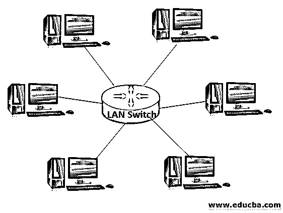
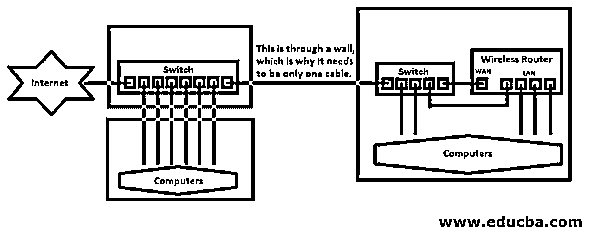

# 局域网交换机是如何工作的？

> 原文：<https://www.educba.com/how-does-lan-switches-work/>

## 局域网交换机简介

为了加快[不同类型网络](https://www.educba.com/types-of-computer-network/)中的通信，[交换机是组网的主要](https://www.educba.com/what-is-switch/)基础部分。交换机可以使用节点从一个网络连接到另一个网络。这些节点有助于高效快速的通信。交换机有不同的类型，交换机的基本功能是为组织的专用网络中的每个节点提供单独的连接，这就是 LAN 交换机。

LAN 交换机允许特定网络系列的通信，这些网络系列在那时作为成对设备连接。此外，它允许直接与多个用户通信。交换的产生提供了无冲突、高速的网络连接，并使系统并行、快速，并且在两个设备之间可获得对等连接。

<small>网页开发、编程语言、软件测试&其他</small>

### 局域网交换机的工作

要在设备中实现最佳网络接入，仅靠设计是不够的。我们还应该集中精力发展。当设计局域网时，我们需要记住一些模型开发的事情。他们应该是，

*   易于交换机管理和配置
*   [VLAN](https://www.educba.com/what-is-vlan/)的使用——网络中的分段&广播中的流量管理
*   最小冗余
*   安全网络

为了了解局域网交换机的工作原理，我们需要了解局域网体系结构中的层次模型。分层模型包括以下几层:

#### 1.接入层交换机

接入层是连接各种设备的最低层，如计算机、打印机、物联网设备等。接入层级别的交换将允许根据设备的优先级对设备之间的网络包和带宽管理进行优先级排序。

#### 2.分布层交换机

接入层和核心层之间的分布层。与其它交换机相比，分布层交换机可能不那么重要，但它们在聚合数据和加快接入层之间的交换方面仍然发挥着重要作用。

#### 3.核心层交换机

核心层是分层模型中的最顶层，由连接外部网络和模型下层的最快交换机组成，满足网络中设备的最高带宽要求。

### 局域网交换机设置

每层中的交换机都被编程为基于以下各种因素来确定优先级:

#### 1.主机名

主机名、控制台线路、VTY 线路是交换机中的基本配置，用于设置设备和相应层的优先级。网络管理员使用这些参数对交换机进行编程，以进行即时/临时配置。

#### 2.双层公寓

交换机中的双工设置可以分为全双工和半双工两种模式，分别对应于目前网络数据包的单向和双向交换。双工设置曾经是交换机配置的重要部分，因此网络管理员必须根据其他网络参数手动配置它们。然而，现代局域网交换机在默认情况下采用全双工配置，以及各自的配置。这有助于管理员轻松完成高级双工设置。

#### 3.港口安全

港口安全是一件重要的事情，因为他们防止违反。在安全性方面存在许多漏洞，交换机可能会受到攻击或损害。此类攻击包括 MAC 地址泛滥、欺骗等。MAC 地址泛滥–这种攻击通过向交换机发送无效的源地址来实施。它们通过节点访问交换机来实现这一点。交换机通常通过将 MAC 地址添加到其地址表中来运行。添加地址有一定的数量限制。在这种攻击中，数据库可能会被填满，交换机无法通过单播转发流量，它开始表现得像集线器一样，并由于端口减少而开始泛洪帧。利用这种攻击，攻击者可以很容易地查看网络节点的所有帧。

#### 4.Mac 地址欺骗

攻击者将自己暴露为 DCHP 服务器。当客户端尝试从服务器请求地址时，地址会得到响应，允许它查看来自特定节点本身的所有流量。所以攻击者可以通过服务器攻击轻松命中客户端的信息。

其他攻击可以通过使用脆弱技术或 telnet 操作交换机来进行。当交换机端口或端口接口在交换机部署之前受到保护时，这种安全性将限制 mac 地址数量并验证端口上允许的数量。

Mac 地址是包含 48 位的网络地址，用十六进制数表示。在第 3 层地址中，IP 地址和 mac 地址的两个部分被分成两部分:唯一标识组织的标识符(24 位)和分配给供应商的编号(24 位)。通常，完整的地址被硬编码在交换机的硬件上&一旦硬编码就不能更改。

### 局域网交换机的好处

*   **增强的可扩展性**–随着企业带宽的增加，网络可以随着自身的增长而扩展。
*   **带宽性能**–提高网络环境中所有个人用户的带宽性能。用户可能正在使用像多媒体这样的应用程序，或者他们可能经常与客户机-服务器数据库进行交互。在他们的互动过程中不会有任何滞后。
*   **零网络故障**–在设计合理的网络中，网络故障的几率非常小；用户将体验到无缝的网络连接。
*   **更少的拥塞&消息传输的延迟**–网络的分段有助于最小化用户接入网络的难度。随着每个网段上可用的 LAN 带宽的增加，这种情况会减少。在业务应用程序中，访问变得更加高效。
*   **并行连接**–当设备通过交换机端口配对和连接时，我们可以同时传输各种数据。当通过基于集线器的网络连接时，此功能不可用。
*   **通过虚拟局域网进行跟踪和保护**–虚拟局域网有助于保持与网络传输的连接；尽管环境中存在物理变化，但它在功能上保持不变，无需重新配置。这有助于个人用户轻松管理和保护工作组中的连接，并根据共同兴趣执行业务功能。这为用户提供了移动的灵活性，并具有与其他用户相同的连接性。

### 结论

LAN 交换机也可以使用命令以多种方式进行配置。在这里，我们已经完成了 LAN 交换机的基本操作和设置。这些有助于检验和排除交换操作中的问题。

### 推荐文章

这是局域网交换机如何工作的指南？.在这里，我们讨论局域网交换机的设置，工作，以及局域网交换机的好处。你也可以看看下面的文章来了解更多-

1.  [VLAN 的种类](https://www.educba.com/types-of-vlan/)
2.  [我们为什么使用 VPN？](https://www.educba.com/why-we-use-vpn/)
3.  [数据模型的类型](https://www.educba.com/types-of-data-model/)
4.  [局域网的类型](https://www.educba.com/types-of-lan/)

