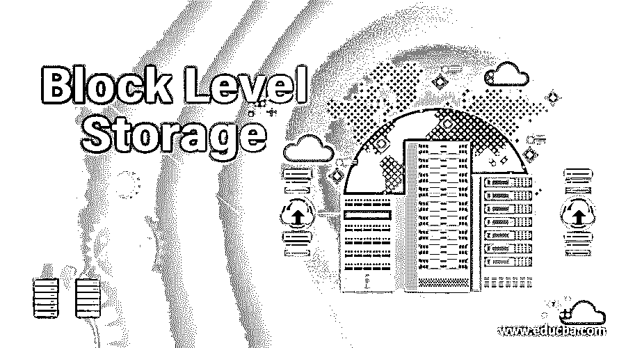

# 块级存储

> 原文：<https://www.educba.com/block-level-storage/>

## 块级存储简介

块级存储通常部署在基于存储区域网络的大规模行业中。块级存储系统中的每个单独的块都可以作为单独的不同硬盘和服务器操作系统进行管理。块级存储包括以太网光纤通道、光纤通道等协议， [iSCSI 用于开发](https://www.educba.com/what-is-iscsi/)基于服务器的操作系统可见且可访问的存储块，并充当目标和源之间的通信接口。在这里，每个数据块都可以在 NFS、SMB、NTFS 和 VMFS 等文件系统的帮助下进行格式化。存储级别提供与其链接的系统的引导。它可用于保存文件，并可作为虚拟机、数据库、文件系统等高级应用程序的存储。在块级存储中，数据的传输简单、可靠且高效。

### 云中的块级存储

块级存储是基于云实施的。托管云上的数据持久性模拟了世界上许多云服务，具有传统数据块服务的基本特征。它类似于以网络连接存储形式提供的物理硬盘。在这里，用户随机分配块来存储和检索数据，但它不携带任何文件或数据的排列。Amazon 的弹性块存储(EBS)是云中块级存储的一个例子。它通常会提供一些活动，如可靠性声誉或备份服务。与块级存储相反，对象或桶存储是由亚马逊 S3 开发的，它是一种简单的数据库存储服务。但是它具有处理文档、文件、视频、数据库和图像的特性。

<small>网页开发、编程语言、软件测试&其他</small>

### 块级存储的优势

块级存储易于理解，它允许人们对文件系统进行全局访问。这是一个简单而熟悉的范例。块设备支持每一种编程语言。读写文件只需不到几秒钟的时间。用户熟悉对文件系统的许可和其他访问。这种类型的存储设备在输入输出操作上提供了低延迟，这对于数据库的使用是灵活的。数据块存储支持基于服务器操作系统实施原始存储卷。用户可以将这些原始存储卷视为单独的硬盘。它允许用户将数据块存储用于任何类型的应用程序，如文件和数据库存储、虚拟机文件系统等。例如，虚拟机在整个组织中的应用。数据块存储可以轻松开发和格式化基于数据块的存储卷，以存储虚拟机文件系统。

一个物理服务器可以链接可以发展成多个虚拟机的块。通过创建多个基于数据块的卷，安装和连接卷的操作系统使人们能够使用该特定操作系统共享文件。块存储系统固有的适应性使其成为从操作系统中提取应用程序的容器的理想选择。它类似于虚拟化，可以从物理硬件访问操作系统。借助于块存储系统，可以很容易地定义和部署容器。集装箱化是在商业环境中用多个集装箱编排的，以享受块存储系统的好处。它可以提供即时服务，并且只需要一台主机来部署多个数据块。

企业存储即服务包括块存储即服务，以支持数据存储需求。使用企业存储时，用户可以直接选择平台即服务或基础架构即服务解决方案，并直接在云中启动应用程序和服务器。开发人员经常使用存储区域网络部署块存储。它是一个提供数据存储访问的计算机网络。存储区域网络通过在本地将块附加到设备上，向其他网络连接的系统提供块存储。

服务器可以与具有光纤通道和互联网小型计算机系统接口的存储区域网络相关联，以管理本地放置的卷中的块。块存储不会通过创建 RAID 阵列来提供任何冗余。对于任何关键数据块存储实施任务来说，这都是一项重要任务。独立磁盘冗余阵列通过将数据复制到两个或多个驱动器来保护数据。因为，如果任何数据损坏，来自另一个磁盘的信息可以替换该数据。

HP、DELL、IBM 等大型存储供应商和华为、Nutanix、Oracle 等小型供应商选择数据块存储平台作为统一存储，使用户能够在同一阵列上运行数据块和文件。OpenStack 块存储通常被称为 Cinder，是一个提供和支持存储块的开源软件。它提供基本的存储容量，如快照管理及其复制。RedHat 和 VMware 也支持 OpenStack 块存储，因为它具有简单的灵活性和弹性。它是云计算的 Amazon Elastic Block Store 中提供的持久块存储。一般来说，EBS 是可扩展的，是为大数据分析、数据仓库和 NoSQL 等工作负载而开发的。

### 要记住的事情

*   块级存储系统是一种数据存储技术，其中数据以块的形式存储。
*   每个块都被视为一个单独的硬盘驱动器，并分配有唯一的元数据地址。
*   软件程序可用于访问块存储系统，例如组织数据、检索数据以及文件系统的所有基本功能。

### 结论

像亚马逊、戴尔和 EMC 这样的大公司正在利用数据块存储产品，这将是一种未来的趋势技术，它以其惊人的优势吸引着人们。尽管存在许多竞争对手，如文件存储和对象存储，但块存储仍发挥着重要作用，并且是热门企业的高度需求。

### 推荐文章

这是块级存储指南。这里我们分别讨论基本概念及其优点和需要注意的事项。您也可以阅读以下文章，了解更多信息——

1.  [AWS 云存储服务](https://www.educba.com/aws-storage-services/)
2.  [云存储提供商](https://www.educba.com/cloud-storage-providers/)
3.  [块存储与文件存储](https://www.educba.com/block-storage-vs-file-storage/)
4.  [什么是块存储？](https://www.educba.com/what-is-block-storage/)

