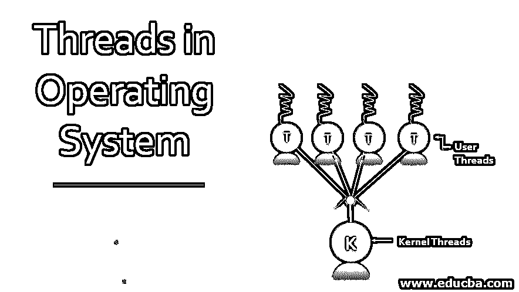
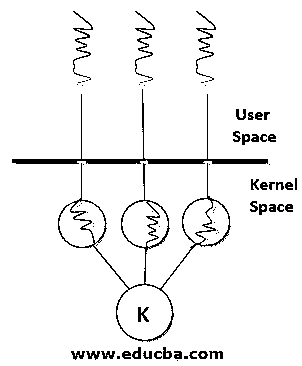

# 操作系统中的线程

> 原文：<https://www.educba.com/threads-in-operating-system/>

## 操作系统中线程的介绍

在本文中，我们将讨论操作系统中的线程。通过在进程中一个接一个地跟踪指令来执行进程代码称为线程。线程控制进程，每个线程代表对代码的控制。任务是并行运行的，它是流程的子集。我们可以称线程为轻量级进程或 LWP。不同的线程执行不同的任务，控制流是独立的。线程可以通过同时做不同的事情来提高应用程序的速度。同一进程中的线程共享地址和内存，并且在需要时可以轻松访问。

### 什么是线程？

*   使用线程将程序分成不同的任务。这些任务给人一种并行运行的错觉，但却是一个接一个地执行的。线程有一个程序计数器、寄存器和堆栈。程序计数器有所有任务和时间的信息，寄存器保存当前的工作变量，堆栈存储执行的历史。
*   诸如代码和数据相关的信息以及打开的文件在线程之间共享。当在一个线程中进行更改时，其他线程也会看到这些更改。同一进程中的线程共享内存空间和地址空间。
*   所有线程在执行代码时都有一个父进程，没有一个线程在没有进程的情况下运行。服务器，无论是网络还是 web，都是使用线程运行的。
*   当处理器共享公共内存时，线程帮助并行执行进程和程序。线程所需的资源较少，并且总是依赖于进程。线程共享进程和线程，进程顺利完成。此外，线程共享任务，就好像一个线程被阻塞，第二个线程承担任务。
*   进程中的单个线程可以读取、写入或更新其他线程中的详细信息。此外，同一进程中的多线程比不同进程中的多线程需要更少的内存空间。
*   当一个线程接管另一个线程的任务或更新信息时，操作系统不会被告知，所有的任务都会准确地完成。

### 操作系统中的线程类型

线程是根据它们被管理的方式来分类的。有两种类型的线程。

<small>网页开发、编程语言、软件测试&其他</small>

#### 1.用户线程

这些线程在用户库中实现和使用。不能使用系统创建它们。在进行线程切换时，如果操作系统被调用，就会有干扰。用户线程避免了所有干扰，不会中断内核系统。内核将这些线程视为单线程进程。这些是在不支持多线程的系统上实现的，因为它是单线程进程。这些简单地用单个寄存器、计数器和堆栈来表示。用户线程不会为创建创建任何单独的任务。切换也很快，因为没有操作系统的干预。线程和内核之间没有协调，因此如果一个线程中断，整个进程都会被阻塞。

#### 2.内核线程

内核管理线程，了解每一个线程。这是一种多线程类型。内核管理一个表来跟踪每个进程中的线程。此外，还有一个单独的表来跟踪流程，并在发生更改时进行更新。操作系统在创建和管理线程时对它们进行更改。线程的知识与内核共享，因此每个进程的时间根据执行情况进行调度。内核线程用于中断进程的应用程序。与用户线程相比，内核线程速度较慢。需要线程控制块来控制任务。

### 操作系统中线程的优势

下面是 OS 中线程的以下优点。

1.  使用线程减少了上下文切换时间。使用传统方法，即使它们属于同一个操作系统，在不同进程之间切换上下文也需要更长的时间。这有助于管理任务的时间。
2.  当使用线程时，一个接一个的任务总是在没有指令的情况下被执行。因此，使用线程可以实现整个流程的并发性。
3.  线程之间的通信和进程之间的通信在线程的帮助下变得高效。这有助于管理流程，而不用使用跟踪器来跟踪整个流程。这降低了成本。
4.  因为很容易进行上下文切换，所以成本较低，因此创建、管理和在进程之间切换线程的整个过程都很经济。
5.  线程大量使用多处理器，因为两者具有相同的特性。与其他处理器相比，构建多处理器既简单又可靠。
6.  当使用多线程时，它会不时地对用户做出响应，从而实现客户满意度。

### 操作系统中线程的缺点

1.  所有的局部和全局变量都在线程间共享。这就产生了一个安全问题，因为全局变量允许访问系统中的任何进程。
2.  当整个应用程序依赖于线程时，如果一个线程中断，整个进程就会中断和阻塞。因此应用程序崩溃。当应用程序用单线程运行进程时，尤其会发生这种情况。当使用许多线程时，这些线程会互相碰撞，使得通信变得困难。
3.  线程依赖于系统和进程来运行。它不是独立的。此外，通过线程执行流程非常耗时。但是没有线程，进程就无法运行。
4.  线程是不可重用的，并且由于基础应用程序的变化，它需要更多的硬件而不是软件。线程没有进程就无法工作，因为它们没有自己的地址空间。

线程对进程很重要，因此对系统也很重要。线程甚至被用于设计操作系统。应该根据用户线程或内核线程仔细确定要使用的线程。必须考虑代码的安全性，因为线程与同一地址空间中的其他线程共享全局变量。

### 推荐文章

这是操作系统中线程的指南。在这里，我们讨论了基本概况及其类型，以及操作系统中线程的优缺点。您也可以看看以下文章，了解更多信息–

1.  [32 位与 64 位操作系统](https://www.educba.com/32-bit-vs-64-bit-operating-system/)
2.  [内核对线程](https://www.educba.com/cores-vs-threads/)
3.  [操作系统的功能](https://www.educba.com/functions-of-operating-system/)
4.  [操作系统中的多线程](https://www.educba.com/multithreading-in-operating-system/)

