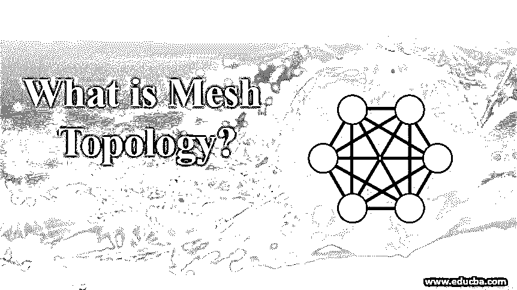

# 什么是网状拓扑？

> 原文：<https://www.educba.com/what-is-mesh-topology/>

## 网状拓扑简介

在这篇文章中。我们将了解什么是网状拓扑？.在数字时代，除了计算机和打印机之外，机器、设备、家用电器和个人小工具也相互联网并连接到互联网。网络通过连接人、机器和任何设备来共享信息和进行交易，扮演着重要的角色。选择正确的网络拓扑取决于业务目标、最终用户要求和任何组织的 IT 政策。它对网络的性能和控制运营成本起着至关重要的作用。拓扑描述了网络中节点在物理和逻辑上相互连接以及与服务器连接的方式。

在本文中，我们来了解一下网状拓扑的特点及其优缺点。

<small>网页开发、编程语言、软件测试&其他</small>

### 什么是网状拓扑？

在网状网络环境中，每个节点(计算机、[集线器、交换机](https://www.educba.com/hub-vs-switch/)和任何其他设备)都与所有其他节点相连。在这种拓扑结构中，节点之间没有层次、统一的模式和相互依赖性，节点之间的连接是随机发生的。

#### 特征

| **特性** | **描述** |
| 自组织/自配置 | 每个节点都充当路由器，并根据节点间连接的可用性来决定数据流的路由。 |
| 自愈 | 如果任何节点出现故障，网络流量负载会在节点之间动态重新分配。 |

#### 历史

网状网络最初是在 20 世纪 80 年代由军方在其无线电网络中采用的，任何人与另一个人通信，并且每个节点将充当路由器。这是在早期的单向语音通信系统(半双工无线电，一次一个人讲话，另一个人接收，反之亦然)的基础上发展起来的，用数据袋代替了语音。

### 网状拓扑的类型

两种主要类型的网状拓扑是

#### 1.全网状拓扑

网络中的所有节点都相互连接。如果网络中有 n 个节点，每个节点将有 n-1 个连接。这种全网状结构在任意两个给定节点之间提供了丰富的连接路径，并内置了大量冗余。任何节点的故障都可以用如此巨大的资源轻松管理。

部署全网状网络非常昂贵，它主要用于任何网络的主干。

#### 2.部分网状拓扑

只有少数节点与所有其他节点连接，如全网状，其余节点仅与少数其他节点连接。这种拓扑提供有限的冗余来管理任何节点的故障。外围网络使用部分网状连接，并与全网状主干串联工作。

### 网状拓扑是如何工作的？

它主要基于两个原理工作，即路由和泛洪。

#### 按指定路线发送

在路由模式中，在将数据分组传送到目的地之前，数据在预定的路径中传输，经过多个节点的跳跃。为了通过网络传输数据，所有中间节点都需要保持活动和连接。如果通信路径中的任何间歇节点出现故障，它会使用自愈技术找到替代路径并完成通信。

#### 洪水泛滥

在泛洪模型中，数据被传送到网络中的所有活动节点。如果一个节点发现数据是发给它的，那么它就消费数据，否则它就把数据传递给下一个节点。数据包的生命周期被定义为一个固定的时间段或在数据被删除之前可以经过的跳数。

### 网状拓扑中的协议

协议定义了两个节点之间数据通信的标准。这些协议适合开放系统互连 [(OSI)模型](https://www.educba.com/what-is-osi-model/)的第 3 层(网络层)。此拓扑中使用了三种类型的协议，即 a .主动式、b .反应式和 c .混合式。每种类型在管理网络和交付方面都有其独特的功能，最终会影响性能和可扩展性。

#### 主动协议

该协议便于使用来自节点的反馈对网络路径中的节点进行持续的自我监控，并且在其任何节点出现故障的情况下主动地重新路由网络路径。它提供强大的性能和从任何故障中快速恢复，并确保网络的最大正常运行时间。

它更适合于网络路径不经常改变的静态环境，而在动态环境中，它消耗更多的资源并有可能发生共谋。因此，该协议应该适用于正确的环境。

#### 反应协议

该协议仅在请求数据传输时确定网络路径。它扫描整个网络并确定最佳路径。因此，它非常适合动态环境，并且具有更好的可伸缩性。但是建立连接需要更多的时间。

#### 混合协议

它使用主动和被动方法的特点，并根据通信需求和环境提供最佳组合。这种方法优化了网络运营的成本。

### 网状拓扑的优点和缺点

以下是几点解释优点和缺点:

#### 优势

以下是给定的优点:

*   **可扩展:**这种拓扑中没有专用路由器，每个节点都像路由器一样工作，很容易添加额外的节点并将其无缝连接到网络。不需要额外的努力来扩大网络。
*   **健壮:**网络可用性不会因为系统中单个节点的故障而受到影响，这种拓扑具有健壮的特性，可以克服任何情况。这个网络不可能完全关闭。
*   **冗余:**这种拓扑提供了多条到达目的地的路径，并且建立了大量冗余以保持最大的正常运行时间。
*   **更低的成本:**这是一个高度分散的系统，没有中央服务器来控制网络，因此它需要更少的基础设施投资。

#### 不足之处

以下是给定的缺点:

*   **复杂:**复杂性增加了，因为每个节点都必须充当路由器，以及发送/接收消息。
*   **规划:**节点不断增加，利用这种拓扑提供的灵活性和可扩展性，管理员必须确保所有节点的延迟一致。这使得网络规划有点困难。
*   **功耗:**功耗要求更高，因为所有节点必须始终保持活动状态并分担负载。

### 结论

行业对 Wi-Fi 技术的广泛采用有利于网状网络，并引发了新的使用案例，尤其是在所有设备都必须连接在一起的 IOT 应用中。

### 推荐文章

这是什么是网状拓扑的指南？.在这里我们讨论一个介绍，特点，历史，如果它，与类型和认识两个原则的优点和缺点。您也可以浏览我们的其他相关文章，了解更多信息——

1.  [什么是网络拓扑？](https://www.educba.com/what-is-network-topology/)
2.  [网络拓扑](https://www.educba.com/network-topologies/)
3.  [混合网络拓扑](https://www.educba.com/hybrid-network-topology/)
4.  [部分网状拓扑](https://www.educba.com/partial-mesh-topology/)

