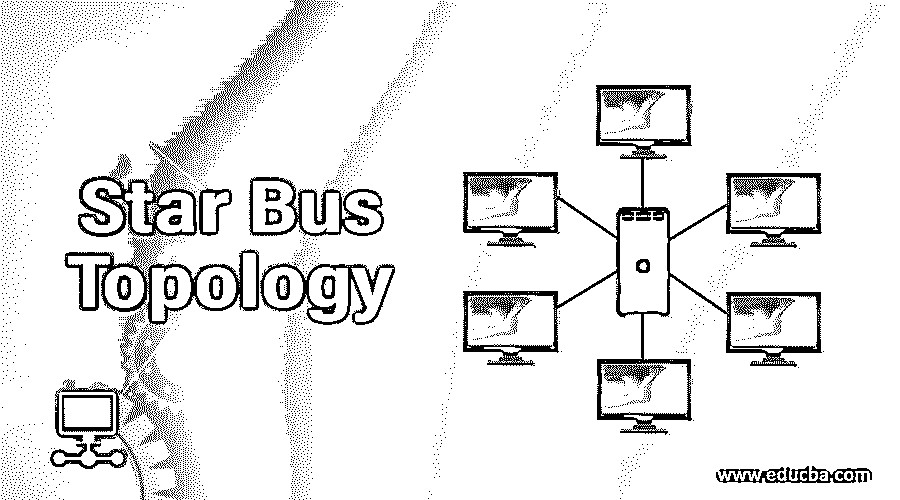

# 星形总线拓扑

> 原文：<https://www.educba.com/star-bus-topology/>

## 星形总线拓扑介绍

星形总线拓扑是办公室和家庭中最常见的计算机网络拓扑之一。利用点对点连接，这里的每台计算机都连接到一个中枢。它可以是计算机服务器，也可以是处理网络的节点的中心点。它是一个简单的组件，在多个硬件组件或计算机之间建立连接，或者在可能的情况下通过整个网络建立连接。该网络可以根据需要改变，并且可以以多种方式实现。本文简要讨论了星形总线拓扑的工作原理、重要性和应用。

### 为什么我们需要星形总线拓扑？

*   如果任何节点受到攻击或任何电缆或组件出现故障，很容易消除受影响的部分，而不会干扰整个网络。因此，所有节点之间的通信将继续进行，而不会在生产环境中造成任何延迟。
*   在不改变整个网络拓扑的情况下，可以很容易地添加和删除新组件。
*   即使在重负载时，星形总线拓扑的性能也很高。
*   它非常适合大型区域网络。

### 星形总线拓扑的工作原理

星形总线拓扑是计算机网络中尖峰状集线器分布模型的体现。在星型总线网络中，每台主机都连接到一个称为集线器的中央介质，而它则充当网络的头，管理通过网络建立的所有连接以及网络中连接的节点之间的传输和接收数据流。这是为连接多个组件而实施的传统方法之一。连接主机、叶节点和集线器的传输线构成了一个类似于星形拓扑的图形。星型总线拓扑结构上的信息在到达目的节点之前先流经集线器。因此，中央集线器管理网络之间的流量，并控制网络的所有输入和输出数据。集线器相当于网络中信息传递的中继器。

<small>网页开发、编程语言、软件测试&其他</small>

一般来说，当网络由两个或更多的系统组成时，就放置集线器。因为如果不实现集线器，两个组件的直接链接是不可能的，并且如果需要新的组件，可以直接连接到该网络的集线器，而不是在网络之间进行多次连接。现在，集线器与新连接的组件一起管理网络的所有数据流。集线器是网络的一个可靠而强大的组件，管理着整个网络的功能。因此，如果节点或传输线发生故障或容易受到攻击，这部分可以很容易地隔离，而不会干扰网络的其余部分。因为这个独特的属性，每个人都喜欢在他们的工作站中实现星型总线拓扑。但是如果网络中心瘫痪，它会关闭整个网络。因此，应该认真处理和监控它，因为它会导致繁琐的问题。

星形总线拓扑的传输线可以是双绞线、同轴电缆或光纤电缆。电缆的一端连接到局域网，而另一端连接到集线器。文件服务器、备份服务器、工作站和所有外围设备等硬件设备都连接到集线器。因为如果紧急需要一个文档，且相关系统出现故障，则可以通过集线器从下一个系统访问以检索该文档。如果集线器收到任何数据包，它会将数据包传输到集线器的所有连接节点。但是一次只有一个节点传输数据，当任何数据包从集线器传输过来时，指定的节点都会成功地接受它，而不会有任何数据丢失或不匹配。星形总线拓扑结构比任何其他拓扑结构都更具私密性和安全性。

### 重要

如果星型总线拓扑中有任何电缆故障，都会导致中央集线器和工作站的断开。只有受影响的工作站被隔离，而网络的其余部分执行其功能。他们不能与受影响的工作站进行交互，因为它是独立的。它可以很容易地导航，理解，并以最低的成本安装简单，并提供了一个快速的过程，因为它是建立在自适应连接器和柔性电缆。由于网络的灵活性和原理的可靠性，它可以很容易地管理复杂的路由协议。

如果在星形拓扑中连接任意最小数量的组件，则数据传输速率高，并且非常适合于短距离。当计算机位于分散的点时，星型总线拓扑的性能很高，因为添加或删除任何组件都非常容易。添加新设备是一个简单的过程，只需从集线器中伸出一根传输电缆。如果用户想要添加打印机，这是很容易的，计算机通过集线器访问打印机，而不需要直接连接或安装。

中心功能的维护是有成本效益的，并且计算机被放置在靠近顶点的位置，类似于凸多边形，因为有适度的系统需求。因为一台电脑的故障并不影响整个沟通过程。由于集线器是网络的瓶颈，所以它可以通过保持业务流来轻松地根据网络的容量扩展网络，这是星型总线拓扑的一种忧虑行为。整个网络在一个集线器上是可靠的，使得在单个点上排除任何错误连接问题变得简单。

### 推荐文章

这是星形总线拓扑的指南。在这里，我们讨论的介绍和为什么我们需要星形总线拓扑结构以及工作和它的重要性。您也可以看看以下文章，了解更多信息–

1.  [混合网络拓扑](https://www.educba.com/hybrid-network-topology/)
2.  [物理拓扑](https://www.educba.com/physical-topology/)
3.  [什么是环形拓扑？](https://www.educba.com/what-is-ring-topology/)
4.  [以太网拓扑](https://www.educba.com/ethernet-topology/)

