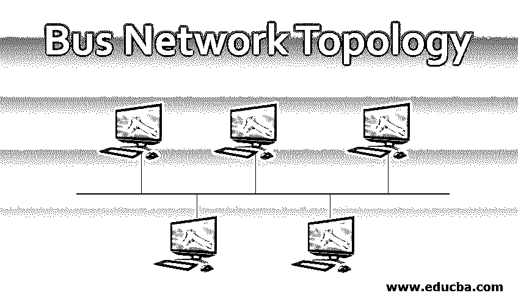
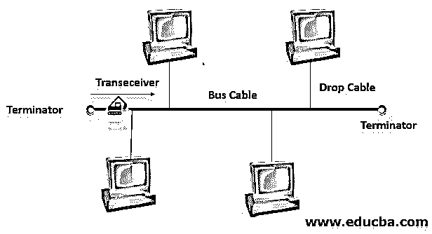

# 总线网络拓扑

> 原文：<https://www.educba.com/bus-network-topology/>

## 总线网络拓扑介绍

总线拓扑与乘用车总线没有任何链接，充当网络主干的中央物理介质电缆被称为 Bus，因而得名。在这种拓扑结构中，每台计算设备都连接到总线电缆，设备通过总线传输消息。[网络设备在电缆的两个方向上发送](https://www.educba.com/networking-devices/)一个通信，所有节点监听该消息，而预期的接收节点仅消费该消息。电缆的每一端都连接到终结器，终结器的功能是防止消息反弹回总线，并防止可能的数据共谋。

### 总线网络的组件

以下是总线网络的组成部分:

<small>网页开发、编程语言、软件测试&其他</small>

#### 1.总线电缆

多段粗同轴电缆通过中继器串联在一起，形成线性总线电缆，网络设备连接到该总线。这符合 10Base5 布线标准。每个网段的最大长度为 500 米，5 个这样的网段可以用 4 个中继器连接在一起，一个网段可以连接 100 个节点。

#### 2.收发器

网络节点不直接连接到总线电缆；相反，它们通过一种叫做收发器的特殊设备连接起来。这些设备通过电缆穿刺连接器连接到总线电缆。这些设备之间的最小距离为 2.5 米。

#### 3.引入电缆

分支电缆将节点中的网卡与收发器连接起来。根据网络中计算机网卡的类型，RJ-45 电缆或同轴电缆被用作引入电缆。引入电缆的最大长度为 50 米。

#### 4.终结者

终结器是连接到由段串行形成的线性总线电缆两端的设备。这将吸收到达总线电缆末端的信号，从而避免信号反射回系统，并防止与常规流量相勾结。

有

1.  由电阻组成的无源终端，提供一个反向阻抗来吸收信号
2.  主动终端使用复杂的电子设备，利用电压吸收信号。

### 为什么我们需要总线拓扑？

总线拓扑的部署有很多用例:

1.  基本以太网采用总线
2.  服务器和客户机需要连接在同一个网络中，并在其中交换数据
3.  非常适合办公室内的小型网络(跨越多个楼层),用于连接文件服务器和最终用户
4.  家用电器、打印机、扫描仪和计算机都可以通过它连接
5.  负担不起集线器或交换机的组织可以使用这种方式
6.  不需要电源来保持总线电缆活动，它可以穿过屋顶-天花板和地下地板，从而节省巨大的办公空间和美观
7.  这种拓扑可用于节点数量保持不变的环境

### 总线网络拓扑的优缺点

以下是总线网络拓扑的优点和缺点:

#### 优势

*   **更便宜:**与星形、环形或网状相比，这种部署的成本更低，因为它消耗的线路长度更短。由于连接被限制在较小的地理范围内，并且外部连接的数量非常少，因此不需要像集线器或交换机这样昂贵的网络设备来连接该网络。功耗为零，因为中央电缆不需要任何终端，在大多数情况下都是无源的(电阻器&电容器)，在这一端没有功耗。
*   **易于安装:**安装这个网络并不需要很大的努力。在粗以太网电缆、少量连接器和分支电缆的帮助下，可以在最短的时间内完成设置。
*   **可扩展:**向网络中添加新的网络设备、计算机、打印机、扫描仪非常简单，只要它们有合适的网络接口卡。这些设备可以无缝添加并立即激活。
*   **线性特性:**线性特性允许网络在任何一个节点出现故障时正常运行，性能不受影响，并确保所有其他节点的不间断服务。
*   **可扩展:**通过中继器设备再添加一段总线电缆，该网络可以轻松扩展到当前网络的相邻物理位置。总线电缆的这种延伸可以容易地容纳更多的节点。
*   **多台设备:**除了电脑之外的任何设备都可以很容易的加入到这个网络中，并且在这个网络中这些设备的操作变得更加容易，团队的生产力得到提升。

#### 不足之处

*   **尺寸限制:**一根总线电缆的尺寸不能超过五段电缆，每段电缆最长可达 500 米，并且一段电缆可连接的节点数量有上限。
*   **安全性:**所有的节点都可以访问网络中的所有数据；因此，该网络中的信息安全薄弱，并且难以安装安全层并使其可操作。
*   **漏洞:**如果中央总线电缆出现问题，整个网络将停止运行，直到电缆问题得到解决。
*   **数据共谋:**节点越多，这个网络中存在冲突的概率就越大。由于冲突期间的数据丢失，数据质量是一个问题，它限制了网络的规模。
*   **过于简单:**这个网络中的节点还没有智能到可以与其他节点智能交互，避免数据通信时的碰撞。因此，它不适合大型网络。

### 结论

总线拓扑为小型地理区域提供了一个智能网络解决方案，它补充了其他类型的网络，形成了一个混合网络，并提供了一个大的网络环境。

### 推荐文章

这是总线网络拓扑的指南。在这里，我们讨论总线网络拓扑的介绍及其组成部分，以及优点和缺点。您也可以浏览我们推荐的文章，了解更多信息——

1.  [什么是网络拓扑？](https://www.educba.com/what-is-network-topology/)
2.  [网络命令|前 9 名](https://www.educba.com/networking-commands/)
3.  [什么是网络协议](https://www.educba.com/what-is-networking-protocols/)
4.  [十大网络面试问题](https://www.educba.com/networking-interview-questions/)

