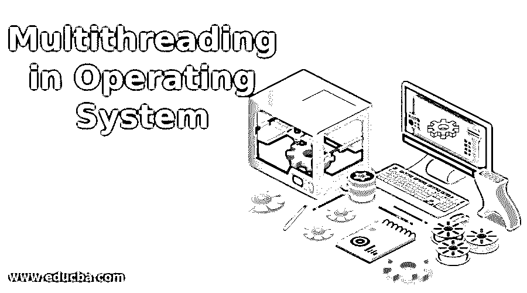

# 操作系统中的多线程

> 原文：<https://www.educba.com/multithreading-in-operating-system/>

## 操作系统中多线程的介绍

无论是日常生活还是公务，活动一个接一个地进行的日子已经一去不复返了。尽可能同时做多项任务是当今的主流，这与效率和灵活性息息相关。它也适用于计算机世界，并且管理计算机资源的操作系统被配备来管理多个并行任务，以提高 CPU 的利用率，并且以更好的前端响应同时服务多个用户。

在操作系统中，多任务发生在两个层次上。一个是进程级的，完全托管的操作系统，另一个是指令级的，称为线程。操作系统通过多线程向程序提供控制以管理并行操作。

<small>网页开发、编程语言、软件测试&其他</small>

### 什么是多线程？

*   多线程可以互换使用，经常与多任务或多道程序一起使用。这三者之间有细微的差别。从进程中挑选出一组独立的指令，并使用这些提取的代码集来形成线程，并且这些线程作为单独的单元来执行。多个这样的线程由操作系统并行执行，并且这些线程由应用程序管理。
*   每个线程指示程序代码或进程的流程，它有自己的程序计数器(PC)来跟踪上一个执行的指令集和下一个要执行的指令集，并有寄存器来存储堆栈中的工作变量和执行历史。一个线程与它的伙伴线程共享它的信息，并且一个线程内发生的变化为其他线程所知。
*   线程是进程的子集，是进程的一部分，它是轻量级的，占用较少的计算机资源，而进程是重量级的，占用较多的计算机资源。线程切换由软件控制，而进程级切换由操作系统管理。
*   线程共享数据和文件系统，而多处理环境有自己的数据和文件存储。在多线程中，如果一个线程由于某种原因被阻塞，其他线程中的作业可以毫无阻碍地运行。每个线程都可以访问和更改其他线程中的数据。
*   通过设计，多线程提供了软件的稳定性。它将每个线程作为一个独立的单元来处理，并屏蔽了影响其他线程的线程性能缺陷，从而避免了系统崩溃。

### 多线程的应用

*   在代码开发期间，应用程序员将整个过程分成线程，即独立指令的单元，线程的例子是几个后台/前端任务，例如更新文件系统中的数据、捕获日志文件、多窗口操作管理、文件扫描、与用户的持续交互。
*   多线程场景包括在同一系统或处理器中工作的多个用户，在给定时间运行不同的应用程序并发出不同的命令，并且操作系统并行执行来自所有用户的所有线程。处理器应该有足够的能力来管理多线程操作。
*   浏览器支持运行多线程操作并同时管理多个活动的应用程序。任何线程的操作都不应该影响另一个线程的操作，并且操作系统有效地处理线程中作业的执行。
*   多线程场景在 Web 应用程序、网络管理软件中得到了非常广泛的应用，它还为许多使用共享资源概念的应用程序中的并行处理提供了坚实的基础。

### 螺纹类型

有两种类型的螺纹，即:

#### 1.用户级线程

*   由用户管理，操作系统不知道的存在
*   线程库提供了构建线程、终止线程、线程间消息和数据接口方式、绘制执行时间表、保存上下文和随时恢复上下文的代码
*   应用程序可以管理这些线程，执行这些线程不需要内核级权限
*   它与操作系统无关，并且可以运行
*   更容易构建和管理整体
*   有时系统调用会在这种类型的线程中被阻塞
*   它不能利用多重处理的好处

#### 2.内核级线程

*   由内核管理，系统软件位于操作系统的核心和核心
*   由操作系统直接支持，应用程序没有任何作用
*   应用程序只声明多线程执行，而操作系统处理线程
*   内核维护进程的上下文信息和单个线程的信息
*   内核处理线程创建、作业调度和管理
*   它处理单个进程和多个进程中的线程
*   如果一个进程中的一个线程出现阻塞，内核可以在同一个进程中打开另一个线程
*   本质上，内核程序是
*   内核创建线程是一个缓慢的过程，线程切换需要内核的干预。

### 操作系统模型中的多线程

一些操作系统允许用户级和内核级线程共存。应用级多线程运行在由内核控制的多个处理器上。

应用程序线程和内核线程之间的关系可以分为:

*   一对一
*   多对多
*   多对一

在多对多关系中，在多处理器环境中，n 个用户线程可以与 m 个内核线程一起运行。在 n 个用户多对一关系中，线程连接到一个内核线程，且在任一时间点只有一个线程连接是活动的。

### 多线程在操作系统中的重要性

多线程促进了多个程序代码的并发执行，并且这些程序代码在 Java 程序中容易管理，包括其执行顺序，并且它在

*   改善对用户的前端响应
*   增强应用程序性能
*   计算机资源的有效利用
*   维护成本低
*   由于并行操作，任务完成速度更快
*   简化开发过程并提高生产率

多线程必须克服复杂的操作设置/切换上下文带来的挑战，以及获得死锁条件的可能性。

### 结论

计算机软件的效率取决于它以敏捷的方式和更快的速度处理指令的能力。多线程操作有助于实现这些目标，Java 编程在编码中固有地提供了多线程设施，并且在 Java 中很容易创建和管理多线程。

### 推荐文章

这是一个操作系统中多线程的指南。这里我们讨论多线程的介绍，类型，应用，模型以及在操作系统中的重要性。您也可以浏览我们的其他相关文章，了解更多信息——

1.  [安卓操作系统](https://www.educba.com/android-operating-system/)
2.  [c#中的多线程](https://www.educba.com/multithreading-in-c-sharp/)
3.  [操作系统的功能](https://www.educba.com/functions-of-operating-system/)
4.  [操作系统的特性](https://www.educba.com/features-of-operating-system/)

