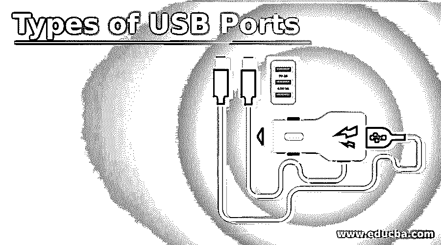

# USB 端口的类型

> 原文：<https://www.educba.com/types-of-usb-ports/>

## USB 端口介绍

很难想象没有电脑和一大堆与之相连的小玩意的现代世界。作为业务应用和个人需求的一部分，笔记本电脑、台式机、平板电脑和移动电话需要与多个外围设备进行交互以交换数据。尽管随着移动计算机的出现，无线连接的势头越来越大，但有线连接在计算机世界的数据连接中仍然扮演着重要角色。

计算机中的 USB 端口类型提供了与外部设备的物理连接点，并且是计算机硬件中的终端点(插槽)提供了与外围设备进行数据交换的入口/出口。一些端口向设备交换电力。键盘、鼠标、打印机、麦克风、显示终端、CD 播放器、网络和照相机是可以连接到端口的少数外部设备。

<small>网页开发、编程语言、软件测试&其他</small>

几种类型的端口是 a .串行端口 b .并行端口 c. PS/2 端口 d .通用串行总线(USB)端口，

VGA(视频图形阵列)端口，f .电源连接器，g. Firewire 端口，h .调制解调器端口，I .以太网端口，j .游戏端口，k .数字视频接口(DVI)端口，l .插座。所有这些端口目前都没有在一台计算机上使用，其中一些已经消失。如果需要使用已没有端口连接的旧设备，可以使用多接口的适配器电缆。

### USB 简介

1.  一个由 7 家公司(Compaq、DEC、Intel、IBM、Microsoft、Nortel 和 NEC)组成的联盟开发了 USB，其目标是简化外部设备与 PC 的连接，避免多个连接器和可用性问题，为连接设备提供更简单的软件配置并增加数据传输
2.  用户不必配置 USB 接口来适应所连接的设备，设备是自我配置的。
3.  访问通道、器件设置、速度、中断和地址由自动配置
4.  在主机级别，USB 连接器是标准化的，因此在没有限制
5.  USB 充分利用设备的能力，无需重新调整任何设备
6.  无需重启电脑即可更改 USB 连接
7.  USB 可以为微型设备供电，因此不需要额外的电缆
8.  USB 具有管理错误的内置机制，并提供可靠的操作性能水平
9.  它需要最少或零努力从用户端操作多个设备在 USB
10.  USB 接口的统一标准消除了对设备级专用接口的需求，并使设备制造商的生活
11.  USB 接口被设计成在影响性能的数据添加期间不会占用太多的计算机资源
12.  USB 在所有计算机和设备中普遍可用，并且是默认的接口标准。
13.  它取代了中的串行端口和并行端口

### USB 端口的类型

在本文中，我们来分析各种类型:

主机是外围设备(接收器)通过插入主机提供的插槽(端口)中的 USB 电缆连接到的计算机。USB 端口可以根据 USB 版本(USB 1.x、USB 2.x …)或 USB 电缆类型(连接器类型 A、B、C)进行分类..).USB 版本侧重于电缆的速度和功能，连接器类型处理插头和端口的物理设计。让我们检查这两个类别。

**Type-A** 这是所有 USB 品牌中最受欢迎的，它的横截面是细长的矩形，它连接到主机侧的 Type-A 端口。这条电缆是用来交换数据和电力的。A 型端口常见于台式机、笔记本电脑、媒体播放器和游戏机。

**B 型**该插头的横截面为方形，在外侧有斜顶角。作为电缆的一部分，它被插入外围设备的上游端口。有些设备没有 B 型端口，电缆仅用于从主机为其供电。B 型插头用于打印机、硬盘和电话。

**Type-C 苹果的 12 英寸 Macbook** 是第一款在设计中融入 Type-C 的笔记本。从物理上看，它像一个微型 USB。这是一个 8.4 毫米 X 2.6 毫米的小尺寸，使它能够适应现代微型外围设备。这种电缆的两端是相同的，任何一端都可以连接到主机或设备，每次都可以正确地插入电缆。

它属于最新的 USB 系列，可以以 10 Gbps 的速度传输数据，传输功率高达 20V 100W 和 5 amps。数据或电力可以双向传输，C 型电缆可以很容易地用来为功率要求为 40 到 70 瓦的笔记本电脑充电。

Type-C 用于 Chromebook Pixel、诺基亚 N1 Tab、Nexus 6P 智能手机等主要品牌。未来所有的电子设备都将支持 C 型 USB，这将成为默认标准。这种单一电缆标准将简化未来处理电子设备的方式，它将很快取代所有其他电缆，给我们带来自由。

**迷你和微型连接器**迷你连接器的发布与 2000 年 4 月的 USB 2.0 版本同步，用于连接数码相机、手机和标签。2007 年发布的微型连接器的厚度只有连接 PDA 的微型连接器的一半。

**USB 1.0** 该版本发布于 1996 年，低速 1.5Mbps 到高速 12 Mbps。USB 1.0 中生产的设备很少，下一版本 USB 1.1 被广泛采用。它没有规定任何小于 A 型和 B 型连接器的设计。

**USB 2.0** 发布于 2000 年 4 月，峰值可达 480Mbps。Mini-A，Mini-B 连接器，Micro USB，以及许多其他 USB 补充属于这个版本。

**USB 3.0** 该规格于 2008 年 11 月发布，处于 5Gbps 的超高速范围内，2013 年 7 月发布的 USB 3.1 达到了 10Gbps 的数据传输速度。2017 年 9 月发布的 USB 3.2 达到了 20Gbps 的速度

USB 4 USB 实现论坛在 2019 年 8 月发布了这个版本，它遵循雷电 3 协议，并具有向后兼容性。

### 结论

虽然当人们在移动中实现移动连接时，无线通信的势头越来越大，但 USB 提供稳定和安全的连接，并满足连接任何设备的物理尺寸要求，无论设备有多小。

### 推荐文章

这是 USB 端口类型的指南。在这里，我们讨论了 USB 端口的简介，并对各种类型的端口进行了详细说明。您也可以浏览我们的其他相关文章，了解更多信息——

1.  [React-Native 样式表](https://www.educba.com/react-native-stylesheet/)
2.  [c++中的套接字编程](https://www.educba.com/socket-programming-in-c-plus-plus/)
3.  [安卓软件](https://www.educba.com/android-software/)
4.  [硒软件](https://www.educba.com/selenium-software/)

