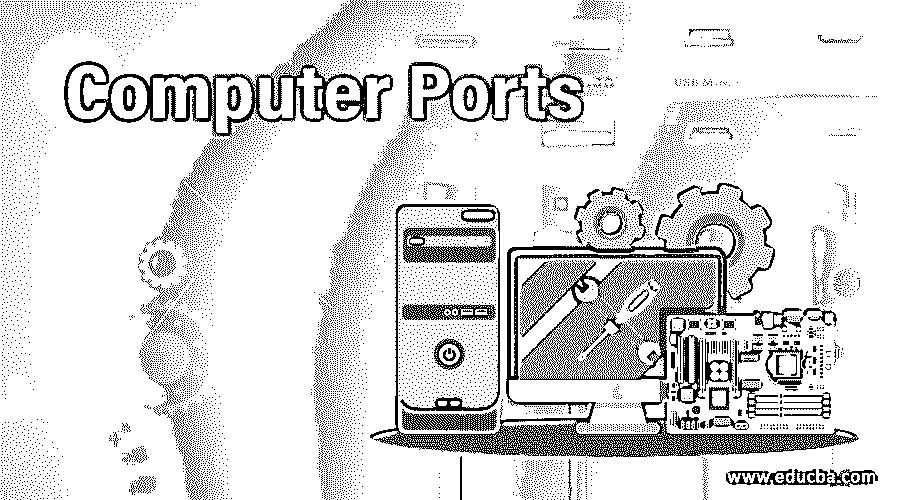

# 计算机端口

> 原文：<https://www.educba.com/computer-ports/>

## 计算机端口介绍

硬件术语中的端口表示连接点。在计算机中，端口是与任何其他硬件(可以是任何外部设备)的连接点。换句话说，它把一台计算机和它的外围设备连接起来，以便从计算机上获得预期的和最大的功能。最常见的外围设备包括扬声器、鼠标、键盘、显示器或监视器、硬盘和笔驱动器等外部驱动器。因此，这些计算机端口充当计算机和来自外围设备的电缆之间的连接点，这将允许数据流到末端。

### 计算机中不同类型的端口

出于便于计算机和设备之间通信的明显原因，计算机通常被称为通信端口。这个端口通常位于计算机的主板上，兼容的硬件可以连接到这个端口上。

<small>网页开发、编程语言、软件测试&其他</small>

根据用于通信的协议，计算机端口简单地分为两类。它们是串行端口和并行端口

#### 1.串行端口

串行端口作为一个接口，数据可以通过串行方式进行通信，串行方式是一位时间和一条通信链路。

#### 2.并行端口

并行端口有助于计算机与其外围设备以并行方式进行通信。数据以并行方式以输入和输出的方式传输。并行端口最常见的例子是打印机端口

让我们看看一些最常用的计算机端口

#### 1.PS/2

这种连接器最初是由 IBM 开发的，主要用于连接鼠标和键盘。IBM 已经将它引入到它的 ist 个人系统/2 系列计算机中。它们有颜色编码，紫色代表键盘，绿色代表鼠标。该连接器中有 6 个引脚。即使连接器看起来一样，如果我们互换键盘和鼠标连接，设备也不会被识别。这些端口对密钥翻转没有限制

这些端口现在是传统端口，因为它们被复杂的 USB 端口所取代，并且现代主板使用这些端口。但是，在一些地方，出于安全原因，这些港口仍然受到青睐。

#### 2.串行端口

PS/2 和 USB 据说是一种常见的串行端口，但在技术术语中，串行端口是一种满足 RS-232 标准的端口。有两种类型的串行端口，它们是 DE 9 和 DB 25，数字表示支持的引脚数。这些都是在旧电脑中看到的，我们很少在现代电脑中看到它们，因为 USB 端口已经取代了它们。大多数串行端口中的数据以每秒 115 千比特的速度传输。

#### 3.Centronics 端口

这是 36 针并行端口，它将连接外围设备，如打印机或扫描仪，通信类型为并行。这些港口是遗产，但在过去很受欢迎。数据通常以每秒 150 千比特的速度传输。

#### 4.通用串行总线端口

简称 USB 是数字通信的现代标准。USB 端口已经成为将外部外围设备连接到计算机的现代通信标准。这种 USB 端口已经取代了串行端口、ps/2 端口、其他游戏端口、并行端口，这些端口已经过时，不再使用。

该 USB 端口可用于多种目的，例如

*   传输数据
*   为外部兼容设备充电的电源
*   外围设备的接口

这些端口不依赖于设备，因为没有标准的设备连接预留。任何兼容设备都可以连接到此端口。

有三种类型的 USB 端口，它们是 A 型、B 型和微型 USB。

A 型是 4 针连接器，目前有不同的型号。USB 3.0 是支持高达 400 MBPS 速度的通用标准之一。USB 2.0 也是相当受欢迎的版本之一。

#### 5.显示端口

通常称为 DP 的显示端口是数字音频和视频设备的接口。它连接到电视，显示器，投影仪。在现代世界中，VGA 端口、HDMI、DVI 等属于显示端口。

#### 6.VGA 端口

许多计算机中都有此端口，用于支持视频内容设备和电视。它有三排 15 个插脚，是 D 型接头。对于旧的 CRT 显示器，VGA 端口是连接点。

一些现代的 LCD 和 LED 支持 VGA 端口，但会影响视频质量

如今，VGA 端口正在成为传统，随着数字视频的出现，HDMI 显示端口变得更加突出。

#### 7.数字视频接口

DVI 是电机等显示设备和 CPU 等显示控制器设备之间的高速数字接口。DVI 的目的是向显示设备传输无损视频信号。

#### 8.HDMI 端口

HDMI 代表高清晰度多媒体接口，能够向连接设备传输高带宽和高质量的音频和视频流。依赖此端口的外围设备有高清电视、蓝光播放器等。

除此之外，还有许多其他端口，如提供互联网连接的以太网端口、连接电话网络的调制解调器端口、有助于连接操纵杆的游戏端口、连接麦克风和其他音频扬声器的插座等。

### 计算机上端口的重要性

物理计算机端口是指通信接口，通过它我们可以连接几个外围设备，这些设备是数字通信的一部分。这些端口在物理大小、形状、引脚、所涉及的几根导线等方面都有所不同。在本文中，我们已经看到了主板上可用的不同端口以及每个端口的用途。根据计算机的用途及其主板可以处理的端口数量和类型，可以处理最大效率。

### 结论

因此，计算机端口是一个接口，我们通过它与不同的外围设备进行通信。本文简要介绍了一些最常用的端口。有时这些端口通常被称为插槽，如 Pendrive 插槽、sd 卡插槽等。

### 推荐文章

这是计算机端口指南。在这里，我们讨论了计算机的不同类型和最常用的端口及其重要性。您也可以看看以下文章，了解更多信息–

1.  [什么是计算机科学？](https://www.educba.com/what-is-computer-science/)
2.  [电脑线缆的种类](https://www.educba.com/types-of-computer-cables/)
3.  [计算机软件的种类](https://www.educba.com/types-of-computer-software/)
4.  [计算机蠕虫的种类](https://www.educba.com/types-of-computer-worms/)

