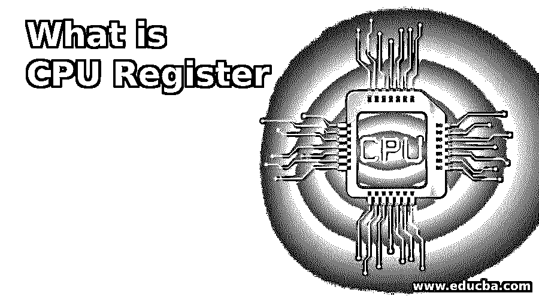

# 什么是 CPU 寄存器

> 原文：<https://www.educba.com/what-is-cpu-register/>

## CPU 寄存器介绍

在计算机体系结构中，CPU 寄存器起着关键作用，它是小数据的存放处或存储器，是处理器的一个组成部分。它是一种非常快速的计算机内存，主要用于非常有效地执行程序和其他主要操作。寄存器主要用于根据 CPU 将立即使用的指令快速存储、接受、传输和操作数据。在计算机的内存层次结构中，寄存器居于首位，处理数据的速度最快。许多快速多端口存储单元是任何寄存器的原子部分。

在基本或更简单的微处理器中，有一个通常称为累加器的存储单元。基本上，这些寄存器用于执行不同的操作。在计算机中，CPU 使用这些寄存器来执行操作

<small>网页开发、编程语言、软件测试&其他</small>

### CPU 寄存器的操作

对于 CPU 处理，这些寄存器起着至关重要的作用。当我们给出输入时，这些输入被存储在寄存器进程中，输出仅来自寄存器。

所以基本上寄存器会执行以下操作。

*   **获取**:获取用户的指令，以及以排序的方式存在于主存储器中的指令
*   **解码**:第二个操作是解码需要执行的指令。因此，CPU 将知道什么是指令
*   **执行**:一旦指令被解码，CPU 就执行执行操作。一旦完成，结果将显示在用户屏幕上

### 不同类型的存储寄存器

有各种类型的寄存器可供使用，下面是一些最常用的 CPU 寄存器及其说明

*   蓄电池(交流)
*   标志寄存器
*   地址寄存器
*   数据寄存器
*   程序计数器
*   指令寄存器
*   堆栈控制寄存器(SCR)
*   内存缓冲寄存器(MBR)
*   变址寄存器

这些寄存器是计算机最重要的组成部分，每个都有特定的用途。让我们看看下面

#### 1.蓄电池

累加器寄存器是 ALU 的一部分，ALU 是算术逻辑单元的缩写，顾名思义，它负责执行算术运算和逻辑运算。控制单元将把从主存储器中取出的数据值存储到累加器中，用于算术或任何其它逻辑运算。该寄存器保存指令的初始数据、中间结果和 asl 以及最终结果。运算的最终结果可以是算术的也可以是逻辑的，它将通过 MBR 传送到主存储器

#### 2.标志寄存器

该寄存器验证或检查 CPU 中条件的各种出现，并由称为标志寄存器的特殊寄存器处理。该寄存器的大小为一个或两个字节，因为它只保存标志信息。该寄存器主要在操作条件时进入画面。

#### 3.数据寄存器

该寄存器用于临时存储从其它相关外围设备传输的数据。

#### 4.地址寄存器

该地址寄存器也称为存储器地址寄存器 MAR，是一个存储单元，用于存储主存储器上数据或指令的地址位置。它们包含地址的一部分，可用于计算完整的地址。

#### 5.程序计数器

这个寄存器通常也被称为指令指针寄存器。顾名思义，这个寄存器将保存下一条需要被获取和执行的指令的地址。当提取指令时，该值递增，因此将总是保存下一条要运行的指令的地址。

#### 6.指令寄存器

一旦从主存储器中取出指令，它就被存储在指令寄存器 IR 中。控制单元从这里接收指令，对其进行解码，并通过向所需的部件发送所需的信号来执行指令。

#### 7.堆栈控制寄存器 SCR

由于该寄存器名称中的工作堆栈代表 block，所以这里它代表一组存储数据的内存块。按照先入后出的顺序存储和检索数据。

#### 8.存储器缓冲寄存器

该寄存器保存从存储器读取或写入存储器的信息或数据。存储在该寄存器中的内容或指令将被传送到指令寄存器 IR，而数据的内容被传送到累加器或 I/O 寄存器。

#### 9.变址寄存器

变址寄存器是计算机 CPU 的一个组成部分，它将在程序执行期间帮助修改内存操作数的地址。基本上，变址寄存器的内容被加到立即地址上，从而得到存储器上数据或指令的有效地址。

### 为什么我们需要一个 CPU 寄存器？

对于指令的快速操作，CPU 寄存器非常有用。没有这些 CPU 的操作是不可想象的。当我们看不同的记忆时，这些是最快的记忆，老挝将在记忆层次中占据首位。寄存器可以保存指令、地址或任何其他类型的数据。有不同类型的寄存器可用，我们已经在文章的上面部分看到了大多数使用。因此有了寄存器，它使 CPU 的操作变得流畅、高效和有意义。根据 ist 要求和规范，寄存器必须足够大。

### **优缺点**

以下是优点和缺点

#### 优势

以下是优点:

*   这些是速度最快的内存块，因此与主内存相比，指令的执行速度更快
*   由于每个寄存器的用途不同，在寄存器的帮助下，CPU 将优雅而流畅地处理指令
*   在数字世界中，很少有 CPU 不注册的

#### 不足之处

让我们来看看缺点:

*   因为寄存器的内存大小是有限的，如果指令更大，那么 cpu 需要使用缓存或主内存以及寄存器进行操作

### 结论

因此，CPU 中可用的寄存器数量以及我们的指令有多大，将显著影响我们代码的执行时间。拥有足够的 CPU 寄存器将有助于更快更平稳地执行

### 推荐文章

这是一个什么是 CPU 寄存器的指南。这里我们讨论一下 CPU 寄存器的介绍，操作，不同类型，用途，优缺点。您也可以浏览我们的其他相关文章，了解更多信息——

1.  [安卓棒棒糖](https://www.educba.com/android-lollipop/)
2.  [什么是机器周期？](https://www.educba.com/what-is-machine-cycle/)
3.  [安装 Maya](https://www.educba.com/install-maya/)
4.  [计算机语言的种类](https://www.educba.com/types-of-computer-language/)

