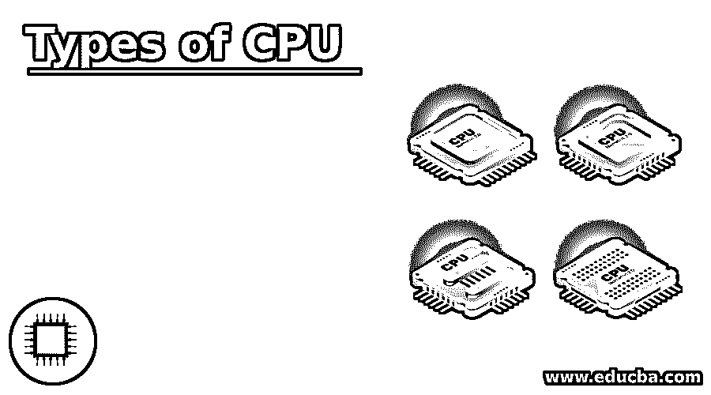

# CPU 的类型

> 原文：<https://www.educba.com/types-of-cpu/>

## CPU 类型介绍

在 CPU 的类型中，CPU 被扩展为中央处理单元，它是位于系统内部的电子电路中的主要和中央处理器。它根据计算机程序执行命令。它执行基本的算术逻辑，输入和输出操作，控制电路遵循计算机中的程序。术语 CPU 被认为是处理器，它由控制单元和处理单元组成，将计算机的核心元件与外部设备(如 I/O 电路和主存储器)区分开来。趋势 CPU 现在以微处理器的形式出现，微处理器包括集成电路中的单元金属-二氧化物-半导体。集成芯片包括 CPU 以及外围接口、存储芯片、微控制器和芯片上的其他系统。很少有系统采用封装在称为 CPU 核心的单个插槽中的多核处理器。

### CPU 的类型

CPU 是一个至关重要的元件，它管理所有的计算和命令，这些计算和命令被传输到计算机的其他组件及其外围设备。CPU 的快速速度服从输入程序的命令。当连接到 CPU 时，这些组件是独立且强大的。所以有必要选择合适的，并据此进行编程。CPU 的主要制造商是 AMD 和 Intel。在过去，处理器被用来寻找正确的和健壮的处理器。

<small>网页开发、编程语言、软件测试&其他</small>

英特尔 486 比 386 更快，但在推出奔腾处理器后，所有处理器都被命名为 Duron、Celeron、Pentium 和 Athlon。各种类型的处理器构建在不同的架构中，如 64 位和 32 位，具有最大的速度和灵活的容量。CPU 的主要类型分为单核、双核、四核、六核、八核和十核处理器，这将在下面解释。

#### 1.单核 CPU

它是最古老的 CPU 类型，可用于大多数个人和官方计算机。单核 CPU 一次只能执行一个命令，在多任务处理中效率不高。这意味着如果执行一个以上的应用程序，性能会明显下降。如果一个操作开始，第二个进程应该等到第一个完成。但是如果用多重操作来填充，计算机的性能会急剧下降。单核 CPU 的性能是通过测量其功率来确定其时钟速度的。

#### 2.双核 CPU

它是一个单 CPU，由两个强大的核心组成，功能就像双 CPU 一样。与单核 CPU 不同，处理器必须在可变的数据流阵列中来回切换，如果执行一个或多个线程，双核 CPU 可以有效地管理多任务处理。为了有效地利用双核 CPU，正在运行的程序和操作系统应该嵌入一种称为同步多线程技术的独特代码。双核 CPU 比单核 CPU 快，但不如四核 CPU 强大

#### 3.四核 CPU

四核 CPU 是多核 CPU 特性和设计的改进型号，在单个 CPU 上有四个内核。类似于双核 CPU，它将工作负载分配给不同的内核，而四核则支持高效的多任务处理。这并不意味着任何单个操作比其他操作快四倍。除非 SMT 代码在其上执行的应用和程序会加快速度并变得不明显。这种类型的 CPU 用于需要像游戏玩家一样同时执行多个不同程序的人，这是在多核 CPU 中优化的 supreme commander 系列。

#### 4.六核处理器

它是另一种多核处理器，有六个内核，可以执行比四核和双核处理器更快的任务。对于个人电脑用户来说，六核处理器非常简单，现在英特尔在 2010 年推出了带六核处理器的英特尔酷睿 i7 处理器。但在这里，智能手机用户只使用四核和双核处理器。如今，智能手机可以使用六核处理器。

#### 5.八核处理器

双核由两个内核构成，四个内核内置四核，六核配有六个内核，而八核处理器由八个独立内核开发而成，可高效执行任务，甚至比四核处理器更快。趋势八核处理器由两组四核处理器组成，在不同类型之间划分不同的活动。很多时候，最低功耗的核心集被用来执行高级任务。如果有任何紧急情况或要求，快速四套核心将被踢开。准确地说，八核与双代码内核完美地定义在一起，并相应地调整它以提供有效的性能。

#### 6.十核处理器

双核处理器由两个内核组成，四核处理器有四个内核，六核处理器有六个内核。Deca-core 有 10 个独立的系统，用于执行和管理任务，比迄今为止开发的其他处理器都要成功。拥有一台个人电脑或任何配备十核处理器的设备是最佳选择。它比其他处理器更快，在多任务处理方面非常成功。十核处理器凭借其先进的特性成为潮流。现在大多数智能手机都配备了低成本的 Deca core 处理器，永远不会过时。当然，市场上的大多数小玩意都是用新处理器更新的，为人们提供了更多有用的用途。

### CPU 的主流处理器

中端处理器被称为主流处理器，相对较大，可管理高性能任务，如视频编辑、3D 游戏和其他面向多媒体的应用。它类似于预算友好的处理器，被实现来以成本有效的方法执行基本任务。这种 CPU 可以轻松地运行办公程序、照片编辑、网页浏览和其他基本任务。

### 推荐文章

这是 CPU 类型的指南。在这里，我们讨论了 CPU 类型的介绍，六个处理器的解释，以及中游处理器。您也可以浏览我们的其他相关文章，了解更多信息——

1.  [计算机体系结构的类型](https://www.educba.com/types-of-computer-architecture/)
2.  [CPU 虚拟化](https://www.educba.com/cpu-virtualization/)
3.  [计算机内存的类型](https://www.educba.com/types-of-memory-in-computer/)
4.  [计算机软件的种类](https://www.educba.com/types-of-computer-software/)

