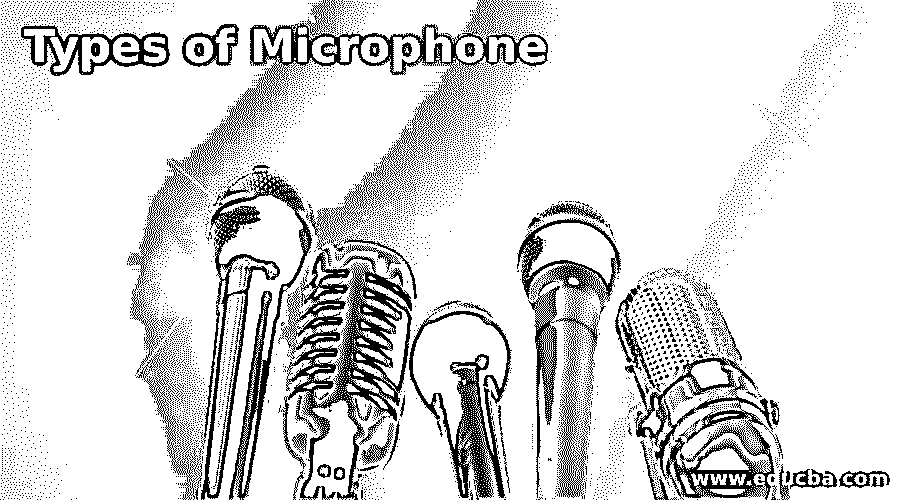

# 麦克风的类型

> 原文：<https://www.educba.com/types-of-microphone/>

## 麦克风简介

麦克风被称为 mike 或 mic，由转换器组成，用于将声音信号转换为电信号。它用于助听器、电话、公共活动的公共广播系统、音乐厅、电影制作、录音和现场音频工程、录音、双向无线电、电视和无线电广播等应用，以及用于录音、语音识别、VoIP 和爆震传感器或超声波传感器等非声学功能的系统。不同类型的麦克风用于将声波中的气压变化转换成电信号。

### 不同类型的麦克风

不同类型的话筒包括带式话筒、低音话筒、多模式话筒、USB 话筒、动圈话筒、小振膜电容话筒、大振膜电容话筒、界面话筒。但最常用的是动圈话筒，它利用线圈保持磁场。在电容板中，电容麦克风使用振动膜来转换电信号。压电麦克风使用压电材料进行电信号转换。在信号再现或记录之前，典型的麦克风应该与前置放大器连接。因此，用户可以根据自己的需求选择合适的工具。

<small>网页开发、编程语言、软件测试&其他</small>

#### 1.动态麦克风

在麦克风的世界里，它们就像是老黄牛。它经久耐用，价格便宜，在一些录音来源上有巨大的声音。它由一个固定在磁场上的旋转感应线圈组成。在这里，动态麦克的工作方式类似于扬声器，反之亦然。管理高水平的 SPL 对瞬时峰值很敏感。因此，它成为吉他、低音音箱和配有近距离话筒的架子鼓等响亮声源的自然选择。这是多才多艺和负担得起的，以增加您的要求和完善的音响系统。

话筒 SM57 是录音中的常用工具之一，用户友好且易于使用。舒尔 SM57 有一个房间，有一个专用的单一竞争者。它有一套令人印象深刻的动态设计，适用于舒尔 SM7B、森海塞尔 MD41、电音 RE20 等录音室场景。所有这些都是很好的选择，但性价比对 SM57 来说是合适和可靠的。

#### 2.配有大型振膜电容的麦克风

它是最受欢迎的录音室录音话筒，时尚、大号、严肃、高度专业。它通过使用电容器将声振动转换成电流来工作。它需要 48V 的电源才能工作。它对带状和动态麦克风很敏感，并提供更大的信号输出。因此，这种灵敏度使它成为人声等终端动态源的安静而理想的选择。因为带有大振膜电容的话筒能以最高的质量呈现多种悦耳的声音。

它有助于开发一个比生活中更大的声音，并将其与专业录音室的人声联系起来。它对各种来源都很有效，并且可以作为一个单独的部分来管理整个任务。大多数 trending LDC 提供了 polar 的选择性模式，这使得它们在各种录制场景中非常通用和有用，是开发工作室的最佳话筒。

#### 3.带有小型振膜电容的麦克风

它通常被称为铅笔冷凝器，因为它们的尺寸极小，是 LDC 的最小华而不实的兄弟。但是它发出的声音令人难以置信。无论尺寸大小，使用小型振膜话筒都是最有效的，并且有着广泛的应用。它具有很高的瞬态灵敏度和有限的拾音模式，带有扩展的顶端模块。它使真正的立体声方法令人惊叹，并适用于声学仪器。它最适用于古典音乐的录音环节。它出现在一对立体声录音中，可用于产生具有实际声学空间的精确立体声图像。

#### 4.带状话筒

这是早期使用的传统麦克风。来自远古时代广播的照片由主持人对着经典的带状麦克风讲话而结束。它由一个超薄的导电元件组成，导电元件固定在磁极之间，以产生信号。不幸的是，带结构太脆弱，不适当的移动和受到高 SPL，但它会导致带断裂。但是，带状话筒的声音耐用性是值得权衡的，并且有一种带有暖奖的复古音调。

当人们需要训练极端高端的组件时，如带有铜管乐器、吉他和放大器的鼓，这是非常合适的。它自然地发展出一个正确的图形，具有结构 8 的极性模式，并对极端质量作出反应。带状麦克风是以更好的方式开发的，不会像脆弱的早期设计那样造成任何重大损害。它对冷凝器和动态情况造成损害。带状话筒不需要 48V 电源，带状话筒触电的风险很高。

#### 5.心形话筒

这种类型的话筒可以捕捉所有以前端模式为重点的区块和前端内容。它有助于消除特定点的声源，并从明确的声音中隔离出来，扰乱其原有的清晰度，使愉快的声音变成噪音。因此适用于现场演出等降噪场合。

这也有助于抑制反馈。这种话筒可以超越现场表演中不必要的拾音模式，从简单的卡拉 ok 到大型音乐会。其他应用包括吉他扬声器和架子鼓，如混合响亮的乐器。声音的微妙协作与麦克风的正确位置有其离轴，并完全专注于唱歌和说话，消除了错误。

#### 6.人声话筒

录制声乐需要最大限度地注意歌手的细微差别，其中带有大振膜电容的麦克风工作得最好。鸟枪式话筒和全向话筒用于合唱团和团体中的拾音。

### 结论——话筒类型

因此，根据要求，可以选择话筒以获得有效的使用。

### 推荐文章

这是一份话筒类型指南。这里我们分别讨论不同类型话筒的介绍。您也可以看看以下文章，了解更多信息–

1.  [什么是麦克风](https://www.educba.com/what-is-a-microphone/)
2.  [物联网工具](https://www.educba.com/iot-tools/)
3.  [传感器类型](https://www.educba.com/types-of-sensors/)
4.  [传输模式](https://www.educba.com/transmission-modes/)

