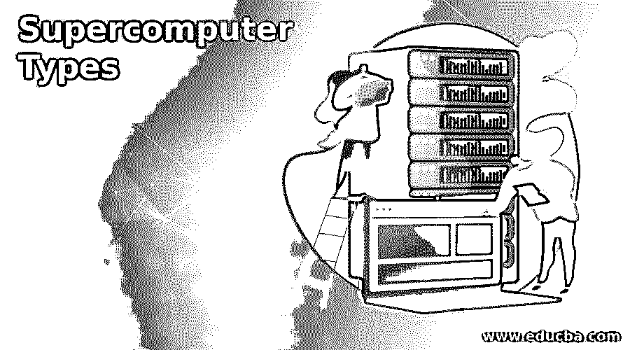

# 超级计算机类型

> 原文：<https://www.educba.com/supercomputer-types/>

## 超级计算机简介

下面的文章提供了超级计算机类型的概述。与通用计算机相比，超级计算机是一种用于执行一些高级功能的计算机。超级计算机在构建和操作方面有一些跟踪，这将同时执行以获得更好的性能，特别是在科学和浮点计算方面。美国、中国、日本和其他国家都在竞相在超级计算机中创造最强大和最高速的处理能力。超级计算机由许多浮点运算组成；它使用基于 Linux 的操作系统来执行它的大部分功能。

### 不同类型的超级计算机

基本上，有两种类型的超级计算机每天都在存在和发展，它们是:

<small>网页开发、编程语言、软件测试&其他</small>

*   通用超级计算机
*   专用超级计算机

#### 1.通用超级计算机

其他通用超级计算机可分为:

*   向量处理超级计算机
*   紧密连接的集群计算机
*   商用电脑

**a .向量处理超级计算机**

*   向量处理超级计算机是一种用于阵列或向量处理的超级计算机，它充当 CPU，可以快速对一组数据元素执行一些数学运算，从可访问性的角度来看，使整个超级计算机更快。这种处理器依赖于数组和向量，其行为与标量处理超级计算机完全相反。标量计算机是可以执行任何操作的计算机类型，并且一次只能处理任何元素。早在 20 世纪 80 年代和 90 年代，标量处理器曾经是当时的超级计算机，但现在它只需要一些与向量处理相关的 CPU。基本上，接受指令的 CPU 包含一个指令集，它可以在任何一维数组上执行，并对单个数据项进行操作。
*   向量处理器还使用某些指令，这些指令是多数据集的形式，这样的指令集被称为 SIMD 指令，大多数向量处理超级计算机都经常使用这些指令。向量处理超级计算机的例子有 SSE 和 Intels x86 的 MMX。然而，传统微处理器的性价比导致这种超级计算机的使用量减少，可能是在 20 世纪 90 年代左右。因此，许多 CPU 设计还包括由多个数据集组成的指令，也称为 MIMD 和超长指令字。使用这种组合的超级计算机的一个例子是富士通 FR-V。

**b .紧密连接的集群计算机**

*   紧密连接的集群计算机是一种超级计算机，它使用连接在一起的计算机作为一个单元来执行任务。这些群集计算机可以是基于控制器的群集、大规模并行群集、多节点群集和双节点群集。最流行和最流行的集群节点包括具有 Linux 操作系统和用于其并行实现的免费软件的集群节点。开放式 SSI 和网格系统也是为映像提供单一系统功能的群集类型。存在基于控制器的集群和并行集群，它们的行为几乎相同，但它们之间的变化和即兴创作很少，就像它们提高了性能和容错能力一样，而用于超级计算机的并行集群有大量处理器工作来解决一组并行指令和计算。
*   ILLIAC IV 成为第一台拥有 64 个处理器和超过 200 个 MFLOPS 的并行计算机。当许多微处理器、高速网络和高性能分布式计算存在时，计算机集群的主要概念就出现了。集群通常用于即兴创作和计算机性能目的，这些计算机比单个计算机成本更高，但在容错方面具有重要意义，因为如果一个系统出现故障，集群中的其他系统可以防止异常情况发生，从而避免工作完全崩溃。灾难恢复和可以减少冗余的业务节点期待集群超级计算机，因为在出现故障时会提供帮助。它对于错误处理也很有用，因为集群有助于解决系统或程序中的许多错误循环。一些例子还包括 IBM 的红杉。

**c .商品电脑**

*   商用计算机也是人们使用的超级计算机类型，主要用于拥有高带宽和较低延迟的标准连接中的局域网连接。此外，它们还用于超级计算机之间的互连，以建立计算机之间的成功通信。它们也被称为商用集群计算，它涉及许多预先存在的可用于并行计算的计算设备，从而降低了有用的计算成本。
*   商品计算是在超小型计算机的成本最小化过程中进行操作的。用于商用计算机计算的供应商产品使用标准化，这有助于提高成本，减少与其他供应商的差异，降低成本，提高整体效率。1981 年发布的 IBM PC 取代并收购了苹果，苹果描绘了商品计算的完美范例，从而发明了用于其他操纵和工作的 VisiCalc 应用程序。

#### 2.专用计算机

另一方面，专用计算机与通用超级计算机相比有如下不同之处:

*   顾名思义，专用计算机是为了实现特定的范围或目标而构建的。
*   专用计算机的特殊性在于它与专用集成电路一起使用，后者能提供更好的性能。
*   所有基于游戏的软件或应用程序，如 Hydra Deep，blue，用于玩游戏，如下棋，设计分子链和结构，使用专用超级计算机进行各种活动和操作。

### 结论–超级计算机类型

超级计算机有一些与它们相关的优点和缺点，它们被用在许多方面。开发人员试图采用这些超级计算机时，他们有一个特定的目的或一般也。他们已经很好地进化到现在，并且每天都在增强。努力放在即兴发挥和提高效率上。

### 推荐文章

这是超级计算机类型指南。为了更好地理解，我们在这里讨论简介和不同的超级计算机类型。您也可以看看以下文章，了解更多信息–

1.  [计算机硬件的类型](https://www.educba.com/types-of-computer-hardware/)
2.  [计算机的部件](https://www.educba.com/components-of-computers/)
3.  [计算机输出设备](https://www.educba.com/computers-output-devices/)
4.  [大型计算机的种类](https://www.educba.com/types-of-mainframe-computers/)

