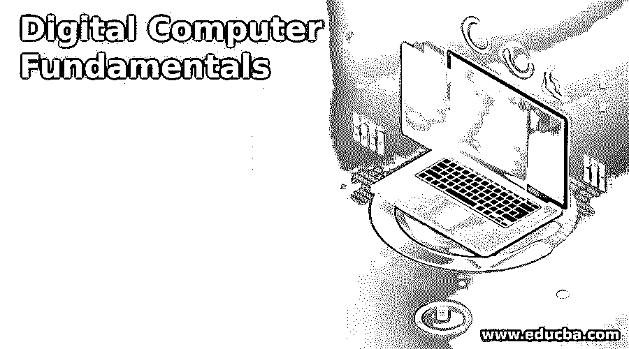

# 数字计算机基础

> 原文：<https://www.educba.com/digital-computer-fundamentals/>

## 数字计算机导论

以下文章提供了数字计算机基础的概要。一种电子系统，其输入是以数字或字母的形式给出的，而不是连续输入，输入数据以二进制数字的形式出现，这种系统称为数字计算机。数字计算机中的数据只以 0 和 1 的二进制形式处理，即使输入的数据是任何其他形式的。无论是输入字符还是修改字符，这些值总是有限的，即数字计算机只能将有限数量的字符作为信息，并且这些字符在内部被有限数量的字符再次修改。这里是 0 和 1。

### 各种数字计算机基础

下面给出了各种数字计算机的基本原理:

<small>网页开发、编程语言、软件测试&其他</small>

*   数字计算机用二进制数字 0 和 1 进行所有运算。因此，无论用户输入什么，都会存储在存储器中，并转换为二进制数字进行处理，操作是根据存储单元中的指令执行的。用户收到的输出将是他们输入的算术或字符。所有这些信息都储存在电脑里。
*   数字计算机的功能部件可以分为四类:输入输出部件(I/O 部件)、算术逻辑部件(ALU)、存储部件和控制部件。用户通过键盘输入，输出通过显示器显示。ALU 对数据进行逻辑运算，并通过显示器将结果显示给用户。存储单元存储用户输入的所有数据，控制单元向所有单元发出处理数据的指令。
*   输入输出单元有以下设备:键盘、鼠标、扫描仪、打印机、麦克风、条形码阅读器、扬声器、投影仪等。辅助存储设备用于用户输入的输入的即时存储。称为辅助存储器或外部存储器，文档数据、多媒体或任何数据都可以存储在辅助存储器中。这是外部存储器，RAM 计算不包括在此存储器中。按照设计，它可以被移除。数据可以永久保存在这里，需要时可以随时检索。
*   算术和逻辑单元是计算机系统的主要单元，它执行所有的逻辑和算术运算。这个组件完成所有的计算和数据处理。这个组件中有算术和逻辑部分。此外，移位操作由 ALU 完成，根据用户的需要，将位向左或向右移位一位。如果必须执行复杂的运算，ALU 应该是强大的，因此 CPU 也应该是强大的，以便与 ALU 进行交互。这使得 CPU 成本很高。ALU 和 CPU 之间应该有一个平衡，帮助管理用户所需的操作，并保持系统的成本。
*   系统的存储由存储单元计算。我们用比特和字节来衡量系统中存储单元的容量。这些是基本的构建模块，我们有千字节、兆字节、千兆字节和兆兆字节。一位代表数据大小，一个字节代表数据项或任何其他整数或字符的大小。字符总是以位的形式存储，这有助于 ALU 单元检索和使用信息进行进一步处理。内存是以字节的形式来衡量的，因此在记录数据时可以正确地定义数据。半字节也表示存储，其中半字节是 4 位。字也是一个存储单元，它表示固定的位组合。对于不同的系统是不同的。
*   处理器的操作由 CPU 中的控制单元控制。指令被提供给 ALU，并且遵循这些指令的方法由控制单元解释给这些单元。如果指令是算术指令，则由控制单元从存储单元中取出并取至 ALU。大多数计算机的工作原理是把运算器和控制器结合在一起，存储器在外部。这就是所谓的中央处理器。CPU 执行所有操作，因为它具有存储、控制和数据处理功能。控制单元管理所有单元。
*   对于几乎任何给数字计算机的方程，我们都能得到一个恰当的、精确的答案。然而，只有计算机能解释机器语言，因此输入被转换成二进制数字。
*   计算机主要用于铁路、办公室、教育机构等。是数字计算机，这些计算机被称为第五代计算机。它们几乎能完成任何操作，因此比模拟计算机更有用。我们可以使用数字计算机进行技术和科学研究，个人使用，或使用遥控器管理任何系统。
*   离散信号用于传输数字计算机的数据。这些信号可以在没有任何信号衰减的情况下传输。此外，用户可以用很少的程序和指令使数字计算机像模拟计算机一样运行。为了用户的利益，机器语言和把它转换成可读语言的整个过程使它具有吸引力。模拟另一方面，模拟装置不容易使用，并且需要时间来输入。
*   通过修改系统中编写的程序，我们可以将一个数字系统用于多种应用。这有助于用户重复使用该系统，从而降低成本。数字系统比任何其他系统都可靠，因为程序在系统中运行良好。如果有人知道布尔运算和数字编程，他们可以设计整个系统。但是模拟系统不可能那么容易设计。这使得数字系统有别于其他系统。如果在编程中出现任何错误，数据操作可以很容易地完成。

### 结论

如果数据放错了位置，数据操作很容易完成，这对于系统面临黑客或病毒威胁的用户来说是一个缺点。数字计算机消耗更多的能量，因此产生更多的热量。数字计算机用户需要对机器语言和编程有一个基本的了解。除了这些缺点之外，数字计算机总是因为易于分析和工作而受到用户的青睐。

### 推荐文章

这是一本数字计算机基础指南。这里我们分别讨论入门和各种数字计算机基础。您也可以看看以下文章，了解更多信息–

1.  [计算机图形学的应用](https://www.educba.com/application-of-computer-graphics/)
2.  [计算机端口](https://www.educba.com/computer-ports/)
3.  [计算机的部件](https://www.educba.com/components-of-computers/)
4.  [计算机输入设备](https://www.educba.com/computer-input-devices/)

