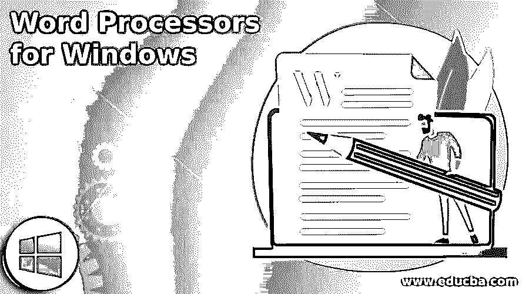

# Windows 文字处理器

> 原文：<https://www.educba.com/word-processors-for-windows/>

## Windows 文字处理器简介

以下文章提供了 Windows 文字处理程序的概述。当输入被提供时，用于编辑和格式化文本的计算机程序被称为字处理器，以便在字处理页中可以看到输出，帮助用户修改或分析文本以满足进一步的要求。最初，我们有不依赖于系统就能工作的文字处理设备，但是现在，大多数文字处理器与系统一起工作，因此它是一个软件程序。我们不能把文字处理器单独称为文本编辑器，因为它可以帮助创建文档，然后根据需求进行编辑。

### 各种文字处理器

Windows 中使用最多的文字处理器是 Microsoft Word。预装后，我们可以享受文字编辑器的特权，拥有所有的特性和导入功能。我们还可以免费使用 Microsoft Word online，不收取任何额外费用。我们在微软的文字处理器中有各种类型的字体和不同的编辑能力。我们可以在 word 文档中添加视觉效果，并在需要的地方添加图像。此外，我们可以将 PowerPoint 或 paint 文档修改成 word 文档，并在其中进行必要的更改。可以添加表格，如果文件是虚拟保存的，我们可以从任何地方访问这些文件。

<small>网页开发、编程语言、软件测试&其他</small>

尽管我们熟悉 Windows 中的 Microsoft word，但我们还有其他可以免费使用的文字处理软件。

#### 1.谷歌文档

*   这是微软 Word 的最佳选择，因为它对所有拥有谷歌账户的人都是免费的。我们没有 Microsoft Word 的所有复杂功能，但这是那些需要快速编辑电子邮件中的文档或系统中没有预装 Microsoft Word 的人的首选应用程序。在 google docs 中编辑过的文档保存在 Google drive 中，这样就可以从任何同步了 Google Drive 的设备上访问这些文档。
*   我们在 Google Docs 中编辑的所有文档都自动保存在 Google Drive 中，因此我们不必担心文档未保存。此外，将任何类型的文档导入谷歌文档都很容易。这允许我们将文档下载到本地驱动器，并在本地用于任何其他目的。此外，如果我们想与他人共享文档，我们可以通过 Google Drive 这样做，我们可以与他们实时协作，以便在处理文档时节省时间。
*   由于功能较少，大多数人不喜欢这个应用程序，但如果我们对 Word 文档的功能需求很少，这是一个很好的应用程序。

#### 2.OpenOffice Writer

*   与 Microsoft Word 相似，但应用程序中没有功能区，Apache 的 OpenOffice Writer 是许多讨厌 Microsoft 2003 年后更新的人的首选。文档格式与 Microsoft Word 不同，但我们可以导入 OpenOffice 将格式化的任何文档文件。
*   我们在 OpenOffice Document 中拥有大部分的 Microsoft Word 功能，这样我们就可以在 OpenOffice 中轻松地编辑 doc 或 docx 文件。然而，如果一个人更喜欢对文档的云支持或者想要在线编辑文档，OpenOffice 不能被考虑，因为它没有任何云支持。我们可以使用 Google Drive 或其他任何云来存储 OpenOffice 文档，并在需要时随时使用；OpenOffice 本身没有云。

#### 3.图书馆作家

*   这也是一个普通的文字处理器，功能有限，用户可以利用所有的功能，准备或编辑一个 Word 文档。界面风格和与其他云提供商的合作使其类似于 OpenOffice editor。所有功能都差不多，选择 LibreOffice 还是 OpenOffice 看自己。
*   这种格式不同于其他 word 文档，但它支持将任何文档导入到编辑器中，这使得任何人使用其他文字处理程序都很容易。虽然这里并不支持所有的特性，但是我们在查看文档时会面临一些挑战，但是我们可以很容易地进行修改。
*   我们有一个强大的 LibreOffice editor 社区，使得它在界面和后端编码方面非常强大。这有助于处理器根据用户的输入进行改进，并使其对不需要任何许可的初学者更有用。由于它的轻量级和社区支持，使用它和其他文字处理器一样安全。它不可能在应用程序中隐藏任何黑客代码，因为应用程序被持续监控，并且社区增加了功能。

#### 4.WPS Office 编辑器

*   在 WPS Editor 中，我们拥有微软 Word 的所有功能和云支持，但我们没有像谷歌文档那样的在线协作。这是免费提供的，许多想念微软 Word 的人更喜欢它的众多功能。WPS oIn addition 提供终身价格为 120 美元的高级许可证。
*   如果我们不想为文字处理器付费，我们可以免费使用它，但当我们试图使用任何功能(如将文档导入应用程序)时，中间会有 10 秒钟的广告。另一方面，高级版没有广告，使编辑与 WPS office 合作变得容易。
*   我们甚至可以在手机上使用 WPS office 来校对和编辑文档，而这种能力是大多数文字处理器所不具备的。

### 结论

如果你仍然喜欢微软的 Word，在线版本也有微软 Word 的有限功能。我们可以在线编辑，并将其保存到一个名为 OneDrive 的微软云平台中，以便在需要时在本地工作。我们可以下载它，并在系统中预装的微软 word 中工作，这样我们就不会像使用其他文字处理器那样面临任何格式问题。所有上述文字处理器都可以在 Windows 中轻松、舒适地工作，并且可以根据用户的要求选择任何存储选项。微软 Word 并不是 Windows 中文字处理器的最后答案。我们可以编写或编辑一个文档，并使它在视觉上让任何人都满意。

### 推荐文章

这是 Windows 文字处理器指南。这里我们分别讨论入门和各种文字处理器。您也可以看看以下文章，了解更多信息–

1.  [文件格式](https://www.educba.com/file-formats/)
2.  [Windows 监控工具](https://www.educba.com/windows-monitoring-tool/)
3.  [Windows 10 创建工具](https://www.educba.com/windows-10-creation-tool/)
4.  [t 中间窗口大小](https://www.educba.com/tkinter-window-size/)

