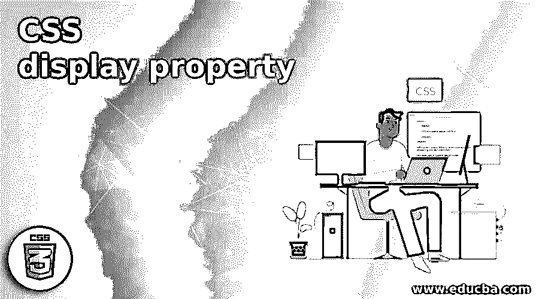
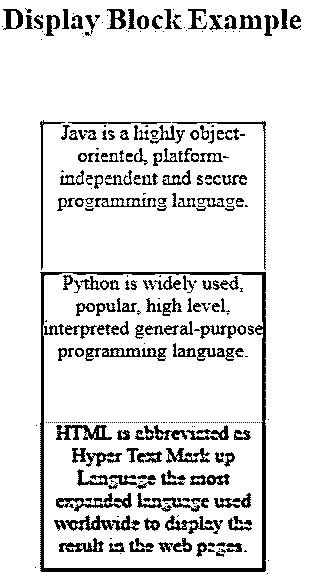
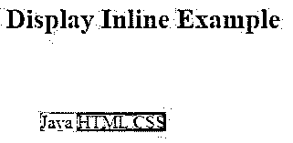
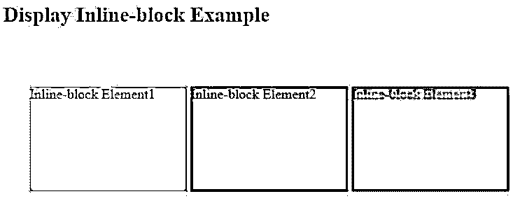

# CSS 显示属性

> 原文：<https://www.educba.com/css-display-property/>




## CSS 显示属性介绍

CSS 显示属性规定了元素的显示行为。简单地说，这个属性在 CSS 中描述了像 div、超链接、标题等组件。，应该放在网页上。顾名思义，这种属性将用于描述网页不同部分的视图。

显式地，display 属性确定元素的内部和外部显示类型。外部类型旨在设置元素在流布局中的参与；内型想定孩子的布局。此外，其他几个显示值也有其特定的定义。

<small>网页开发、编程语言、软件测试&其他</small>

### CSS 显示属性的语法和参数

CSS 中显示属性语法可以写成如下所示:

```
display: value;
```

以下是显示属性使用的参数:

*   **inline:** 一个元素会被用来显示为一个 inline 元素。
*   **block:** 用于将一个元素作为块元素来查看。
*   **内容:**移除容器。
*   **flex:** 用于在块级别查看作为 flex 容器的元素。
*   **grid:** 这用于在块级别将元素视为网格容器。
*   **inline-block:** 这用于在内联级别将元素视为块容器。
*   **inline-flex:** 这用于在内联级别查看作为 flex 容器的元素。
*   **inline-grid:** 这用于在内联级别查看作为网格容器的元素。
*   **列表项:**用于显示<李>元素中的所有元素。
*   **表:**用于将所有元素的行为定义为<表>。
*   **table-caption:** 对于所有元素，行为被设置为< caption >。
*   **表-列-组:**对于所有元素，行为被设置为<列>。
*   **table-header-group:** 对于所有元素，行为设置为<表头>。
*   **表-表尾-组:**对于所有元素，行为设置为<表尾>。
*   **表-行-组:**对于所有元素，行为设置为<行>。
*   **表格单元:**对于所有元素，行为设置为< td >。
*   **table-column:** 对于所有元素，行为设置为< col >。
*   **table-row:** 对于所有元素，行为设置为< tr >。
*   **无:**用于消除元素。
*   **初始:**用于放置默认值。
*   **继承:**它从父元素中继承元素。

```
For instance,
p {
display: inline;
}
```

### 如何在 CSS 中显示属性？

*   HTML 中的默认显示属性值取自 HTML 标准或浏览器/用户的默认样式表。
*   创建块级元素行为的 CSS 显示值是 block、list-item、table。
*   块级元素提供垂直方向上不同的文档行，文档前后有一个换行符。
*   诸如< div >、< p >、< h1 >、< h2 >等 HTML 元素传统上显示块动作。

### CSS 显示属性的示例

下面是 CSS 显示属性的示例:

#### 示例#1

**代码:**

```
<!DOCTYPE html>
<html lang="en">
<head>
<meta charset="utf-8">
<title> CSS Display Property Example </title>
<style>
.main {
margin:30px;
text-align:center;
}
#para1{
height: 120px;
width: 180px;
background: darksalmon;
display: block;
}
#para2{
height: 120px;
width: 180px;
background: olive;
display: block;
}
#para3{
height: 120px;
width: 180px;
background: fuchsia;
display: block;
}
</style>
</head>
<body>
<h2> Display Block Example </h2>
<br>
<div class = "main">
<div id="para1"> Java is a highly object-oriented, platform-independent and secure programming language. </div>
<div id="para2"> Python is widely used, popular, high level, interpreted general-purpose programming language. </div>
<div id="para3"> HTML is abbreviated as Hyper Text Mark up Language the most expanded language used worldwide to display the result in the web pages.</div>
</div>
</body>
</html>
```

**输出:**




在上面的例子中，我们使用 block property 来显示块结构中的元素。该属性将 div 一个接一个地垂直放置。使用 block 属性，可以改变 div 的高度和宽度。如果没有描述宽度，那么 block 属性下的 div 将占用容器宽度。因此，这三个 div 块将用指定的颜色以及指定的高度和宽度属性来定义。

#### 实施例 2

**代码:**

```
<!DOCTYPE html>
<html lang="en">
<head>
<meta charset="utf-8">
<title> CSS Display Property Example </title>
<style>
.main {
margin:30px;
}
#para1{
background: darksalmon;
display: inline;
}
#para2{
background: olive;
display: inline;
}
#para3{
background: fuchsia;
display: inline;
}
</style>
</head>
<body>
<h2> Display Inline Example </h2>
<br>
<div class = "main">
<div id="para1"> Java </div>
<div id="para2"> HTML </div>
<div id="para3"> CSS </div>
</div>
</body>
</html>
```

**输出:**




在上面的例子中，我们使用内联属性值，它显示了内联结构。此外，它以水平方式放置元素。该属性忽略用户设置的高度和宽度。

#### 实施例 3

**代码:**

```
<!DOCTYPE html>
<html lang="en">
<head>
<meta charset="utf-8">
<title> CSS Display Property Example </title>
<style>
.main {
margin:30px;
}
#para1{
height: 120px;
width: 180px;
background: darksalmon;
display: inline-block;
}
#para2{
height: 120px;
width: 180px;
background: olive;
display: inline-block;
}
#para3{
height: 120px;
width: 180px;
background: fuchsia;
display: inline-block;
}
</style>
</head>
<body>
<h2> Display Inline-block Example </h2>
<br>
<div class = "main">
<div id="para1"> Inline-block Element1 </div>
<div id="para2"> Inline-block Element2 </div>
<div id="para3"> Inline-block Element3 </div>
</div>
</body>
</html>
```

**输出:**




在上面的例子中，我们使用 inline-block 属性在同一行中创建块框，并设置 div 元素的高度和宽度。因此，创建的块元素将被视为内嵌框。

#### 实施例 4

**代码:**

```
<!DOCTYPE html>
<html lang="en">
<head>
<meta charset="utf-8">
<title> CSS Display Property Example </title>
<style>
body {
display: inline;
}
p {
display: inherit;
color: red;
}
</style>
</head>
<body>
<h2> Display Inherit Example </h2>
<br>
<p> EDUCBA is a leading global provider of skill based education. </p>
<p> It is online learning model along with amazing 2500+ courses. </p>
</body>
</html>
```

**输出:**


在上面的例子中，我们使用了 inherit 属性，它从父元素继承属性。为了利用这个属性，我们已经将 body 设置为 inline 属性，这将两个段落放在一行中。

### 结论

到目前为止，我们看到了显示属性，这是 CSS 中最重要和最有效的属性之一。这非常有助于使网页看起来与众不同，但仍然符合 web 标准。web 页面将每个 HTML 条目识别为一个框，并使用 display 属性，我们决定如何显示某些框，或者是显示还是隐藏它们。

### 推荐文章

这是一个 CSS 显示属性的指南。这里我们讨论一下入门，CSS 中的显示属性是如何工作的？并附有示例。您也可以看看以下文章，了解更多信息–

1.  [CSS 水平对齐](https://www.educba.com/css-horizontal-align/)
2.  [CSS 行](https://www.educba.com/css-row/)
3.  [CSS 3D 变换](https://www.educba.com/css-3d-transforms/)
4.  [CSS 伪元素](https://www.educba.com/css-pseudo-elements/)


