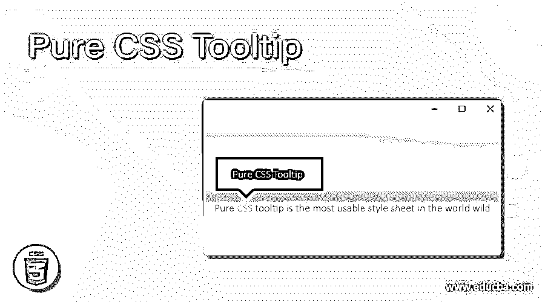
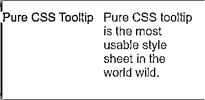
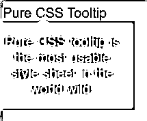
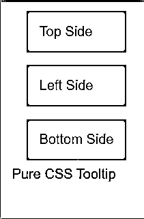

# Pure CSS Tooltip

> 原文：<https://www.educba.com/pure-css-tooltip/>




## 纯 CSS 工具提示介绍

*   这是一个使用悬停效果访问任何小信息的元素。
*   它在将鼠标停留在所需位置后显示消息。
*   这是一个纯类，使用 CSS hover 显示项目的微小消息。
*   它的功能是将 CSS 悬停效果应用于图像、项目或网页链接，并显示相关信息。
*   它是一个动画功能，带有 web 应用程序 web 元素或 web 链接的消息框。

**语法:**

*   (HTML 页面)语法如下。

```
<P class = "tooltip" > Pure CSS Tooltip
 Pure CSS tooltip is the most usable style sheet in the world wild. 
</P>
```

**描述:**

<small>网页开发、编程语言、软件测试&其他</small>

*   class = "tooltip "用于选择项目以创建悬停效果。
*   class = "tooltiptext "用于在工具提示框中创建一条消息。
*   的。顶，。底部，。左转然后。右键用于选择工具提示框方向。

*   (样式页面)语法如下。
    *   在悬停效果应用于 tooltip 类之前，tooltiptext 会被隐藏。

```
.tooltip .tooltiptext {
top: -10px;
left: 55px;
position: absolute;
visibility: hidden;
}
```

*   在 tooltip 类中应用悬停效果后，tooltiptext 变得可见。

```
.tooltip:hover .tooltiptext {
visibility: visible;
}
```

*   方向(HTML 页面)语法如下。
    *   顶层语法如下。

```
<P class = "tooltip top" > Pure CSS Tooltip </P>
```

*   底部语法如下。

```
<P class = "tooltip bottom" > Pure CSS Tooltip </P>
```

*   左边的语法如下。

```
<P class = "tooltip left" > Pure CSS Tooltip </P>
```

*   右边的语法如下。

```
<P class = "tooltip right" > Pure CSS Tooltip </P>
```

*   方向(样式页)语法如下。
    *   右边的语法如下。

```
.tooltip .tooltiptext {
bottom: 20px;
left: 50px;
}
```

*   顶部语法中的文本如下。

```
.tooltip .tooltiptext {
width: 150px;
bottom: 20px;
left: 50px;
margin-left: -70px;
}
```

### 纯 CSS 工具提示是如何工作的？

*   框架中有两个 pure.css 链接。这些有响应和无响应的链接如下。
    *   pure.css 响应式框架链接被添加到 HTML 文件中。

```
<link rel="stylesheet" href="https://unpkg.com/purecss@2.0.3/build/base-min.css">
```

*   pure.css 非响应框架链接被添加到 HTML 文件中。

```
<link rel="stylesheet" href="https://unpkg.com/purecss@2.0.3/build/pure-nr-min.css">
```

*   responsive framework 的 pure.css 备用 CDNs 文件被添加到 HTML 文件中。

```
<link rel="stylesheet" href="https://cdnjs.cloudflare.com/ajax/libs/pure/2.0.3/pure-min.css"/>
```

*   语法添加到网页中。

```
<P class = "tooltip" > Pure CSS Tooltip
 Pure CSS tooltip is the most usable style sheet in the world wild. 
</P>
```

*   html 页面中添加了 tooltiptext 语法..工具提示。工具提示文本{

```
 top: -10px;
left: 55px;
position: absolute;
visibility: hidden;
}
.tooltip:hover .tooltiptext {
visibility: visible;
}
```

*   结合工作流程，做一个工具提示的演示。

```
<!DOCTYPE html>
<html>
<meta name = "viewport" content = "width = device-width, initial-scale = 1">
<link rel="stylesheet" href="https://unpkg.com/purecss@2.0.3/build/pure-min.css">
<style>
.tooltip {
color:blue;
position: relative;
display: inline-block;
}
.tooltip .tooltiptext {
top: -10px;
left: 55px;
position: absolute;
border-radius: 6px;
padding: 10px 10px;
visibility: hidden;
width: 120px;
background-color: yellow;
color:blue;
}
.tooltip:hover .tooltiptext {
visibility: visible;
}
</style>
<body>
<P class="tooltip"> Pure CSS Tooltip
 Pure CSS tooltip is the most usable style sheet in the world wild. 
</P>
</body>
</html>
```

### 例子

让我们讨论一下例子。

#### 示例#1:带有方向示例和输出的基本纯 CSS 工具提示

**代码:**

```
<html>
<meta name = "viewport" content = "width = device-width, initial-scale = 1">
<link rel="stylesheet" href="https://unpkg.com/purecss@2.0.3/build/pure-min.css">
<style>
.tooltip {
color:blue;
position: relative;
display: inline-block;
}
.tooltip .tooltiptext {
top: -10px;
left: 125px;
position: absolute;
border-radius: 6px;
padding: 10px 10px;
visibility: hidden;
width: 120px;
background-color: yellow;
color:blue;
}
.tooltip:hover .tooltiptext {
visibility: visible;
}
</style>
<body>
<P class="tooltip right"> Pure CSS Tooltip
 Pure CSS tooltip is the most usable style sheet in the world wild. 
</P>
```

**输出:**




#### 示例#2:箭头和底部消息框示例和输出

**代码:**

```
<!DOCTYPE html>
<html>
<meta name = "viewport" content = "width = device-width, initial-scale = 1">
<link rel="stylesheet" href="https://unpkg.com/purecss@2.0.3/build/pure-min.css">
<style>
.tooltip {
color:blue;
position: relative;
display: inline-block;
}
.tooltip .tooltiptext {
visibility: hidden;
width: 150px;
background-color: orange;
color: white;
text-align: center;
padding: 15px 10px;
position: absolute;
top: 100%;
left: 45%;
margin-left: -70px;
}
.tooltip .tooltiptext::after {
content: "";
position: absolute;
margin-left: -2px;
border-width: 10px;
bottom: 100px;
left: 55px;
border-style: solid;
border-color: transparent transparent orange transparent;
}
.tooltip:hover .tooltiptext {
visibility: visible;
}
</style>
<body>
<P class="tooltip"> Pure CSS Tooltip
 Pure CSS tooltip is the most usable style sheet in the world wild. 
</P>
```

**输出:**




#### 示例 3:多个消息框示例和输出

**代码:**

```
<!DOCTYPE html>
<html>
<head>
<meta name = "viewport" content = "width = device-width, initial-scale = 1">
<link rel="stylesheet" href="https://unpkg.com/purecss@2.0.3/build/pure-min.css">
<style>
body {
display: flex;
align-items: center;
flex-direction: column;
justify-content: center;
height: 500px;
}
.tooltip {
background-color: orange;
padding: 15px 15px;
position: relative;
margin: 15px;
}
.tooltip::after {
background-color: yellow;
color: black;
display: none;
position: absolute;
z-index: 999;
width: 150px;
height:50px;
}
.tooltip::before {
background-color: yellow;
content: ' ';
display: none;
position: absolute;
width: 15px;
height: 15px;
z-index: 999;
}
.tooltip:hover::after {
display: block;
}
.tooltip:hover::before {
display: block;
}
.tooltip.top::before {
top: 0;
left: 50px;
transform: translate(-55%, calc(-98% - 1px)) rotate(46deg);
}
.tooltip.top::after {
content: 'Pure CSS Tooltip';
top: 0;
left: 50px;
transform: translate(-55%, calc(-98% - 8px));
}
.tooltip.left::before {
top: 50%;
left: 0;
transform: translate(calc(-98% - 3px), -55%) rotate(46deg);
}
.tooltip.left::after {
content: 'Pure CSS Tooltip';
top: 0;
left: 0;
transform: translateX(calc(-98% - 8px));
}
.tooltip.bottom::before {
bottom: 0;
left: 52%;
transform: translate(-52%, calc(98% + 3px)) rotate(45deg);
}
.tooltip.bottom::after {
content: 'Pure CSS Tooltip';
bottom: 0;
left: 52%;
transform: translate(-52%, calc(98% + 8px));
}
</style>
</head>
<body>
<div >
<p class="tooltip top"> Top Side </p>
<p class="tooltip left"> Left Side </p>
<p class="tooltip bottom"> Bottom Side </p>
</div>
</body>
</html>
```

**输出:**




### 结论

纯 CSS 工具提示传达一个单词、网络链接和元素的小消息帮助。这是一个使用鼠标指针显示的节省空间的消息框。它是用户友好的，易于获取信息，并按要求显示。

### 推荐文章

这是一个纯粹的 CSS 工具提示指南。这里我们讨论定义，纯 CSS 工具提示是如何工作的？，及其语法和示例。您也可以看看以下文章，了解更多信息–

1.  [CSS 单选按钮](https://www.educba.com/css-radio-button/)
2.  [CSS 偏移](https://www.educba.com/css-offset/)
3.  [CSS 指针事件](https://www.educba.com/css-pointer-events/)
4.  [CSS calc()](https://www.educba.com/css-calc/)


