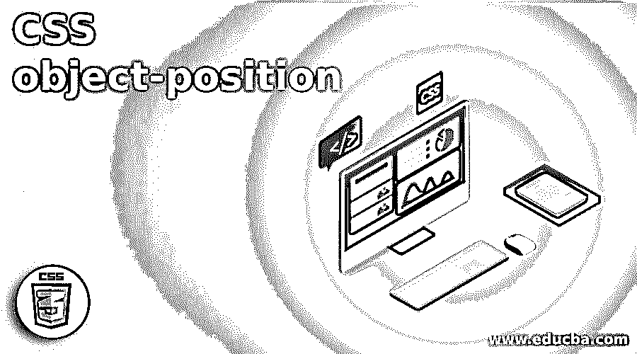
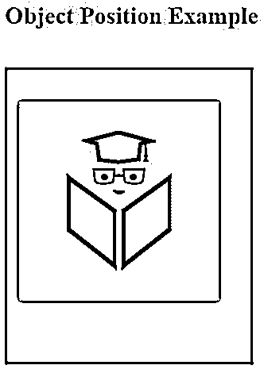
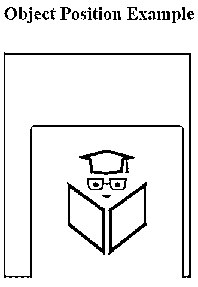
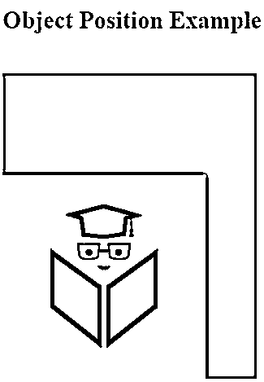
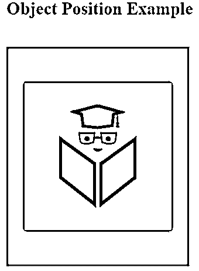
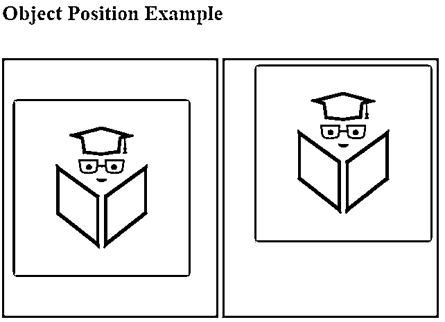

# CSS 对象位置

> 原文：<https://www.educba.com/css-object-position/>




## CSS 对象位置介绍

CSS object-position 属性规定了元素框内被替换元素内容的对齐方式。object-position 属性可以与 object-fit 属性一起使用，并描述 X / Y 如何在内容框中协调视频或图像等元素。object-position 属性的工作方式接近于 preserveAspectRatio < align >参数在 SVG 中的工作方式。object-position 属性用于定义嵌入 HTML 的外部媒体的大小和位置，主要是标签内的图像以及< video >、< iframe >或< embed >元素的内容。

**语法:**

<small>网页开发、编程语言、软件测试&其他</small>

CSS 对象位置属性的语法可以定义如下:

```
object-position: position|initial|inherit;
```

*   **位置:**该参数规定了图像或视频在其内容框内的位置。第一个值控制 x 轴，第二个值控制 y 轴。它可以是字符串(左、中或右)，也可以是数字(以像素或百分比表示)。负值被批准。
*   **initial:** 该参数有助于将其默认值设置为该属性。
*   **继承:**该参数从其父元素继承而来。

举个例子，

对象-位置:50% 50%；

它定义了内容框中间的图像。

### CSS 对象位置属性是如何工作的？

*   对象(图像或视频)必须如何适应其框的规范方法。对象适合选项包括“包含”(按纵横比适合)、“填充”(填充对象拉伸)和“覆盖”(溢出框但保持比例)，其中对象位置允许对象像背景图像一样重新定位。
*   object-fit 和 object-position 是两个重要的 CSS 属性，它们使开发人员能够控制图像或视频元素中的内容。object-position 属性帮助您在 HTML 中放置元素。
*   任何 HTML 特性都可以放在你想要的任何位置。您可以根据父项决定是相对于其自然位置还是绝对位置来放置页面上的项目。

### CSS 对象位置的示例

下面是提到的例子:

#### 示例#1

**代码:**

```
<!DOCTYPE html>
<html lang="en">
<head>
<meta charset="utf-8">
<title> CSS object-position Example </title>
<style>
img {
width: 250px;
height: 300px;
background-color: grey;
object-fit: none;
object-position: 15px 35px;
}
</style>
</head>
<body>
<h2> Object Position Example </h2><br>

</body>
</html>
```

**输出:**




在上面的例子中，CSS 样式已经与 object-fit 属性和 object-position 属性一起分配给 img 标记，object-fit 属性指定如何调整图像的大小以适合其容器，object-position 属性指定如何在内容框中用 x 或 y 坐标定位图像。在代码中，我们将对象位置设置为“15px ”,即从左侧开始的大部分，从顶部开始的大部分。

#### 实施例 2

对象位置将设置为 75% 100%的示例。

**代码:**

```
<!DOCTYPE html>
<html lang="en">
<head>
<meta charset="utf-8">
<title> CSS object-position Example </title>
<style>
img {
width: 250px;
height: 300px;
background-color: grey;
object-fit: none;
object-position: 75% 100%;
}
</style>
</head>
<body>
<h2> Object Position Example </h2><br>

</body>
</html>
```

**输出:**




在上面的例子中，我们已经设置了 75%的物体位置在盒子的左侧，100%在盒子的顶部。如上例所述，代码再次使用了对象适合和对象位置属性。

#### 实施例 3

现在我们将创建一个在内容框底部左侧显示图像的例子。

**代码:**

```
<!DOCTYPE html>
<html lang="en">
<head>
<meta charset="utf-8">
<title> CSS object-position Example </title>
<style>
img {
width: 250px;
height: 300px;
background-color: grey;
object-fit: none;
object-position: left bottom;
}
</style>
</head>
<body>
<h2> Object Position Example </h2><br>

</body>
</html>
```

**输出:**




在上面的例子中，我们将对象位置设置在底部的左侧。也就是说，图像将显示在从左侧开始的框的“左”大部分，在框的底部。

#### 实施例 4

**代码:**

```
<!DOCTYPE html>
<html lang="en">
<head>
<meta charset="utf-8">
<title> CSS object-position Example </title>
<style>
img {
width: 250px;
height: 300px;
background-color: grey;
object-fit: none;
object-position: initial;
}
</style>
</head>
<body>
<h2> Object Position Example </h2><br>

</body>
</html>
```

**输出:**




在上面的例子中，使用了初始属性，将元素设置为 50% 50%。即，默认情况下，图像将被放置在内容框的中间。initial 关键字添加具有属性初始值的元素。它在任何 CSS 属性上启用，并使元素使用为其定义的属性的初始值。

#### 实施例 5

**代码:**

```
<!DOCTYPE html>
<html lang="en">
<head>
<meta charset="utf-8">
<title> CSS object-position Example </title>
<style>
img {
width: 250px;
height: 300px;
background-color: grey;
object-fit: none;
object-position: inherit;
}
#img_obj{
object-position: 15px;
}
#img_obj1{
object-position: 80% 10%;
}
</style>
</head>
<body>
<h2> Object Position Example </h2><br>


</body>
</html>
```

**输出:**




第一个图像从元素框的左边缘开始放置，其左边缘插入 15 个像素。第二个图像靠着元素框的右边缘放置，其右边缘齐平，位于框高度的 10%下方。在上面的示例中，使用了 inherit property，它使用了父元素的属性。它使用 id '#img_obj1 '来设置内容框中的元素。

### 结论

到目前为止，我们已经看到了 object-position 属性是如何在不同的场景中使用的。由于对象位置和对象适合属性可能更有用，所以这取决于您支持的浏览器是否能在现实世界中实际使用它们。除 IE / Edge 之外的所有主流浏览器都支持对象匹配，除 IE / Edge 和 Safari 之外的所有主流浏览器都支持对象定位。对象拟合和对象位置可以解释为平行于图像属性的背景尺寸和背景位置。只有直接插入 HTML 的元素才需要这些。

### 推荐文章

这是一个 CSS 对象定位的指南。为了更好地理解，我们在这里讨论 CSS 对象位置属性如何与编程示例一起工作。您也可以看看以下文章，了解更多信息–

1.  [复选框 CSS](https://www.educba.com/checkbox-css/)
2.  [CSS 压缩器](https://www.educba.com/css-compressor/)
3.  [CSS 禁用](https://www.educba.com/css-disabled/)
4.  [CSS 文本笔划](https://www.educba.com/css-text-stroke/)


