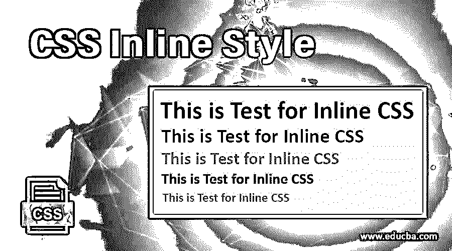
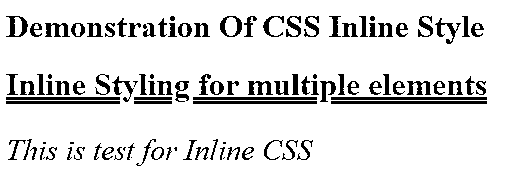
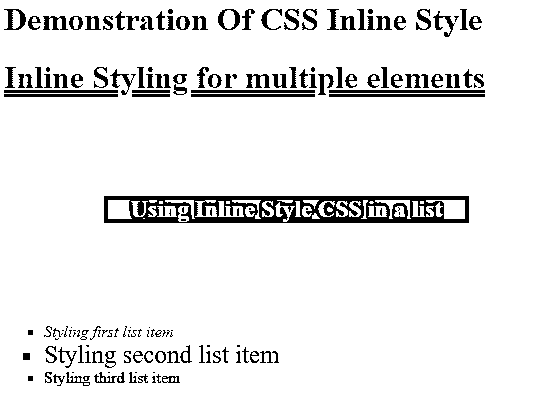
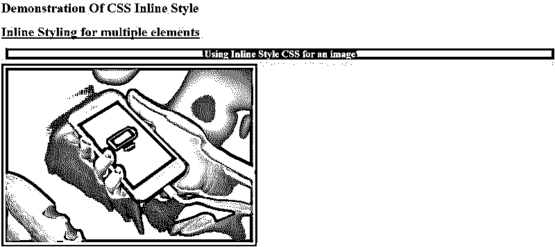

# CSS 内联样式

> 原文：<https://www.educba.com/css-inline-style/>




## CSS 内联样式介绍

级联样式表或 CSS 是一种样式表语言，它定义了 HTML 页面应该如何呈现。它基本上是对一段特定的标记语言代码的表示进行样式化。在任何 HTML 代码中包含 CSS 有三种方式，即外部、内部和内联。当我们在外部方法中调用页面中外部定义的样式表时，我们在内部方法中用相同的 HTML 代码在

<small>网页开发、编程语言、软件测试&其他</small>

#### 1.使用内联 CSS 样式化单个元素

*   基本 HTML 页面的代码
*   包括 HTML、head、body 标签。
*   在标签中，定义一个段落标签

    并使用样式属性来设置段落的样式。这可以通过以下方式实现:

```
<p style="color:blue; font-size:50px; font-style: italic;">This is test for Inline CSS</p>
```

**HTML 代码:**

```
<html>
<head>
<title>Inline CSS</title>
<h1>Demonstration Of  CSS Inline Style</h1>
</head>
<body>
<p style="color:blue; font-size:50px; font-style: italic;">This is test for Inline CSS</p>
</body>
</html>
```

**输出:**


#### 2.对多个元素使用内联 CSS

*   类似于示例 1，我们将创建一个带有基本 HTML 标签的 HTML 页面。
*   在正文中，我们首先定义标题标签，即

    # 。我们使用各种属性来样式化

    # 标签，比如文本修饰、文本修饰样式、颜色、字体粗细。

```
<h1 style="text-decoration: underline;text-decoration-style:double; color: crimson; font-weight: 400px;">Inline Styling for multiple elements</h1>
```

*   接下来，我们定义段落标签的样式，即

    ，在这里我们定义颜色、字体大小和字体样式。

```
<p style="color:red; font-size:30px; font-style: italic;">This is test for Inline CSS</p>
```

**HTML 代码:**

```
<html>
<head>
<title>Inline CSS</title>
<h1>Demonstration Of  CSS Inline Style</h1>
</head>
<body>
<h1 style="text-decoration: underline;text-decoration-style:double; color: crimson; font-weight: 400px;">Inline Styling for multiple elements</h1>
<p style="color:red; font-size:30px; font-style: italic;">This is test for Inline CSS</p>
</body>
</html>
```

**输出:**




**Note:** In the above two examples, we have used various properties on style attribute, such a font-weight, text-decoration. There are various other properties that can be looked upon. It will be a good idea to create a sample HTML page, and try as many style properties as possible, for the purpose of awareness and ease.

#### 3.使用内联样式 CSS 来设计 HTML 中的列表

*   在这个例子中，为了更好地理解 CSS 中的内联样式，我们将设计一个无序列表并定制每个列表项。
*   一旦我们创建了一个 HTML 页面的基本结构，我们将在主体中创建一个列表。由于这是一个无序列表，我们将使用标签

```
<ul style="list-style:square;">
```

*   现在，我们将自定义每个列表项，即
*   标签。请注意，在尝试代码时，可以向每个元素添加更多的属性来尝试不同的样式。

```
<li style="color:blue; font-style: italic;">Styling first list item</li>
<li style="color: purple; font-size: 25px;">Styling second list item</li>
<li style="color: green; font-weight: 400px;">Styling third list item</li>
```

**HTML 代码:**

```
<html>
<head>
<title>Inline CSS</title>
<h1>Demonstration Of  CSS Inline Style</h1>
</head>
<body>
<h1 style="text-decoration: underline;text-decoration-style:double; color: crimson; font-weight: 400px;">Inline Styling for multiple elements</h1>
<h2 style="background: royalblue; color: white; font-size: 40 px; margin: 100px; text-align:center;">Using Inline Style CSS in a list</h2>
<ul style="list-style:square;">
<li style="color:blue; font-style: italic;">Styling first list item</li>
<li style="color: purple; font-size: 25px;">Styling second list item</li>
<li style="color: green; font-weight: 400px;">Styling third list item</li>
</ul>
</body>
</html>
```

**输出:**




#### 4.使用内联样式 CSS 对图像进行样式化

*   我们可以使用内联样式的 CSS 为图像设置各种属性。
*   在这个例子中，我们将为图像设置一个边框。还有很多属性可以边练习边探索。
*   在编写完 HTML 页面的基本元素后，我们将样式化并根据我们的需求使用附加属性来调整图像的大小。

```

```

**HTML 代码:**

```
<html>
<head>
<title>Inline CSS</title>
<h1>Demonstration Of  CSS Inline Style</h1>
</head>
<body>
<h1 style="text-decoration: underline;text-decoration-style:double; color: crimson; font-weight: 400px;">Inline Styling for multiple elements</h1>
<h2 style="background: royalblue; color: white; font-size: 40 px; margin: 10px; text-align:center;">Using Inline Style CSS for an image</h2>

</body>
</html>
```

**输出:**




因此，在这篇文章中，讨论了各种各样的例子，展示了如何将内联风格的 CSS 应用到一个人的 HTML 项目中。但是，如果项目是高级的，并且需要严格的样式，建议必须使用外部样式表。这不仅简化了工作，而且恰当地构建了项目。如果项目很小，并且很少元素(本质上不是动态的)需要样式，可以使用内联 CSS。内联样式 CSS 是仅限于 HTML 页面元素的局部级别的更改。对于在全局层次上定义样式，使用外部样式表将是一个更好的主意。

### 推荐文章

这是一个 CSS 内联样式的指南。在这里，我们讨论了 CSS 内联样式的介绍和工作原理，以及示例和代码实现。您也可以阅读以下文章，了解更多信息——

1.  [CSS 分页](https://www.educba.com/css-pagination/)
2.  [CSS 选择器的类型](https://www.educba.com/types-of-css-selectors/)
3.  [CSS 字体属性](https://www.educba.com/css-font-properties/)
4.  [CSS 中的文本对齐](https://www.educba.com/text-align-in-css/)


