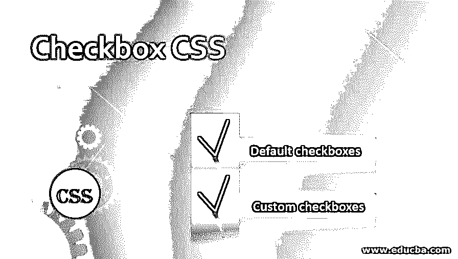
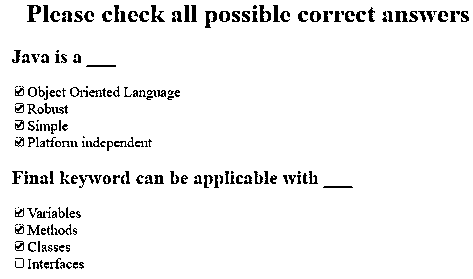
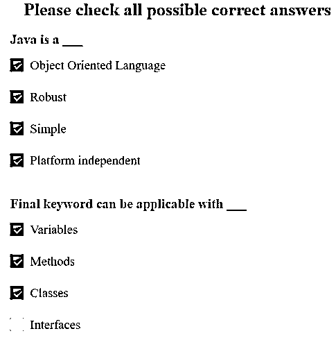
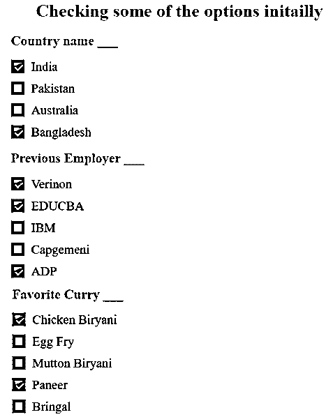

# 复选框 CSS

> 原文：<https://www.educba.com/checkbox-css/>




## 复选框 CSS 简介

CSS checkbox 用于一次从选项列表中选择多个选项。通常，复选框是方形的，框内有空间。当用户点击方框中的空格时，就表示选择被选中。当有人从给定的选项列表中选择多个选项时，复选框是最佳选择，但如果是单选按钮，我们一次只能选择一个单选按钮。

**实时示例**:假设在一次考试中，特定问题有 4 个选项。在更多问题中，如果有两个以上的选项是正确的。如果我们选择常规单选按钮，我们一次只能选择一个选项，但事实并非如此。我们必须一次选择两个以上的选项，所以我们必须使用复选框来实现这一要求。

<small>网页开发、编程语言、软件测试&其他</small>

**优势**

*   使用复选框**可以选择多个选项。**

### 复选框的类型

CSS 中有两种复选框

*   默认复选框
*   自定义复选框

#### 1.默认复选框

添加任何其他样式不需要默认复选框。默认情况下，CSS 库为这个复选框提供了一些样式。

**语法:**

```
<label>//Write some content here
<input type="checkbox" checked="checked">//checked="checked" will make checkbox checked
</label>
```

#### 2.自定义复选框

这个自定义复选框必须要求添加额外的样式，因为这是用户需要的复选框，所以根据他们的要求，他们必须提供 CSS 样式。

**语法:**

```
<style>
CSS Styles
/* topClass class styles*/
.topClass {
display: block;
cursor: pointer;
font-size: 22px;
-webkit-user-select: none;
-moz-user-select: none;
-ms-user-select: none;
user-select: none;
position: relative;
padding-left: 35px;
margin-bottom: 12px;
}
/* Hidden the default check box*/
.topClass input {
position: absolute;
cursor: pointer;
height: 0;
width: 0;
opacity: 0;
}
/* creating user custom contentMark */
.contentMark {
position: absolute;
height: 25px;
width: 25px;
background-color: #eee;
top: 0;
left: 0;
}
/* when hover the mouse green color will be added */
.topClass:hover input ~ . contentMark {
background-color: green;
}
/* When the checkbox is checked, add a blue background */
.toClass input:checked ~ . contentMark {
background-color: blue;
}
/* create checkmark, initially hidden if we not check*/
.contentMark:after {
position: absolute;
display: none;
content: "";
}
/* checked and showed if we check the box */
.topClass input:checked ~ . contentMark:after {
display: block;
}
/*It styles the contentMark class indicator */
.topClass. contentMark:after {
left: 9px;
top: 5px;
width: 5px;
-ms-transform: rotate(45deg);
border-width: 0 3px 3px 0;
-webkit-transform: rotate(45deg);
transform: rotate(45deg);
height: 10px;
border: solid white;
}
</style>
```

**HTML 代码:**

```
<label class="topClass">First Question
<input type="checkbox" checked="checked">

</label>
```

### 复选框 CSS 的示例

下面举几个例子

#### 示例#1

带问题和答案的默认复选框

**代码:**

```
<!DOCTYPE html>
<html>
<title>CSS checkbox</title>
<head>
<style>
h1
{
color: green;
text-align: center;
}
h2
{
color:blue;
}
label
{
color: brown;
font-size: 18px;
}
</style>
</head>
<body>
<h1>Please check all possible correct answers</h1>
<h2>Java is a ___</h2>
<label>
<input type="checkbox">Object Oriented Language
</label>
<br>
<label>
<input type="checkbox">Robust
</label>
<br>
<label>
<input type="checkbox">Simple
</label>
<br>
<label>
<input type="checkbox">Platform independent
</label>
<br>
<h2>Final keyword can be applicable with ___</h2>
<label>
<input type="checkbox">Variables
</label>
<br>
<label>
<input type="checkbox">Methods
</label>
<br>
<label>
<input type="checkbox">Classes
</label>
<br>
<label>
<input type="checkbox">Interfaces
</label>
</body>
</html>
```

**输出:**




#### 实施例 2

带有问题和答案的自定义复选框:

**代码:**

```
<!DOCTYPE html>
<html>
<style>
h1 {
color: green;
text-align: center;
}
h2 {
color: blue;
}
label {
color: brown;
font-size: 18px;
}
/* The labelClass */
.labelClass {
display: block;
position: relative;
padding-left: 36px;
margin-bottom: 13px;
-webkit-user-select: none;
-moz-user-select: none;
-ms-user-select: none;
user-select: none;
cursor: pointer;
-moz-user-select: none;
-ms-user-select: none;
user-select: none;
cursor: pointer;
font-size: 23px;
}
/* Hide the browser's default checkbox */
.labelClass input {
position: absolute;
height: 0;
width: 0;
opacity: 0;
cursor: pointer;
width: 0;
}
/* Create a custom checkbox */
.checkmark {
position: absolute;
top: 0;
height: 24px; width : 24px; background-color : pink;
left: 0;
width: 24px;
background-color: pink;
}
/* On mouse-over, add a grey background color */
.labelClass:hover input ~ .checkmark {
background-color: gray;
}
/* When the checkbox is checked, add a blue background */
.labelClass input:checked ~ .checkmark {
background-color: brown;
}
/* Create the checkmark/indicator (hidden when not checked) */
.checkmark:after {
content: "";
position: absolute;
display: none;
}
/* Show the checkmark when checked */
.labelClass input:checked ~ .checkmark:after {
display: block;
}
/* Style the checkmark/indicator */
.labelClass .checkmark:after {
left: 10px;
top: 6px;
-webkit-transform: rotate(46deg);
-ms-transform : rotate( 46deg);
transform : rotate( 46deg);
width: 6px;
height: 11px;
border: solid white;
border-width: 0 2px 2px 0;
-ms-transform: rotate(46deg);
transform: rotate(46deg);
}
</style>
<body>
<h1>Please check all possible correct answers</h1>
<h2>Java is a ___</h2>
<label class="labelClass"> <input type="checkbox">Object
Oriented Language 
</label>
<br>
<label class="labelClass"> <input type="checkbox">Robust

</label>
<br>
<label class="labelClass"> <input type="checkbox">Simple

</label>
<br>
<label class="labelClass"> <input type="checkbox">Platform
independent 
</label>
<br>
<h2>Final keyword can be applicable with ___</h2>
<label class="labelClass"> <input type="checkbox">Variables

</label>
<br>
<label class="labelClass"> <input type="checkbox">Methods

</label>
<br>
<label class="labelClass"> <input type="checkbox">Classes

</label>
<br>
<label class="labelClass"> <input type="checkbox">Interfaces

</label>
</body>
</html>
```

**输出:**




**解释:**示例 1 没有任何样式，而在示例 2 中，我们有一个定制的复选框，其样式使字体和复选框变得漂亮。

#### 实施例 3

自动选择项目

**代码:**

```
<!DOCTYPE html>
<html>
<style>
h1 {
color: fuchsia;
text-align: center;
}
h2 {
color: brown;
}
label {
color: green;
font-size: 18px;
}
/* The labelClass */
.labelClass {
display: block;
position: relative;
padding-left: 36px;
margin-bottom: 13px;
-webkit-user-select: none;
-moz-user-select: none;
-ms-user-select: none;
user-select: none;
cursor: pointer;
-moz-user-select: none;
-ms-user-select: none;
user-select: none;
cursor: pointer;
font-size: 23px;
}
/* Hide the browser's default checkbox */
.labelClass input {
position: absolute;
height: 0;
width: 0;
opacity: 0;
cursor: pointer;
width: 0;
}
/* Create a custom checkbox */
.checkmark {
position: absolute;
top: 0;
height: 24px; width : 24px; background-color : orange;
left: 0;
width: 24px;
background-color: navy;
}
/* On mouse-over, add a grey background color */
.labelClass:hover input ~ .checkmark {
background-color: gray;
}
/* When the checkbox is checked, add a blue background */
.labelClass input:checked ~ .checkmark {
background-color: brown;
}
/* Create the checkmark/indicator (hidden when not checked) */
.checkmark:after {
content: "";
position: absolute;
display: none;
}
/* Show the checkmark when checked */
.labelClass input:checked ~ .checkmark:after {
display: block;
}
/* Style the checkmark/indicator */
.labelClass .checkmark:after {
left: 10px;
top: 6px;
-webkit-transform: rotate(46deg);
-ms-transform : rotate( 46deg);
transform : rotate( 46deg);
width: 6px;
height: 11px;
border: solid white;
border-width: 0 2px 2px 0;
-ms-transform: rotate(46deg);
transform: rotate(46deg);
}
</style>
<body>
<h1>Checking some of the options initailly </h1>
<h2>Country name ___</h2>
<label class="labelClass"> <input type="checkbox" checked="checked">India

</label>
<br>
<label class="labelClass"> <input type="checkbox">Pakistan

</label>
<br>
<label class="labelClass"> <input type="checkbox">Australia

</label>
<br>
<label class="labelClass"> <input type="checkbox" checked="checked">Bangladesh

</label>
<br>
<h2>Previous Employer ___</h2>
<label class="labelClass"> <input type="checkbox" checked="checked">Verinon

</label>
<br>
<label class="labelClass"> <input type="checkbox" checked="checked">EDUCBA

</label>
<br>
<label class="labelClass"> <input type="checkbox">IBM

</label>
<br>
<label class="labelClass"> <input type="checkbox">Capgemeni

</label>
<label class="labelClass"> <input type="checkbox" checked="checked">ADP

</label>
<h2>Favorite Curry ___</h2>
<label class="labelClass"> <input type="checkbox" checked="checked">Chicken Biryani

</label>
<br>
<label class="labelClass"> <input type="checkbox">Egg Fry

</label>
<br>
<label class="labelClass"> <input type="checkbox">Mutton Biryani

</label>
<br>
<label class="labelClass"> <input type="checkbox" checked="checked">Paneer

</label>
<label class="labelClass"> <input type="checkbox">Bringal

</label>
</body>
</html>
```

**输出:**




### 结论

可以使用默认样式和自定义样式创建 CSS 复选框。默认复选框没有丰富的 GUI，而自定义复选框有丰富的 GUI。我们可以在复选框中一次选择多个项目。最初，我们还可以自动选中任意数量的复选框。

### 推荐文章

这是一个关于复选框 CSS 的指南。在这里，我们讨论了复选框 CSS 的介绍以及 2 个类型和例子，以便更好地理解。您也可以看看以下文章，了解更多信息–

1.  [CSS 验证器](https://www.educba.com/css-validator/)
2.  [CSS 边框颜色](https://www.educba.com/css-border-color/)
3.  [CSS 边框生成器](https://www.educba.com/css-border-generator/)
4.  [CSS 溢出](https://www.educba.com/css-overflow/)


