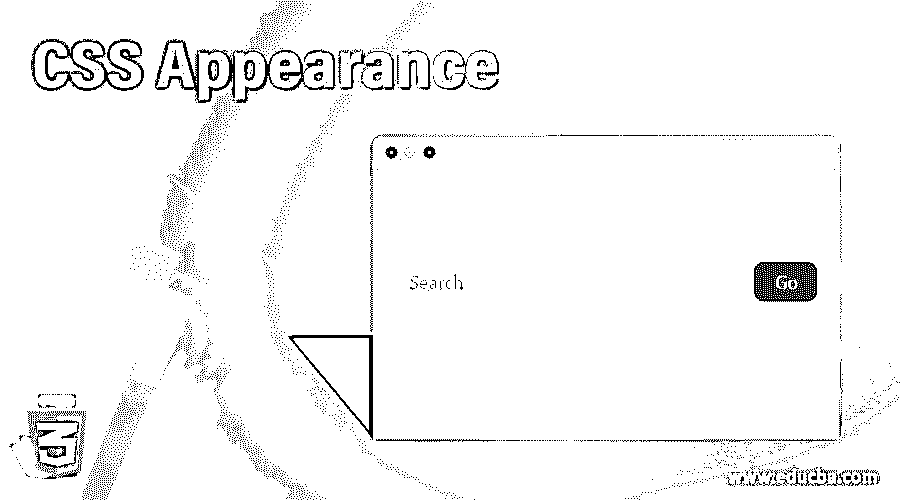
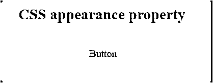
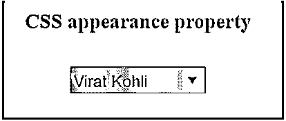

# CSS 外观

> 原文：<https://www.educba.com/css-appearance/>

## CSS 外观介绍

CSS 外观属性允许网站开发人员模拟本机用户界面(UI)控件来改变 HTML 元素的外观。许多 Web 开发人员通过使用诸如-webkit-用于 Safari、Google Chrome 和 Opera 的新版本，-ms-用于 Internet Explorer，-moz-用于 Firefox，-o-用于 Opera 的旧版本等扩展来插入特定于浏览器的属性，以获得最佳的浏览器兼容性。像任何 CSS 属性一样，如果浏览器不真正支持专有扩展，这将被忽略。

appearance 属性提供了一个带有平台的元素——本机样式侧重于用户操作系统的概念。这里要考虑的一点是，外观属性已经从 CSS 3 标准中删除了。然而，在 CSS 基本用户界面第 4 级模块(截至 2016 年 11 月的作者草案)中仍然提到了这一点，并且在未来可能会被重新解释。

<small>网页开发、编程语言、软件测试&其他</small>

### 语法和参数

外观属性的语法可以写成如下所示:

`appearance: value;
For instance.
appearance: button;
Here, an element is plotted like a button.
For instance,
div {
-moz-appearance:button; /* This is for Mozilla Firefox browser*/
-webkit-appearance:button; /* This is for Safari and Chrome browsers*/
appearance:button; /*defined property value */
}`

**参数:**

CSS 外观属性的参数可以定义如下:

*   **外观:**普通|图标|窗口|按钮|菜单|字段
*   **正常:**显示正常数值的元素。
*   **图标:**为元素提供小图片。
*   **窗口:**该参数将元素显示为视口。
*   **按钮:**这种类型的参数将元素显示为按钮。
*   **菜单:**提供多种选项供用户从列表中选择。
*   **字段:**将元素定义为输入字段。

### 外观属性在 CSS 中是如何工作的？

外观是用于显示给定元素的特定浏览器样式的属性。例如，带有 HTML 的下拉框、滑块、输入字段等等。我们可以使用它将浏览器样式应用到您的网站，或者删除浏览器的原生样式，以便可以从头开始设计元素。除了外观属性，还有-webkit-appearance，主要由 Google Chrome、Opera、Microsoft Edge 和 Safari 使用，以及-moz-appearance，由 Mozilla Firefox 使用。

CSS 外观属性的使用有两个主要原因:

*   向默认情况下不具有特定于平台的样式的项添加该样式。
*   来消除默认情况下某个项目平台的独特样式。

### CSS 外观的示例

下面是一些描述用法的例子:

#### 示例#1

**代码:**

`<!DOCTYPE html>
<html lang="en">
<head>
<meta charset="utf-8">
<title> CSS appearance property </title>

</head>
<body>

<h2> CSS appearance property </h2>
 

 Button 

</body>
</html>`

**输出:**

在浏览器中打开 html 文件，它将产生以下结果:

在上面的示例中，使用了按钮元素，该元素标有如图所示的文本。页面的背景颜色由#8FBC8FHEX 代码指定。其他 CSS 样式在名为。button_class。

#### 实施例 2

**代码:**

`<!DOCTYPE html>
<html lang="en">
<head>
<meta charset="utf-8">
<title> CSS appearance property </title>

</head>
<body>

<h2> CSS appearance property </h2>
 

<select>
<option>ViratKohli</option>
<option> M S Dhoni</option>
<option>Rohit Sharma </option>
<option>ShikarDhawan</option>
</select>

</body>
</html>`

**输出:**

在上面的例子中，我们使用了 appearance 属性值作为缺省值“none ”,并且不会对元素进行特殊的样式设置。该元素可以使用 CSS 按照常规进行样式化。背景将设置为不同类型的十六进制值以及线性渐变，该渐变定义了两种以上颜色之间的渐进过渡。这种效果将直接应用于选择标签以及其他 CSS 样式。after 选择器在 select 标记的内容之后添加不同类型的 CSS 样式。

#### 实施例 3

**代码:**

`<!DOCTYPE html>
<html lang="en">
<head>
<meta charset="utf-8">
<title> CSS appearance property </title>

</head>
<body>

<h2> CSS appearance property </h2>
 
<input type="search"> This is type attribute with search
  
<input type="text" class="search_demo"> This attribute type is text, and has been made like search
  
<input type="search" class="reset_class"> This is type attribute with search and reset

</body>
</html>`

**输出:**

在上面的示例中，type 属性输入定义了搜索字段，这些字段是文本字段，用户可以在该属性中输入搜索查询。此外，我们在“search_demo”类中创建了具有 webkit 外观的搜索字段。该值使用搜索字段主题来显示元素。

### 结论

到目前为止，我们已经学习了 CSS 外观属性，默认情况下，外观属性定义了元素如何出现，尤其是在控制表单中。利用不同的 CSS 属性，可以通过将值设置为“none”来完全重新定义默认外观。尽管-webkit-appearance 属性不是标准 W3C CSS 定义的一部分，但它旨在在 webkit 浏览器引擎控制的浏览器上运行，如 Apple Safari 和 Google Chrome。为了与浏览器完全兼容，将等效的 W3C CSS3 添加到代码中。

### 推荐文章

这是一个 CSS 外观的指南。在这里，我们还讨论了 CSS 外观的介绍以及外观属性是如何工作的，并给出了不同的例子。您也可以看看以下文章，了解更多信息–

1.  [CSS 背景色](https://www.educba.com/css-background-color/)
2.  [CSS 向下箭头](https://www.educba.com/css-arrow-down/)
3.  [CSS 屏蔽](https://www.educba.com/css-masking/)
4.  [CSS 加载器](https://www.educba.com/css-loader/)

