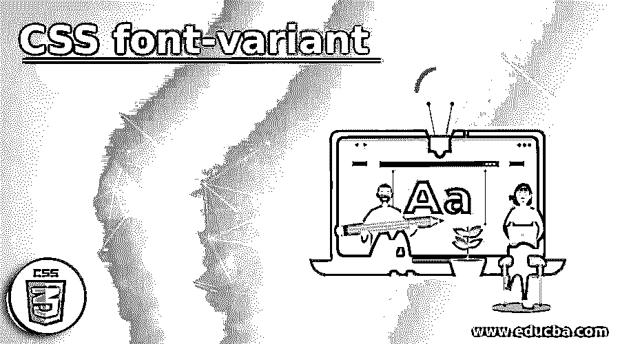
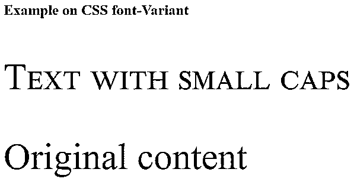
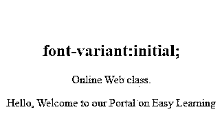
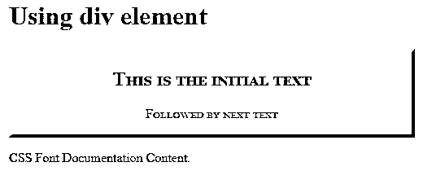
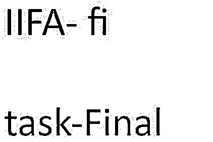
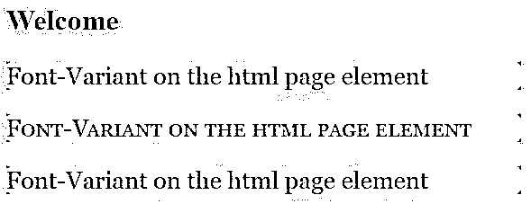
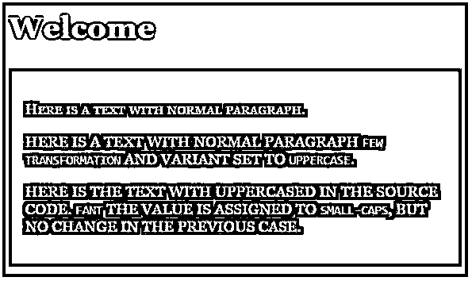

# CSS 字体变体

> 原文：<https://www.educba.com/css-font-variant/>




## CSS 字体简介-变体

CSS font-variant 属性被定义为将小写字母转换为大写字母的字体元素的变体，并在我们需要为文档中的文本使用小型大写字母时使用。这个属性可以应用于各种带有属性样式表的 HTML 标签，这是为了在窗口中调整文本大小时保持可读性和重量而设计的。

### 句法

字体变体的一般语法写为:

<small>网页开发、编程语言、软件测试&其他</small>

```
Selector {
Font-variant: value;
}
```

这个属性在这个正常的 ad 中取四个值，小盘股很好地统治了这个属性。这些值可以是下列任意值:

**Normal:** 这指定了正常的字体变量，并被认为是默认值。它选择一个不小的字体。

**small-caps:** 通过缩放将小写字母转换为大写字母来选择小型大写字体。

**inherit:** 该关键字指定从父项继承的值。这意味着它跟在根元素后面。

**initial:** 显示字体的默认大小值。

### 字体可变属性在 CSS 中如何工作？

我们知道 CSS 在 HTML 元素上有字体属性，这有助于改变 HTML 元素的外观。字体属性之一是字体变量。它在 CSS 2 和 CSS3 中给出了一个风格化的字体特性。font-variant 属性指定文本是否应该设置为小型大写字母。它与常规大写字母完全不同，常规大写字母是常规版本的缩小属性。此外，当我们使用 text-transform 属性时，这个字体变量属性也会受到影响。例如，如果字体设置为小写，并且 transform 属性指定为小写，则最终所有字符都以小写显示。

让我们看看这个属性如何与 CSS 一起使用，并通过实时例子解释它们的工作。

例如，让我们拿

```
.css
#fontsmall {
font-variant: small-caps;
}
.html
<p>This line is original text</p>
<p id="fontsmall">This text is creative CSS</p>
```

对于上面的代码，工作过程就像它获取 id ='fontsmall '一样开始，其中除了第一个字母之外的所有字母都被转换成小型大写字母。原来的大写字母比原来的大写字母稍微大一点。所有浏览器都很好地支持这个属性。

CSS3 属性允许我们在我们希望的字体上提供字体特性，并检查它们的工作情况(使用连字)。连字使由两个或更多字符一起指定的文本看起来更漂亮。例如，在大写字母上制作风格特征。

```
font-variant-ligatures: common-ligatures;
```

将 font-variant 属性设置为 none 会重置所有其他指定的 none 功能，如正常、小型大写字母。在 CSS3 中，除了 small-caps 属性之外，它们还有如下扩展属性

*   交替
*   大写字母
*   东亚人
*   绳索
*   数字的

### 实现 CSS 字体变体的示例

在这里，我们将探索如何使用该属性的一些示例:

#### 示例#1

通过设置 CSS 属性将小型大写文本指定为大写:

**代码:**

```
<!doctype html>
<title> Example on CSS font-Variant </title>
<style>
p
{font-size: 6vw;
}
.ab {
font-variant: small-caps;
}
</style>
<h1>Example on CSS font-Variant </h1>
<p class="ab"> Text with small caps </p>
<p> Original content </p>
```

**输出:**




**解释:**因此，这里的段落类“ab”被设置为字体变体:小型大写字母，因此它将文本更改为大写字母，而其他段落文本内容保持正常，没有任何更改效果。这是我们执行上述代码片段时，它在浏览器中的样子。

#### 实施例 2

通过设置 CSS 属性为文本分配初始值:

**代码:**

```
<!DOCTYPE html>
<html>
<head>
<style>
h2 {
color: purple;
}
h1 { color: yellow;
}
p.init {
font-variant: initial;
}
p.edu {
font-variant: initial;
}
</style>
</head>
<body>
<center>
<h1>Stylish Demo On page</h1>
<h2>font-variant:initial;</h2>
<p class="init">Online Web class. </p>
<p class="edu">
Hello, Welcome to our Portal on Easy Learning
</p>
</body>
</html>
```

**输出:**




**解释:**这里没有任何变化反映在输出中，因为我们已经将字体变量设置为 initial，每个文本仍然是小写字母。下面是上面代码的输出。

#### 实施例 3

使用小型大写字母显示带有文本内容的边框样式演示:

**代码:**

```
<!DOCTYPE html>
<html>
<head>
<style>
.myclass {
border: 4px outset yellow;
background-color: lightorange;
text-align: center;
font-variant:small-caps;
}
</style>
</head>
<body>
<h1>Using div element</h1>
<div class="myclass">
<h2>This is the initial text</h2>
<p>Followed by next text</p>
</div>
<p>CSS Font Documentation Content. </p>
</body>
</html>
```

**输出:**




**解释:**此处字体变体被视为小型大写字母。因此，类内容被设置为大写。

#### 实施例 4

字体变体上的实现–连字:

**代码:**

```
<!doctype html>
<title>Example on CSS</title>
<link href="//fonts.googleapis.com/css?family=Lora" rel="stylesheet">
<style>
div {
font-family: calibri, serif;
font-size: 6vw;
}
.ligmode{
font-variant-ligatures: historical-ligatures;
color: green;
}
.ligon {
font-variant-ligatures: Discretionary ligatures;
color: blue;
}
</style>
<div>
IIFA- fi
<br> </br>
task-Final
</div>
```

**输出:**




**解释:**当我们执行上述代码时，span 类“ligmode”的文本将显示历史连字，而 Span 类“ligon”的文本将显示在任意连字上。

#### 实施例 5

**代码:**

```
<!DOCTYPE html>
<html>
<head>
<style>
.ff
{
font-variant: normal;
}
.ff1
{
font-variant: small-cap;
}
.ff2
{
font-variant: all-small-caps;
}
</style>
</head>
<body>
<p>Most popular in CSS Style is.</p>
<p class="ff">Changing the normal font size and implementing small-caps effect.</p>
<p class="ff1">Hello world sample Example.</p>
<p class="ff2">DEVELOPERS MAKE USE OF THIS STYLING.</p>
</body>
</html>
```

**输出:**


#### 实施例 6

CSS 字体-变体显示 CSS2 属性值的演示:

**代码:**

```
<!DOCTYPE HTML>
<html>
<head>
<h1> Welcome </h1>
<style>
p{font-family:Georgia,Verdana;
color:red;
background-color: lightblue;
font-size:1.7em;}
.norm{font-variant:normal;}
.smacaps{font-variant:small-caps;}
.inh{font-variant:inherit;}
</style>
</head>
<body>
<p class="norm">Font-Variant on the html page element</p>
<p class="smacaps">Font-Variant on the html page element</p>
<p class="inh">Font-Variant on the html page element</p>
</body>
</html>
```

**输出:**




#### 实施例 7

使用外部 CSS:

**代码:**

```
<div class="main">
<div class="content">
<p class="parent">
Here is a text with normal paragraph.
</p>
<p class="child">
Here is a text with normal paragraph <code>few transformation</code> and variant set to <code>uppercase</code>.
</p>
<p class="subchild">
HERE IS THE TEXT WITH UPPERCASED IN THE SOURCE CODE. <code>FANT</code> THE VALUE IS ASSIGNED TO <code>SMALL-CAPS</code>, BUT NO CHANGE IN THE PREVIOUS CASE.
</p>
</div>
</div>
```

**ff.css**

```
body {
background-color: #8A2BE2;
color: #00FFFF;
font-size: 1.2em;
font-family: 'Helvetica Neue', Georgia, Arial, sans-serif;
}
.main {
margin: 30px auto;
max-width: 600px;
}
.content{
padding: 21px;
background-color: #000000;
}
.parent {
font-variant: small-caps;
}
.child {
font-variant: normal;
text-transform: uppercase;
}
.subchild {
font-variant: small-caps;
}
```

**输出:**




### 结论

因此，这篇文章解释了如何使用 CSS 属性 font-variant 与他们的工作和例子。为了更好地指导这方面的工作，这里给出了许多程序。总之，我们带来了所有的价值观和他们的工作，这是非常有助于创建一个时尚的网站。

### 推荐文章

这是一个 CSS 字体变体的指南。在这里，我们讨论一个 CSS 字体变体的介绍，语法，它是如何工作的编程例子。您也可以浏览我们的其他相关文章，了解更多信息——

1.  [CSS 字体属性](https://www.educba.com/css-font-properties/)
2.  [CSS 排版](https://www.educba.com/css-typography/)
3.  [CSS 按钮边框](https://www.educba.com/css-button-border/)
4.  [CSS 右边距](https://www.educba.com/css-margin-right/)


