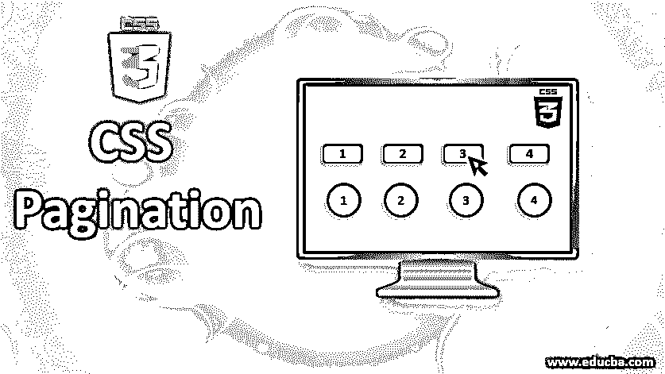

# CSS 分页

> 原文：<https://www.educba.com/css-pagination/>




## CSS 分页介绍

分页是将文档分成几页并给出页码的方法。分页可以很容易地找到大量的内容，并将多个条目或 web 内容分解到不同的页面中，使您能够轻松地切换内容。分页网页链接基本上可以让访问者浏览你的内容。CSS 分页是一个很好的方法来索引网站首页的各个页面。当你的网站上有很多页面时，你需要为每个页面添加一些分页。

### CSS 中分页的类型

下面是 CSS 中分页的类型:

<small>网页开发、编程语言、软件测试&其他</small>

*   简单分页
*   活动的可悬停分页
*   圆形活动和悬浮按钮
*   带边框的分页
*   圆形边框分页
*   居中分页
*   分页间距
*   分页大小

#### 1.简单分页

下面的例子描述了简单的分页。“pagination”类可用于定义 HTML 页面中的分页。

**代码:**

```
<!DOCTYPE html>
<html>
<head>
<style>
.pagination a {
font-size: 18px;
float: left;
padding: 8px 16px;
text-decoration: none;
}
</style>
</head>
<body>
<h2>Simple Pagination</h2>
<div class="pagination">
<a href="#">«</a>
<a href="#">1</a>
<a href="#">2</a>
<a href="#">3</a>
<a href="#">4</a>
<a href="#">5</a>
<a href="#">6</a>
<a href="#">7</a>
<a href="#">8</a>
<a href="#">9</a>
<a href="#">10</a>
<a href="#">»</a>
</div>
</body>
</html>
```

将上面的代码保存在 HTML 页面上，根据自己的选择命名。然后，在浏览器中打开该文件，它将显示如下图所示的输出。

**输出:**


#### 2.活动的可悬停分页

当前页面将使用活动类显示。当鼠标经过它们时，悬停将切换页面链接的颜色。

**代码:**

```
<!DOCTYPE html>
<html>
<head>
<style>
.pagination a {
font-size: 18px;
float: left;
padding: 8px 16px;
text-decoration: none;
}
.pagination a.active {
background-color:#d7bb6c;
}
.pagination a:hover:not(.active) {
background-color: #d4d5d2;
}
</style>
</head>
<body>
<h2>Active and Hoverable Pagination</h2>
<div class="pagination">
<a href="#">«</a>
<a href="#">1</a>
<a href="#">2</a>
<a href="#">3</a>
<a href="#">4</a>
<a class = "active" href="#">5</a>
<a href="#">6</a>
<a href="#">7</a>
<a href="#">8</a>
<a href="#">9</a>
<a href="#">10</a>
<a href="#">»</a>
</div>
</body>
</html>
```

**输出:**


#### 3.圆形活动和悬浮按钮

在这种类型的分页中，border-radius 属性可用于圆形活动按钮和可悬停按钮。

**代码:**

```
<!DOCTYPE html>
<html>
<head>
<title>
Rounded Active and Hoverable Buttons
</title>
<style>
.pagination a {
font-size: 18px;
float: left;
padding: 8px 16px;
text-decoration: none;
}
.pagination a.active {
background-color:#d7bb6c;
border-radius:6px;
}
.pagination a:hover:not(.active) {
background-color: #d4d5d2;
border-radius:6px;
}
</style>
</head>
<body>
<h2>Rounded Active and Hoverable Buttons</h2>
<div class="pagination">
<a href="#">«</a>
<a href="#">1</a>
<a href="#">2</a>
<a href="#">3</a>
<a href="#">4</a>
<a href="#">5</a>
<a class = "active" href="#">6</a>
<a href="#">7</a>
<a href="#">8</a>
<a href="#">9</a>
<a href="#">10</a>
<a href="#">»</a>
</div>
</body>
</html>
```

**输出:**


#### 4.带边框的分页

当您想要向分页添加边框时，可以使用此类型。

**代码:**

```
<!DOCTYPE html>
<html>
<head>
<title>
Bordered Pagination
</title>
<style>
.pagination a {
font-size: 18px;
float: left;
padding: 8px 16px;
text-decoration: none;
border:1px solid grey;
}
.pagination a.active {
background-color:#d7bb6c;
}
.pagination a:hover:not(.active) {
background-color: #d4d5d2;
}
</style>
</head>
<body>
<h2>Bordered Pagination</h2>
<div class="pagination">
<a href="#">«</a>
<a href="#">1</a>
<a href="#">2</a>
<a href="#">3</a>
<a href="#">4</a>
<a href="#">5</a>
<a class = "active" href="#">6</a>
<a href="#">7</a>
<a href="#">8</a>
<a href="#">9</a>
<a href="#">10</a>
<a href="#">»</a>
</div>
</body>
</html>
```

**输出:**

**T2】**


 **#### 5.圆形边框分页

当您希望通过使用 border-radius 属性向分页添加圆形边框时，可以使用此类型。

**代码:**

```
<!DOCTYPE html>
<html>
<head>
<title>
Rounded Bordered Pagination
</title>
<style>
.pagination a {
font-size: 18px;
float: left;
padding: 8px 16px;
text-decoration: none;
border-radius:6px;
border:1px solid grey;
}
.pagination a.active {
background-color:#d7bb6c;
}
.pagination a:hover:not(.active) {
background-color: #d4d5d2;
}
</style>
</head>
<body>
<h2>Rounded Bordered Pagination</h2>
<div class="pagination">
<a href="#">«</a>
<a href="#">1</a>
<a href="#">2</a>
<a href="#">3</a>
<a href="#">4</a>
<a href="#">5</a>
<a class = "active" href="#">6</a>
<a href="#">7</a>
<a href="#">8</a>
<a href="#">9</a>
<a href="#">10</a>
<a href="#">»</a>
</div>
</body>
</html>
```

**输出:**

**T2】**


 **#### 6.居中分页

借助 text-align 属性，这种类型的分页可以居中显示。

**代码:**

```
<!DOCTYPE html>
<html>
<head>
<title>
Centered Pagination
</title>
<style>
.center {
text-align:center;
}
.pagination a {
font-size: 18px;
float: left;
padding: 8px 16px;
text-decoration: none;
border:1px solid grey;
}
.pagination a.active {
background-color:#d7bb6c;
}
.pagination a:hover:not(.active) {
background-color: #d4d5d2;
}
</style>
</head>
<body>
<h2>Centered Pagination</h2>
<div class="center">
<div class="pagination">
<a href="#">«</a>
<a href="#">1</a>
<a href="#">2</a>
<a href="#">3</a>
<a href="#">4</a>
<a href="#">5</a>
<a class = "active" href="#">6</a>
<a href="#">7</a>
<a href="#">8</a>
<a href="#">9</a>
<a href="#">10</a>
<a href="#">»</a>
</div>
</div>
</body>
</html>
```

**输出:**

**T2】**


 **#### 7.分页间距

这种类型的分页可用于在页面链接之间留出空间，而不是对它们进行分组。可以借助链接之间的边距属性来提供空间。

**代码:**

```
<!DOCTYPE html>
<html>
<head>
<title>
Space Between Pagination
</title>
<style>
.center {
text-align:center;
}
.pagination a {
font-size: 18px;
float: left;
margin:0px 6px;
padding: 8px 16px;
text-decoration: none;
border:1px solid grey;
}
.pagination a.active {
background-color:#d7bb6c;
}
.pagination a:hover:not(.active) {
background-color: #d4d5d2;
}
</style>
</head>
<body>
<h2>Space Between Pagination</h2>
<div class="center">
<div class="pagination">
<a href="#">«</a>
<a href="#">1</a>
<a href="#">2</a>
<a href="#">3</a>
<a href="#">4</a>
<a href="#">5</a>
<a class = "active" href="#">6</a>
<a href="#">7</a>
<a href="#">8</a>
<a href="#">9</a>
<a href="#">10</a>
<a href="#">»</a>
</div>
</div>
</body>
</html>
```

**输出:**


#### 8.分页大小

这种类型的分页可用于更改分页的大小。这可以通过使用 font-size 属性来实现。

**代码:**

```
<!DOCTYPE html>
<html>
<head>
<title>
Pagination Size
</title>
<style>
.center {
text-align:center;
}
.pagination a {
font-size: 22px;
float: left;
margin:0px 6px;
padding: 8px 16px;
text-decoration: none;
border:1px solid grey;
}
.pagination a.active {
background-color:#d7bb6c;
}
.pagination a:hover:not(.active) {
background-color: #d4d5d2;
}
</style>
</head>
<body>
<h2>Pagination Size</h2>
<div class="center">
<div class="pagination">
<a href="#">«</a>
<a href="#">1</a>
<a href="#">2</a>
<a href="#">3</a>
<a href="#">4</a>
<a href="#">5</a>
<a class = "active" href="#">6</a>
<a href="#">7</a>
<a href="#">8</a>
<a href="#">9</a>
<a href="#">10</a>
<a href="#">»</a>
</div>
</div>
</body>
</html>
```

**输出:**


### 结论

到目前为止，我们已经研究了分页的作用，其中大量的内容可以分成不同的 HTML 页面，用户可以轻松地切换信息。为了使内容多样化，可以在 HTML 元素中使用 pagination 类。因此，当 HTML 页面的大量内容可以划分为离散的页面时，CSS 分页非常有用。

### 推荐文章

这是一个 CSS 分页指南。在这里，我们讨论了不同类型的 CSS 分页，如简单，积极和悬浮等。，以及代码实现。您也可以浏览我们推荐的文章，了解更多信息——

1.  [CSS 箭头](https://www.educba.com/css-arrow/)
2.  [CSS 位置](https://www.educba.com/css-position/)
3.  [CSS 边距颜色](https://www.educba.com/css-margin-color/)
4.  [CSS 阴影](https://www.educba.com/css-drop-shadow/)


******