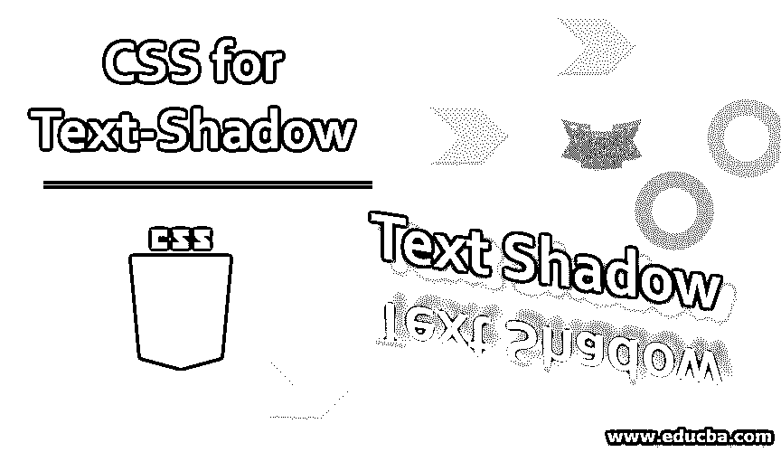

# 文本阴影的 CSS

> 原文：<https://www.educba.com/css-for-text-shadow/>




## 什么是 CSS 文本阴影？

级联样式表用于设计 html 页面的样式。这将计算一个 HTML 页面可能包含的所有元素。文本样式是 CSS 中一个非常突出的特性。页面上的文本内容与其他元素(如图像、链接、按钮等)的样式保持一致和同步是非常重要的。通过 CSS 的[使用，我们可以确保页面上的文本是同步的。CSS 提供了许多文本特性，如文本颜色、字母间距、文本大小、行高、文本方向。一个这样的属性是文本阴影。通过使用此功能，我们可以将文本与阴影一起投影，以突出显示文本。这将给出我们想要突出显示的文本的理想轮廓。本文将详细讨论这个特性。在这个主题中，我们将学习文本阴影的 CSS。](https://www.educba.com/css-arrow/)

### 文本阴影语法及其在 CSS 中的工作原理？

文本阴影可以用于内联 CSS，内部 CSS 或外部 CSS。文本阴影的语法是:

<small>网页开发、编程语言、软件测试&其他</small>

```
text-shadow: horizontal-shadow vertical-shadow blur-radius color/none/ inherit/initial;
```

这里，水平阴影、垂直阴影、模糊半径是强制参数，而颜色是可选参数。

*   None、initial 和 inherit 是全局值，其中 none 指定没有文本阴影，inherit 指示元素采用为父元素设置的参数，initial 将确保属性恢复为其默认值。
*   水平阴影和垂直阴影是决定阴影与文本距离的数值参数。
*   水平阴影指定阴影与文本的水平距离，即向左或向右。如果该值为正，阴影将朝右，如果为负，阴影将朝左。
*   垂直阴影指定垂直距离，即上方或下方。如果该值为正值，阴影将位于文本下方，如果该值为负值，阴影将位于文本上方。
*   模糊半径也是一个数值参数，必须指定，否则，其默认值为 0。这个参数决定了阴影的模糊程度(亮或宽)。值越高，阴影越宽。
*   顾名思义，颜色是决定阴影颜色的特征。这是一个可选参数。

### 文本阴影的 CSS 示例

为了更清楚起见，让我们通过一些例子来讨论这个特性:

#### 1.使用内联 CSS 的基本文本阴影

*   <root>创建一个 html 页面。包括创建页面所需的基本标签，如:</root>、。
*   在 body 标签中，定义任何文本元素，并使用内联样式定义其文本阴影参数。对于这个例子，我们将

    # 的样式设置如下:

```
<h1 style="text-shadow: 1px 2px 4px #00EE00;">Testing Text-shadow Property</h1>
```

*   因此，整个 html 代码应该有点像下面定义的结构:

```
<html>
<head>
<title>Text-Shadow property</title>
</head>
<body>
<h1 style="text-shadow: 1px 2px 4px #00EE00;">Testing Text-shadow Property</h1>
</body>
</html>
```

*   保存页面，并打开保存的。html 文件。输出文本将带有绿色阴影，如屏幕截图所示:


#### 2.使用外部样式表的文本阴影

*   对于这个例子，我们采用外部 CSS 方法。我们将首先创建一个 CSS 文件，然后在我们的 html 页面中调用它的特性。因此，作为第一步，我们将创建一个 css 文件，即 textProp.css
*   接下来，我们将样式化段落标记，即 p，并为其定义各种属性，如下所示:

```
p{
text-align: center;
text-shadow: 2px 2px 4px blueviolet;
font-size: 20px;
font-family: 'Courier New', Courier, monospace;
background-color: rgb(230, 217, 217);
}
```

*   我们还将定义一个名为“黄色文本”的类。我们将能够在 html 页面的各种元素中调用这个类。该类必须编码如下:

```
.yellow-text{
text-align: center;
text-shadow: 4px -1px 4px green;
font-style: italic;
font-family: Arial, Helvetica, sans-serif;
color: yellow;
}
```

*   将这些代码组合起来，最终的 CSS 表单应该是:

```
p{
text-align: center;
text-shadow: 4px 2px 4px blueviolet;
font-size: 20px;
font-family: 'Courier New', Courier, monospace;
background-color: rgb(230, 217, 217);
}
.yellow-text{
text-align: center;
text-shadow: 4px -1px 4px green;
font-style: italic;
font-family: Arial, Helvetica, sans-serif;
color: yellow;
}
```

*   现在我们将创建一个 html 页面，调用样式表并使用我们定义的样式。要测试所有已定义的属性，html 代码可以类似于下面定义的代码:

```
<html>
<head>
<title>Text-Shadow property</title>
<link rel = "stylesheet" href = "textProp.css">
</head>
<body>
<h1 class="yellow-text">Testing Text-shadow Property</h1>
<p>This is testing for the styling set for paragraph tag. This is External method of using CSS </p>
<p class="yellow-text">Test 2 for p and yellow text</p>
</body>
</html>
```

*   出于实验目的，在 p 标记中调用了 text-yellow 类。可以有更多的组合进行研究和测试。
*   html 代码的最终页面或输出应该如下所示:


#### 3.创建多个阴影

*   特定文本可以有多个阴影。我们只需要在同一个定义中添加另一组参数，用逗号分隔，如下所示:

```
text-shadow: 4px 2px 4px blueviolet, -4px -2px 4px red;
```

*   类似于上一个例子，我们将创建一个外部 CSS 文件，其中我们将为所有带有

    标签的文本定义多个阴影。我们可以为标题元素

    # 添加一些样式。CSS 文件应该类似于下面的示例:

```
p{
text-align: center;
text-shadow: 4px 2px 4px blueviolet, -4px -2px 4px red;
font-size: 20px;
font-family: 'Courier New', Courier, monospace;
background-color: rgb(230, 217, 217);
margin: 100px;
}
h1{
text-align: center;
font-family: 'Courier New', Courier, monospace;
color: purple;
text-shadow: 4px 4px 4px violet;
}
```

*   我们将创建一个 html 页面，调用样式表并使用元素，我们已经在 CSS 文件中为这些元素定义了样式。html 代码应该如下所示:

```
<html>
<head>
<title>Text-Shadow property</title>
<link rel = "stylesheet" href = "textProp.css">
</head>
<body>
<h1>Testing Multiplle Text-Shadows</h1>
<p>This is test for multiple shadows for text in paragraph element. There are two colors of shadows. One is violet and one is red.</p>
</body>
```

*   该文件的输出应该如下所示:


因此，我们讨论了 CSS 提供的文本阴影属性在 html 页面中样式化文本的用法。还有许多其他的方法，你可以尝试文字阴影。这对于突出显示一些重要的文本非常有用。

### 推荐文章

这是一个文本阴影的 CSS 指南。在这里，我们讨论基本概念，文本阴影如何在 CSS 中工作，以及适当的例子。您也可以看看以下文章，了解更多信息–

1.  [CSS 文本格式](https://www.educba.com/css-text-formatting/)
2.  [CSS 的优势](https://www.educba.com/advantages-of-css/)
3.  [CSS 三角形生成器](https://www.educba.com/css-triangle-generator/)
4.  [CSS 边距颜色](https://www.educba.com/css-margin-color/)


