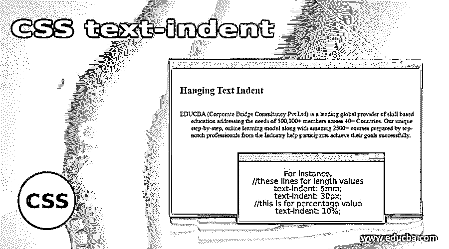
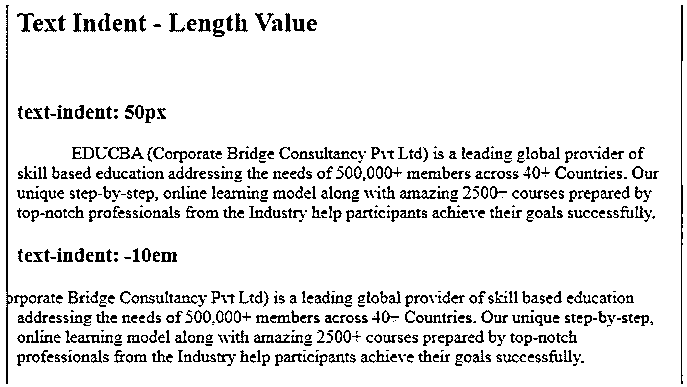
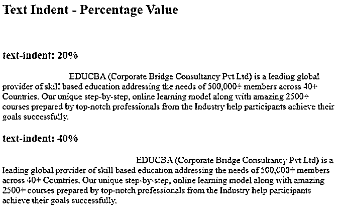

# CSS 文本-缩进

> 原文：<https://www.educba.com/css-text-indent/>




## CSS 文本简介-缩进

在 CSS 中，可以在每个文本块中使用 text-indent 属性来确定首行缩进。它也接受负值。这意味着如果该值为负值，则第一行向左缩进。间距是从块级别的容器元素的开始边缘开始测量的。在整个代码中，间距和缩进应该是准确的。大多数开发人员喜欢使用 4 或 2 个空格的缩进。

对于 HTML，其父标签中的每个嵌套标签都应该缩进一次。在每个块元素后插入换行符。没有必要缩进 HTML 代码，避免所有浏览器和搜索引擎的缩进和额外的间距。然而，对于每一个读者来说，缩进你的文本是一个好主意，因为它会使代码更容易扫描和阅读。

<small>网页开发、编程语言、软件测试&其他</small>

**语法:**

CSS 文本缩进属性的语法可以定义如下:

```
text-indent: length|initial|inherit;
```

*   **长度:**用于设置固定缩进，如 px、pt、cm、em 等。默认长度值为 0。
*   **initial:** 该参数用于将属性设置为默认值。
*   **inherit:** 该参数用于继承其父元素的属性。

```
For instance,
//these lines for length values
text-indent: 5mm;
text-indent: 30px;
//this is for percentage value
text-indent: 10%;
```

### CSS 文本缩进属性是如何工作的？

文字缩进在文字处理中用于定义空格的间距或数量，以区分段落的左边距或右边距。当在 block 元素上指示时，将创建 text-indent 属性，这意味着这也将影响 inline-block 的后代元素。在编程语言中使用缩进显示结构中的数据元素。缩进使得程序更容易阅读和理解。像 Python 这样的编程语言使得缩进成为强制性的，这增强了程序的可读性

### CSS 文本缩进的例子

下面是一些例子:

#### 示例#1

现在，我们将看到 CSS 文本缩进属性的例子如下:**代码:**

```
<!DOCTYPE html>
<html lang="en">
<head>
<meta charset="utf-8">
<title> CSS text-indent Example </title>
<style>
.mytext {
text-indent: 50px;
}
.mytext1 {
text-indent: -6em;
}
</style>
</head>
<body>
<h2> Text Indent - Length Value </h2>
<br>
<h3> text-indent: 50px </h3>
<div class = "mytext">
EDUCBA (Corporate Bridge Consultancy Pvt Ltd) is a leading global provider of skill based education addressing the needs of 500,000+ members across 40+ Countries. Our unique step-by-step, online learning model along with amazing 2500+ courses prepared by top-notch professionals from the Industry help participants achieve their goals successfully.
</div>
<h3> text-indent: -10em </h3>
<div class = "mytext1">
EDUCBA (Corporate Bridge Consultancy Pvt Ltd) is a leading global provider of skill based education addressing the needs of 500,000+ members across 40+ Countries. Our unique step-by-step, online learning model along with amazing 2500+ courses prepared by top-notch professionals from the Industry help participants achieve their goals successfully.
</div>
</body>
</html>
```

**输出:**

在浏览器中打开该文件，它将产生以下结果:




在上面的例子中，我们为第一段设置了 50px 的文本缩进，它从文本的开始移动了 50px 的缩进。在第二段中，文本的第一行将缩进-10em。

#### 实施例 2

**代码:**

```
<!DOCTYPE html>
<html lang="en">
<head>
<meta charset="utf-8">
<title> CSS text-indent Example </title>
<style>
.mytext {
text-indent: 20%;
}
.mytext1 {
text-indent: 40%;
}
</style>
</head>
<body>
<h2> Text Indent - Percentage Value </h2>
<br>
<h3> text-indent: 20% </h3>
<div class = "mytext">
EDUCBA (Corporate Bridge Consultancy Pvt Ltd) is a leading global provider of skill based education addressing the needs of 500,000+ members across 40+ Countries. Our unique step-by-step, online learning model along with amazing 2500+ courses prepared by top-notch professionals from the Industry help participants achieve their goals successfully.
</div>
<h3> text-indent: 40% </h3>
<div class = "mytext1">
EDUCBA (Corporate Bridge Consultancy Pvt Ltd) is a leading global provider of skill based education addressing the needs of 500,000+ members across 40+ Countries. Our unique step-by-step, online learning model along with amazing 2500+ courses prepared by top-notch professionals from the Industry help participants achieve their goals successfully.
</div>
</body>
</html>
```

**输出:**




在上面的例子中，我们为第一段设置了 20%的文本缩进，它从文本的开始移动了 20%的缩进。在第二段中，文本将从开始缩进 40%。

#### 实施例 3

**代码:**

```
<!DOCTYPE html>
<html lang="en">
<head>
<meta charset="utf-8">
<title> CSS text-indent Example </title>
<style>
.mytext {
text-indent: initial;
}
</style>
</head>
<body>
<h2> Text Indent - Initial Value </h2>
<br>
<div class = "mytext">
EDUCBA (Corporate Bridge Consultancy Pvt Ltd) is a leading global provider of skill based education addressing the needs of 500,000+ members across 40+ Countries. Our unique step-by-step, online learning model along with amazing 2500+ courses prepared by top-notch professionals from the Industry help participants achieve their goals successfully.
</div>
</body>
</html>
```

**输出:**


在上面的例子中，我们使用了“initial”关键字，它表示被标识为属性初始值的指定值。它将属性定义为默认值。

#### 实施例 4

**代码:**

```
<!DOCTYPE html>
<html lang="en">
<head>
<meta charset="utf-8">
<title> CSS text-indent Example </title>
<style>
.mytext {
text-indent: -28px;
padding-left: 28px;
}
</style>
</head>
<body>
<h2> Hanging Text Indent </h2>
<br>
<div class = "mytext">
EDUCBA (Corporate Bridge Consultancy Pvt Ltd) is a leading global provider of skill based education addressing the needs of 500,000+ members across 40+ Countries. Our unique step-by-step, online learning model along with amazing 2500+ courses prepared by top-notch professionals from the Industry help participants achieve their goals successfully.
</div>
</body>
</html>
```

**输出:**


悬挂缩进是段落的第一行向左突出，而文章的其余部分整齐地缩进。这也用于参考书目，作者的名字从最左边开始，但是段落的其余部分缩进。

### 结论

到目前为止，我们已经研究了如何使用 CSS 文本缩进属性来放置 block 元素的缩进。您可以使用长度值、百分比值和初始属性来查看更好的结果。因此，文本缩进有助于更好地将程序结构与人类读者联系起来。

### 推荐文章

这是一个 CSS 文本缩进的指南。在这里，我们还讨论了 css 文本缩进属性的定义和如何工作，以及不同的例子和代码实现。您也可以看看以下文章，了解更多信息–

1.  [CSS 标题设计](https://www.educba.com/css-header-design/)
2.  [CSS 导航栏](https://www.educba.com/css-navigation-bar/)
3.  [CSS 换行](https://www.educba.com/css-line-break/)
4.  [复选框 CSS](https://www.educba.com/checkbox-css/)


