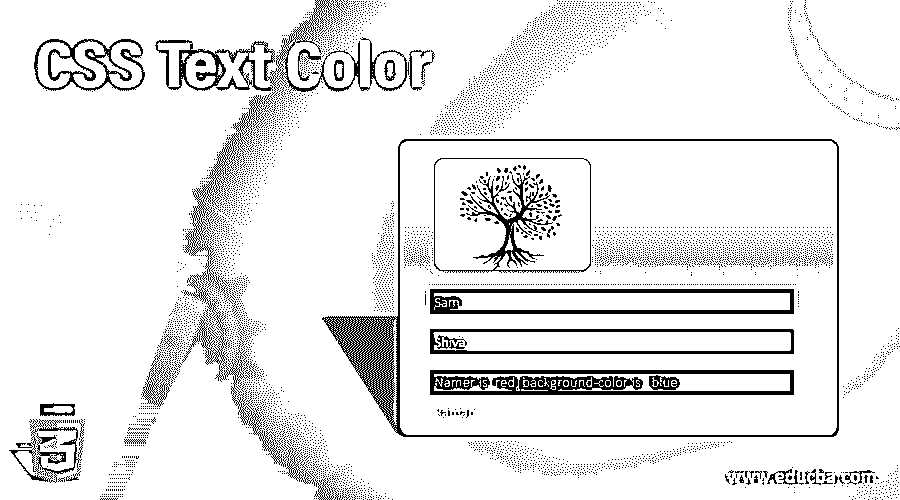
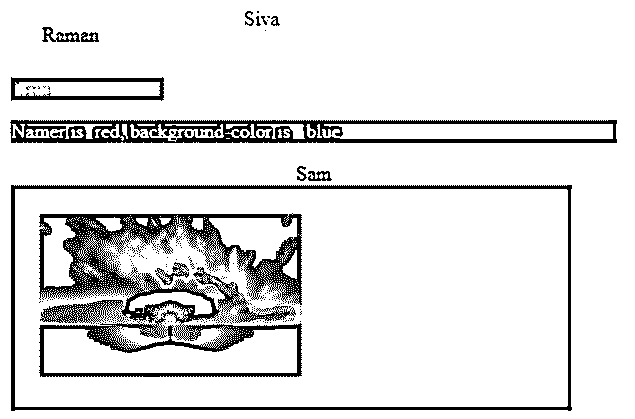
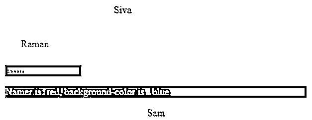
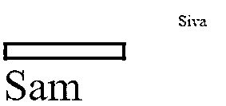

# CSS 文本颜色

> 原文：<https://www.educba.com/css-text-color/>




## CSS 文本颜色介绍

在 CSS(层叠样式表)代码中，文本是在网页中创建表示的格式类型之一。每个文本都有不同的字体、大小、颜色和对齐方式。文本使用一些文本格式属性来设置样式。我们可以使用标题和其他区域，如页脚等。Text-align 属性用于在网页中对齐这些内容，基于此，添加了额外的 color 属性，并用于设置指定文本的颜色。带有颜色名称值(如十六进制格式)的文本也使用 CSS 中的 RGB(红绿蓝)格式类型。

**语法和参数:**

<small>网页开发、编程语言、软件测试&其他</small>

CSS 代码是用 html 页面的样式标签编写的，我们可以遵循一些规则和语法来定制更有吸引力的网页。我们在所有的 css 属性中使用文本格式类型。

```
<html>
<head>
<style>
.firstcss{
background-color: ;
color:;
}
--we can write css styles based on the customer requirements the attributes and their properties are enabled in the codes---
</style>
</head>
<body>
</body>
</html>
```

上述代码是网页中基于 css 文本和颜色表示的基本语法之一。我们可以使用任意数量的 css 属性和它们的属性参数，也可以在这里传递名为用于定制网页的属性和属性值的参数。

### 它在 CSS 中是如何工作的？

在 CSS 样式代码中，我们使用了大量的属性和默认值。使用这些类型的值可以是文本、数字、特殊字符等。我们可以启用其 css 属性的特定属性，以使演示更具吸引力。通过使用一些默认的 html 标签、ID 或一些内置的类，我们可以在基于 html 文本的元素中使用 css 颜色代码。

当我们在基于 html 标签的元素中使用 css 颜色时,

# 是默认颜色之一，也是在 html 代码中使用最广泛的颜色，它可以帮助 css 样式中的任何元素。

# 主要是我们在 html 中使用的标签，因为

接下来，我们可以在 html 网页中使用 id 的帮助下使用 css 颜色，就像我们使用

# 标题标签一样，但元素是通过给它默认 ID 来提供的。这些 ID 在样式代码的标题部分声明，ID 也可以是任何使用的样式，与 html 标签中使用的相同，但重要的一点是 ID 值应该以特殊字符开始，如“#”符号，然后我们可以使用任何格式，如字母，数字等。我们可以在 css 中使用文本颜色，这是在 css 样式表中添加颜色的方法之一。它也遵循上述两种方法，但不同的是没有我们使用的“#”符号。“css 代码中的符号。

前缀值应该在点运算符中强制开始，否则 css 代码不会在 html 网页中使用，演示文稿不会在屏幕上显示。除了在

特别是 css 使用了与文本和颜色相关的不同属性集，其中一些是“颜色、方向、字母间距、单词间距、文本缩进、文本对齐、文本装饰、文本转换、空白和文本阴影”，这些是一些默认属性，已经在样式代码中使用，每个属性都有自己的 CSS 功能和优点。

### CSS 文本颜色示例

下面是提到的例子:

#### 示例#1

**代码:**

```
<!DOCTYPEhtml>
<html>
<head>
<title>Welcome To My Domain</title>
<style>
.first {
padding: 12px;
width: 73%;
margin: 2 auto;
background-color: green;
text-align: center;
color: red;
border-radius: 1 2 52px 53px;
border: 2px yellow;
}
.second{
margin: 12px;
padding: 13px;
color: green;
border: 3px blue;
}
.third{
width: 122px;
display: inline-block;
background-color: blue;
}
.four{
text-align: right;
}
.five{
text-align: center;
}
.six{
text-align: left;
}
.eleven {
width: 83%;
margin: 2 auto;
padding: 23px;
background: green;
}
.sam {
position: absolute;
right: 3px;
width: 303px;
background-color: yellow;
}
</style>
</head>
<body>
<divclass="sam">Siva</div>
<divclass="second">Raman</div>
<divclass="third">Arun</div>
<pstyle="color: #ffffff; background-color: #ff0000">Namer is: red, background-color is : blue</p>
<divclass="five">Sam</div>
<divclass="eleven">
<imgsrc="first.jpg"alt="centered image"/>
</div>
</div>
</body>
</html>
```

**输出:**

**

** 

#### 实施例 2

**代码:**

```
<!DOCTYPEhtml>
<html>
<head>
<title>Welcome To My Domain</title>
<style>
.first {
padding: 12px;
width: 73%;
margin: 2 auto;
background-color:"#ffffff";
text-align: center;
color: rgb(105%, 0%, 0%);
border-radius: 1 2 52px 53px;
border: 2px yellow;
}
.second{
margin: 12px;
padding: 13px;
color: hsla(0, 105%, 50%, 0.5);
border: 3px blue;
}
.third{
width: 122px;
display: inline-block;
background-color: blue;
}
.four{
text-align: right;
}
.five{
text-align: center;
}
.six{
text-align: left;
}
.eleven {
width: 83%;
margin: 2 auto;
padding: 23px;
background: green;
}
.sam {
position: absolute;
right: 3px;
width: 303px;
background-color: yellow;
}
</style>
</head>
<body>
<divclass="first">Siva</div>
<divclass="second">Raman</div>
<divclass="third">Arun</div>
<pstyle="color: #ffffff; background-color: #ff0000">Namer is: red, background-color is : blue</p>
<divclass="five">Sam</div>
</body>
</html>
```

**输出:**




#### 实施例 3

**代码:**

```
<!DOCTYPEhtml>
<html>
<head>
<title>Welcome To My Domain</title>
<style>
.demo
{
color: orange;
color: #f00;
color: #ff0000;
color: rgb(253,0,0);
color: rgb(105%, 0%, 0%);
font-size:44px;
color: hsl(0, 100%, 50%);
}
.first {
padding: 12px;
width: 73%;
margin: 2 auto;
background-color:"#ffffff";
text-align: center;
color: rgb(105%, 0%, 0%);
border-radius: 1 2 52px 53px;
border: 2px yellow;
}
.third{
width: 122px;
display: inline-block;
background-color: blue;
}
</style>
</head>
<body>
<divclass="first">Siva</div>
<divclass="third">Arun</div>
<divclass="demo">Sam</div>
</body>
</html>
```

**输出:**




### 结论

在 CSS 表单中，颜色是重要的对比，因为它计算了基于文本的值与背景颜色的亮度的比率。文本被放置和插入到网页中的正确位置，它不影响其他内容，如图像和动画。

### 推荐文章

这是一个 CSS 文本颜色的指南。这里我们讨论文本颜色在 CSS 中是如何工作的，以及相应的语法和例子。您也可以看看以下文章，了解更多信息–

1.  [粘滞页脚 CSS](https://www.educba.com/sticky-footer-css/)
2.  [CSS 按钮边框](https://www.educba.com/css-button-border/)
3.  [CSS 导航栏](https://www.educba.com/css-navigation-bar/)
4.  [复选框 CSS](https://www.educba.com/checkbox-css/)


