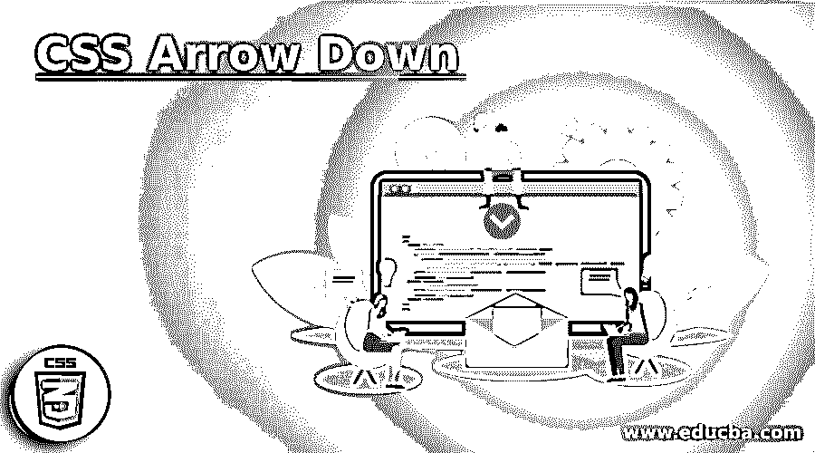
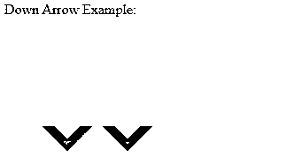
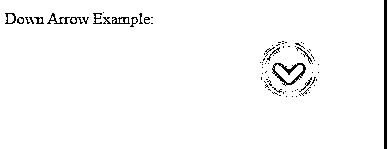

# CSS 向下箭头

> 原文：<https://www.educba.com/css-arrow-down/>




## CSS 简介向下箭头

使用 CSS 创建箭头非常简单。箭头可以决定我们如何在应用程序或网站中访问它们，通过进行多种活动，如“转到下一页”，指示“顶部或底部，左侧或右侧”以及其他几个滚动。在本文中，我们将通过使用 CSS 伪元素& borders 来使用向下箭头，很容易构建各种箭头样式，分别在移动和桌面上看起来令人惊叹。

CSS 向下箭头可以通过使用各自的 CSS 类来指定，并且将被各种类型的样式引用。因此，我们将各种 CSS 向下箭头放在一起，让您开始使用，如下所示。

<small>网页开发、编程语言、软件测试&其他</small>

### 句法

向下箭头的语法可以写成如下所示:

```
.down-arrow (name of the class) {
width: 0; // width for the element
height: 0; // width for the element
// other CSS styles
}
```

在示例部分，我们将使用上面的格式来利用 HTML 页面中的向下箭头。

### 向下箭头在 CSS 中是如何工作的？

CSS 向下箭头可以在 CSS 动画和过渡效果的帮助下使用。例如，我们将反弹效果，应用圆到箭头，样式箭头边框，背景颜色，等等。

### 实现 CSS 向下箭头的示例

下面是 CSS 向下箭头的一些例子:

#### 示例#1

**代码:**

```
<!DOCTYPE html>
<html lang="en">
<head>
<meta charset="utf-8">
<title> CSS Down Arrow Example </title>
<style>
.arrow {
border: solid grey;
border-width: 0 4px 4px 0;
display: inline-block;
padding: 5px;
}
.myarrow {
transform: rotate(45deg);
-webkit-transform: rotate(45deg);
}
</style>
</head>
<body>
<p> Down Arrow Example: <br>
<i class="arrow myarrow"> </i> </p>
</body>
</html>
```

**输出:**


**解释:**在上面的例子中，骨髓类是用 transform 属性定义的，该属性允许我们旋转元素，并被设置为 45 度。arrow 类包括要显示的箭头的 CSS 样式。对于其余的例子，使用上面的输出步骤。

#### 实施例 2

**代码:**

```
<!DOCTYPE html>
<html lang="en">
<head>
<meta charset="utf-8">
<title> CSS Down Arrow Example </title>
<style>
body {
background: grey;
}
.div_center {
display: flex;
height: 50vh;
align-items: center;
}
.arrow_center {
position: relative;
border: 3px solid #fff;
width: 100px;
height: 100px;
border-radius: 50%;
}
span {
height: 4px;
margin: 2px;
width: 30px;
background: red;
transition: 0.3s ease;
}
span:first-child {
position: absolute;
transform: rotate(45deg);
left: 25%;
bottom: 35%;
}
span:nth-child(2) {
position: absolute;
transform: rotate(-45deg);
left: 45%;
bottom: 35%;
}
span:nth-child(3) {
position: absolute;
transform: rotate(45deg);
left: 25%;
bottom: 55%;
}
span:nth-child(4) {
position: absolute;
transform: rotate(-45deg);
left: 45%;
bottom: 55%;
}
.arrow_center:hover span:nth-child(1) {
transform: rotate(-100deg);
}
.arrow_center:hover span:nth-child(2) {
transform: rotate(100deg);
}
.arrow_center:hover span:nth-child(3) {
transform: rotate(150deg);
}
.arrow_center:hover span:nth-child(4) {
transform: rotate(-150deg);
}
</style>
</head>
<body>
<div class="div_center">
<div class="arrow_center">


</div>
</div>
</body>
</html>
```

**输出:**


**解释:**上面的例子使用了 transform 属性来旋转元素。每个元素都根据指定的旋转值以及其他 CSS 样式进行旋转。

#### 实施例 3

**代码:**

```
<!DOCTYPE html>
<html lang="en">
<head>
<meta charset="utf-8">
<title> CSS Down Arrow Example </title>
<style>
.arro {
box-sizing: border-box;
height: 5vw;
width: 5vw;
border-style: solid;
border-color: #9DC0F0;
border-width: 0px 1px 1px 0px;
transform: rotate(45deg);
transition: border-width 15ms ease-in-out;
}
.arro:hover {
border-bottom-width: 5px;
border-right-width: 5px;
}
.container {
display: flex;
justify-content: center;
background-color: grey;
height: 50vh;
}
</style>
</head>
<body>
<p> Down Arrow Example: <br>
<div class="container">
<a data-scroll href="#page_body">
<div class="arro"></div>
</a>
</div>
</p>
</body>
</html>
```

**输出:**


**说明:**在本例中，向下箭头用。arro 类以及旋转 45 度的变换属性。它使用当用户悬停在元素上时发生的过渡属性来提供过渡效果。箭头元素显示在容器中，如图所示。

#### 实施例 4

**代码:**

```
<!DOCTYPE html>
<html lang="en">
<head>
<meta charset="utf-8">
<title> CSS Down Arrow Example </title>
<style>
#arrow_down {
width: 50vw;
height: 50vh;
display: flex;
justify-content: center;
align-items: center;
}
.arrow {
width: 4vw;
height: 4vw;
border: 2vw solid;
border-color: black transparent transparent black;
transform: rotate(-135deg);
}
.arrow_down_slide {
position: absolute;
-webkit-animation: slide 5s linear infinite;
animation: slide 5s linear infinite;
}
.delay_time {
-webkit-animation-delay: 2s;
animation-delay: 2s;
}
@-webkit-keyframes slide {
0% { opacity:0; transform: translateX(20vw); }
20% { opacity:1; transform: translateX(10vw); }
80% { opacity:1; transform: translateX(-10vw); }
100% { opacity:0; transform: translateX(-20vw); }
}
@keyframes slide {
0% { opacity:0; transform: translateX(20vw); }
20% { opacity:1; transform: translateX(10vw); }
80% { opacity:1; transform: translateX(-10vw); }
100% { opacity:0; transform: translateX(-20vw); }
}
</style>
</head>
<body>
<p> Down Arrow Example: <br>
<div id="arrow_down">
<div class="arrow_down_slide">
<div class="arrow"> </div>
</div>
<div class="arrow_down_slide delay_time">
<div class="arrow"> </div>
</div>
</div>
</p>
</body>
</html>
```

**输出:**




**解释:**这个例子使用 transform 属性按照指定的样式旋转元素。样式箭头在 arrow_down id 中指定。动画 CSS 属性被应用为样式之间的动画，持续 5 秒钟。@keyframes 规则用于在动画的多个阶段定义动画属性的值，关键帧称为 slide。

#### 实施例 5

**代码:**

```
<!DOCTYPE html>
<html lang="en">
<head>
<meta charset="utf-8">
<title> CSS Down Arrow Example </title>
<style>
body {
background: grey;
}
@keyframes bounce {
0%, 20%, 50%, 80%, 100% {
-webkit-transform: translateY(0);
-moz-transform: translateY(0);
-ms-transform: translateY(0);
transform: translateY(0);
}
40% {
-webkit-transform: translateY(-20px);
-moz-transform: translateY(-20px);
-ms-transform: translateY(-20px);
transform: translateY(-20px);
}
60% {
-webkit-transform: translateY(-10px);
-moz-transform: translateY(-10px);
-ms-transform: translateY(-10px);
transform: translateY(-10px);
}
}
.arrow_circle {
width: 50px;
height: 50px;
border-radius: 50px;
border: solid 1px white;
position: fixed;
left: 20%;
}
.arrow {
margin: 0 auto;
margin-top: 10px;
width: 30px;
height: 30px;
background-image: url();
background-size: contain;
}
.bounce {
-webkit-animation: bounce 3s infinite;
-moz-animation: bounce 3s infinite;
-ms-animation: bounce 3s infinite;
animation: bounce 3s infinite;
}
</style>
</head>
<body>
<p> Down Arrow Example: <br>
<div class="arrow_circle bounce animated">
<div class="arrow">
</div>
</div>
</p>
</body>
</html>
```

**输出:**




**解释:**这个例子使用了 bounce 属性，该属性用 3 秒钟来制作箭头动画。bounce 属性将应用于样式中指定的不同类型的浏览器。箭头的圆可以用。具有各自 CSS 样式的 arrow_circle 类。弹跳是将动画与其关键帧声明相匹配的关键帧名称。

### 结论

到目前为止，我们已经研究了各种可以在网站或应用程序中轻松定制的向下箭头。通过使用 CSS 伪元素和边框，我们可以很容易地创建在桌面和手机上看起来都很棒的向下箭头。试着用上面的代码片段构建，你会对向下箭头有更好的理解。

### 推荐文章

这是一个 CSS 向下箭头的指南。这里我们讨论 CSS 向下箭头的介绍，语法，它是如何工作的，代码和输出的例子。您也可以浏览我们的其他相关文章，了解更多信息——

1.  [CSS 文本轮廓](https://www.educba.com/css-text-outline/)
2.  [CSS 滚动条](https://www.educba.com/css-scrollbar/)
3.  [CSS 表格样式](https://www.educba.com/css-table-styling/)
4.  [CSS 的优势](https://www.educba.com/advantages-of-css/)


