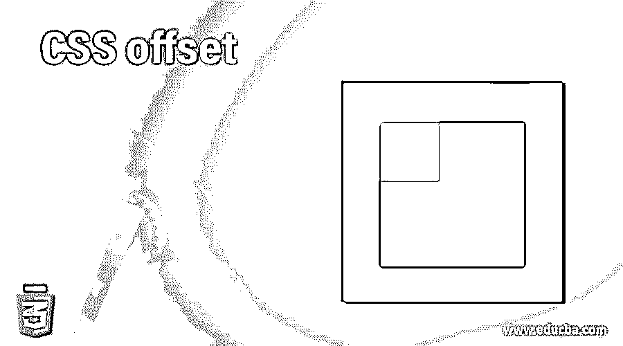
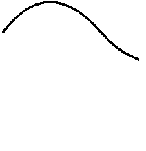
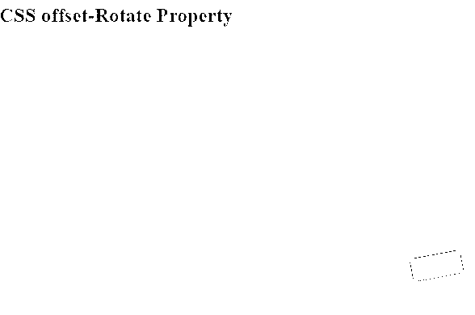
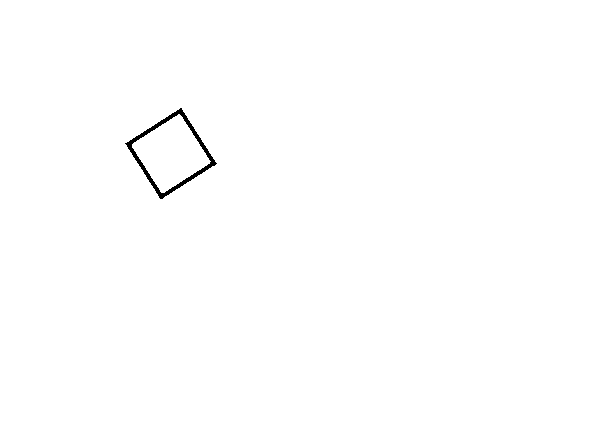

# CSS 偏移

> 原文：<https://www.educba.com/css-offset/>




## CSS 偏移介绍

CSS offset 属性也被称为 motion，它被定义为规定内容位置的部分，并允许一个元素在一个路径中定义。它支持四种常见的值，如上、左、下、右。它定义了动画移动过程中 HTML 中元素的移动路径。它利用关键帧移动来制作动画，被忽略的值被设置为初始值。它有助于指定元素从给定位置偏移多远，就像包含框边缘一样。

**语法**

<small>网页开发、编程语言、软件测试&其他</small>

CSS 偏移的一般语法如下所示:

```
Offset: path | rotate | distance | position | anchor;
```

### CSS 中如何抵消属性工作？

这里让我们从偏移属性值开始，这使得偏移在移动中做动作。它们指定路径的初始位置。

*   **偏移旋转:**该属性用于实现盒子沿偏移路径方向的角度。并且其方向也取决于偏移路径和方向。偏移旋转采用自动、反向和最终<角度>的值。自动帮助元素面向特定方向。为了控制元素旋转时定义的路径的行为，使用了此属性。
*   **偏移路径:**这是偏移中最有效的值，被认为是主要的运动路径模块，同时也有一些值，如 URL、path()和 none。这需要一个 path()函数，它的位置如下:

```
offset-path: path('M 0 200 L 250 200 L 400 200');
```

为了在路径上移动元素，动画使用了关键帧。

*   **偏置距离:**偏置距离是沿着路径指定的，假设它应该指定一个固定的长度。范围从 0%到 100 %。中间值为 50 %，默认值为 0 %。所有这些值指定了路径的总长度，它们的值以长度和百分比的形式给出。

让我们在这里取一个样本代码

```
M300,0 A300,300 0 1,1 200,400 A200,200 0 1,1 200,0
```

这里首先构造一条路径，使得起点给出圆的最高位置。第一个字母“M”表示它是一个移动到(300，0)的起点。进入下一部分，以 300，300 为半径画一个圆弧。

它们所在的路径中几乎没有命令

*   **M:** 移动一个位置
*   **L:** 画一条线。
*   **A:** 做出一个弧形
*   **Z:** 路径关闭，返回起点。

因此，在下面的所有例子中，运动是在元素中实现的。通过动画化 offset-distance 属性来移动路径中的每个元素，而这又是由 CSS transition 来完成的。

*   **offset-anchor:** 在指定元素上做一个点，用这个点确定路径的位置。简单地说，它在盒子里做一个点，并沿着偏移路径移动。它采用自动和位置的值。

### 实现 CSS 偏移的示例

下面是提到的例子:

#### 例 1。用 Path 属性实现 offset。

**代码:**

```
<!DOCTYPE html>
<html>
<head>
<title>Hello World</title>
<style>
@keyframes smove {
from {
offset-distance: 2%;
}
to {
offset-distance: 150%;
}
}
dzv {
width: 50px;
height: 50px;
background-color: yellow;
offset: path("M 150 150 L 210 120 L 230 300 z") auto;
animation: smove 5s linear infinite;
}
</style>
</head>
<body>
<h2> Demo on Offset property</h2>
<div></div>
</body>
</html>
```

**输出:**


#### 例 2。利用距离和笔划实现偏移。

**代码:**

```
<!DOCTYPE html>
<html>
<head>
<title>Hello World</title>
<style>
body {
background: brown;
padding: 21px;
display: flex;
justify-content: center;
}
.run {
stroke: blue;
}
.demo {
motion-path: path('M 5 5 m -3, 0 a 3,5 0 1,0 8,0 a 4,4 0 1,0 -8,0');
offset-path: path('M 5 5 m -4, 0 a 4,4 0 1,0 8,0 a 4,4 0 1,0 -8,0');
animation: move 4s linear infinite;
}
@keyframes move {
100% {
motion-offset: 110%;
offset-distance: 110%;
}
}
</style>
</head>
<body>
<svg viewbox="0,0 20,20" width="150px" height="150px">
<path
class="run"
fill="none"
stroke-width="0.20"
d="M 5 5 m -4, 0 a 4,4 0 1,0 8,0 a 4,4 0 1,0 -8,0"
/>
<circle class="demo" r="2" fill="yellow"></circle>
</svg>
</body>
</html>
```

因此，在本例中，使用偏移属性的路径值对圆进行动画处理。

**输出:**


#### 实施例 3

**代码:**

```
<!DOCTYPE html>
<html>
<head>
<title>Hello World</title>
<style>
svg {
width: 200px;
display: block;
position: relative;
}
.memo {
width: 12px;
height: 12px;
background-color: yellow;
border-radius: 60%;
offset-path: path('M20 90 Q 80.5 10, 150 90 T 300 80');
offset-distance: 0%;
animation: memoball 5s linear alternate infinite;
}
@keyframes memoball {
from {
offset-distance: 0%;
}
to {
offset-distance: 50%;
}
}
</style>
</head>
<body>
<svg width="200px" height="150px" version="1.1">
<path fill="transparent" stroke="red" stroke-width="3" d="M20 90 Q 80.5 10, 150 90 T 300 80" class="path"></path>
</svg><div class="memo"></div>
</body>
</html>
```

**输出:**




#### 实施例 4。实现偏移旋转

**代码–rotate.html**

```
<!DOCTYPE html>
<html>
<head>
<title> Offset-Rotate Property</title>
<style>
body {
background-color: #3cb371;
}
.rotater {
width: 60px;
height: 60px;
background: linear-gradient(#ff6347 55%, #ee82ee 55%);
position: relative;
left: 60%;
top: 200px;
offset-path: path("M19.50,52.42s50.77-75.05,105.20-.65,105.70-7.20,105.75-7.20S250.36,6.50,150.33,8.08s-15,71.57-94.51,74.56S18.45,58.46,19.50,60.42Z");
offset-rotate: reverse;
animation: move 5s linear infinite;
}
@keyframes move {
100% {
offset-distance: 100%;
}
}
h2{
color : red;
}
</style>
<body>
<h2>CSS offset-Rotate Property</h2>
<div class="rotater"></div>
</body>
</html>
```

在这里，路径是由偏移定义的，并且通过使值相反来使元素旋转。

**输出:**




#### 例 5。使用锚点属性实现

**代码:**

```
<!DOCTYPE html>
<html>
<head>
<title> Offset-Rotate Property</title>
<style>
body {
background-color: pink;
padding: 0 5em;
width: 100%;
}
svg, .bbb {
position: absolute;
}
.bbb {
height: 60px;
width: 60px;
offset-path: path("M0,381 C8.21283455,261.121686 34.1400486,180.27218 75.575265,145.646712 C141.863248,92.2187469 265.92384,261.819412 334.586493,241.743905 C397.463236,219.698512 452.033427,1.38464317 452.012437,1.28454317");
offset-rotate: 0;
animation: move 5s 0ms infinite alternate ease-in-out;
}
.aa {
background-color: blue;
offset-anchor: center center;
}
.bb {
background-color: green;
offset-anchor: left top;
}
.cc {
background-color: rose;
offset-anchor: right bottom;
}
@keyframes move {
100% {
offset-distance: 100%;
}
}
</style>
<body>
<svg class="track" viewBox="0 0 450 376" width="450px" height="376px">
<path fill="none" stroke="yellow" stroke-width="2" d="M0,381 C8.21283455,261.121686 34.1400486,180.27218 75.575265,145.646712 C141.863248,92.2187469 265.92384,261.819412 334.586493,241.743905 C397.463236,219.698512 452.033427,1.38464317 452.012437,1.28454317"></path>
</svg>
<div class="bbb aa"></div>
<div class="bbb bb"></div>
<div class="bb cc"></div>
</body>
</html>
```

**输出:**




### 结论

因此，在本文中，我们看到了属性在动画帧中使用它们的工作，并浏览了几个属性值，以及使用 HTML 和 CSS 在 SVG 元素中实现它们。因为这是一个动画用法，所以也必须检查浏览器兼容性。

### 推荐文章

这是一个 CSS 偏移的指南。在这里，我们讨论了 CSS 偏移，语法，它是如何与编程实例的介绍。您也可以浏览我们的其他相关文章，了解更多信息——

1.  [CSS 文本格式](https://www.educba.com/css-text-formatting/?source=leftnav)
2.  [CSS 中心分区](https://www.educba.com/css-center-div/?source=leftnav)
3.  CSS 中的[按钮](https://www.educba.com/button-in-css/?source=leftnav)
4.  [CSS 按钮边框](https://www.educba.com/css-button-border/?source=leftnav)


