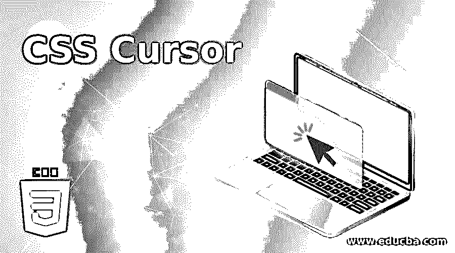
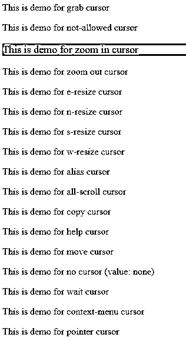

# CSS 光标

> 原文：<https://www.educba.com/css-cursor/>




## CSS 光标简介

对于任何在系统上工作的人来说，鼠标光标是非常重要的。在虚拟光标的帮助下，人们获得了重新定向的感觉。光标有各种符号或图标，普遍定义了系统的状态。级联样式表提供了光标属性，用户可以使用该属性创建和定制自己选择的光标。通过这种方式，他们可以预先决定当最终用户在他们的页面中导航时光标的行为。该属性提供了多种光标变体，可以根据页面中内容或元素的类型按需使用。

### 句法

在 CSS 中创建光标的语法是:

<small>网页开发、编程语言、软件测试&其他</small>

```
cursor: value| initial| inherit;
```

**说明:**这里的值表示需要的光标类型。在 CSS 中，开发人员在创建光标时有多种选择。其中一些是复制、进度、十字线、抓取、抓取、帮助、移动、不允许、不放下、文本、垂直文本、单元格、等待、放大、缩小、上下文菜单等。由开发人员决定何时使用哪个光标。除此之外，还可以选择使用 URL 作为值，并导入任何在线可用的特定光标设计。人们总是可以尝试 CSS 中的所有选项。

### 实现 CSS 光标的示例

让我们来看看游标的一些用法，以及我们如何通过外部、内部和内联 CSS 来实现它们。

#### 1.外部 CSS 光标

*   这个例子是一个外部 CSS 代码，所以我们将首先从编码 CSS 文件开始。
*   为了演示不同类型的游标，我们将定义不同的类，这些类将调用不同的游标值。CSS 文件的代码应该类似于下面的代码片段:

**代码:**

```
.cursor1{
cursor: grab;
background-color: palegreen;
}
.cursor2{
cursor: not-allowed;
font-size: 16px;
background-color: peachpuff;
}
.cursor3{
cursor: zoom-in;
font-size: 18px;
background-color: peru;
}
.cursor4{
cursor: zoom-out;
}
.cursor5{
cursor: e-resize;
}
.cursor6{
cursor: n-resize;
}
.cursor7{
cursor: s-resize;
}
.cursor8{
cursor: w-resize;
}
.cursor9{
cursor: alias;
}
.cursor10{
cursor: all-scroll;
}
.cursor11{
cursor: copy;
}
.cursor12{
cursor: help;
}
.cursor13{
cursor: move;
}
.cursor14{
cursor: none;
}
.cursor15{
cursor: wait;
}
.cursor16{
cursor: context-menu;
}
.cursor17{
cursor: pointer;
}
```

*   现在 CSS 代码已经完成，我们将为它创建 HTML 页面。由于它的外部 css，请注意，我们将不得不调用 html 代码头部分的 CSS 文件。
*   在 body 部分，我们将使用几个段落元素，这样我们就可以使用 CSS 文件中定义的所有类。最终的 HTML 代码应该类似于以下代码:

**代码:**

```
<html>
<head>
<title>Cursor Demo</title>
<link rel = "stylesheet" href = "cursor.css">
</head>
<body>
<p class="cursor1">This is demo for grab cursor</p>
<p class="cursor2">This is demo for not-allowed cursor</p>
<p class="cursor3">This is demo for zoom in cursor</p>
<p class="cursor4">This is demo for zoom out cursor</p>
<p class="cursor5">This is demo for e-resize cursor</p>
<p class="cursor6">This is demo for n-resize cursor</p>
<p class="cursor7">This is demo for s-resize cursor</p>
<p class="cursor8">This is demo for w-resize cursor</p>
<p class="cursor9">This is demo for alias cursor</p>
<p class="cursor10">This is demo for all-scroll cursor</p>
<p class="cursor11">This is demo for copy cursor</p>
<p class="cursor12">This is demo for help cursor</p>
<p class="cursor13">This is demo for move cursor</p>
<p class="cursor14">This is demo for no cursor (value: none)</p>
<p class="cursor15">This is demo for wait cursor</p>
<p class="cursor16">This is demo for context-menu cursor</p>
<p class="cursor17">This is demo for pointer cursor</p>
</body>
</html>
```

**输出:**当这个 html 代码被保存并通过浏览器打开时，它将给出如下输出。




**Note:** The screenshot does not display any cursor, but to see all the cursors, compile the code and open through the browser. Hovering over each paragraph will show the different cursors used.

#### 2.内部 CSS 光标

*   这个例子使用了内部 CSS，所以我们将直接为 HTML 页面编码。
*   因为这是内部 CSS，我们将在标题部分定义样式，在

    

    Primary Sidebar

    