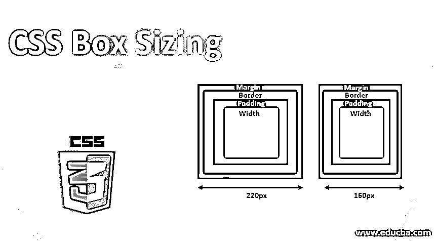
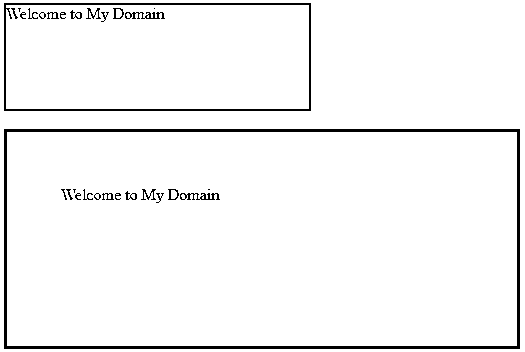
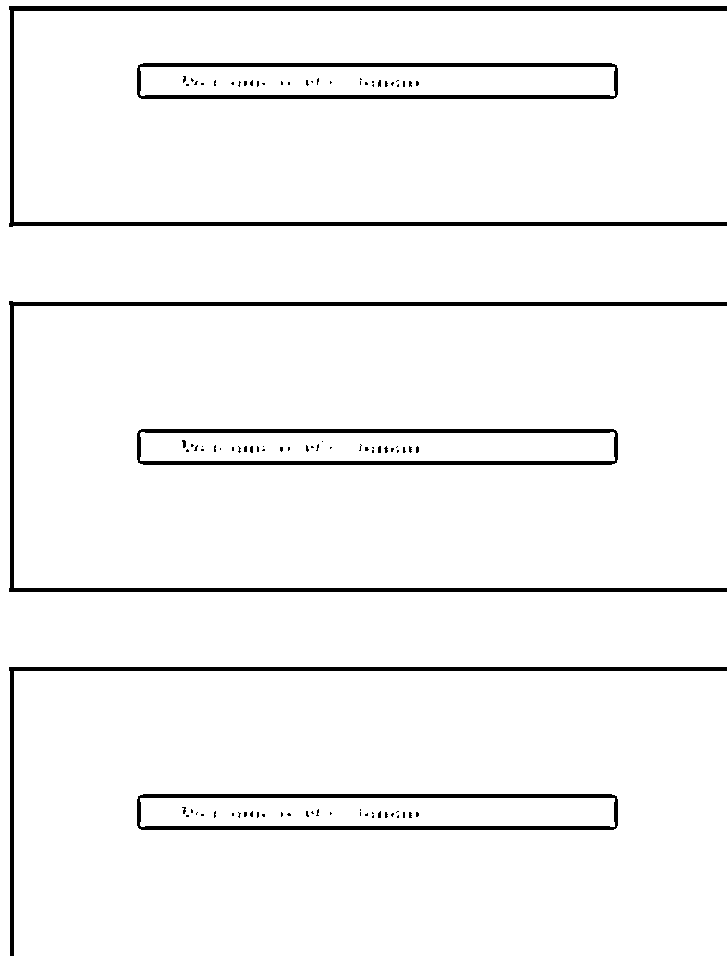
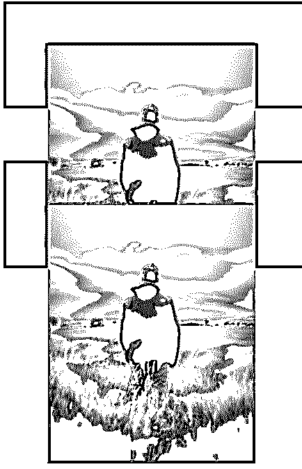

# CSS 框大小调整

> 原文：<https://www.educba.com/css-box-sizing/>




## CSS 框大小调整简介

Box sizing 属性使我们能够在元素的总宽度和高度中包括填充和边框。CSS 样式也有一组不同的属性，可以将网页与丰富多彩的业务演示结合使用。每个都有一些不同的属性、行为和风格。CSS 框大小是属性之一，它包括元素的填充和[边框样式。这将有助于包括 CSS 样式元素的总宽度和高度，这是前端网页上计算。](https://www.educba.com/css-border-style/)

**语法:**

<small>网页开发、编程语言、软件测试&其他</small>

在 CSS 中，元素的每个属性都有自己的语法，用于标识 CSS 样式中的元素，以用于演示片段。

```
<html>
<head>
<style>
.elements{
box-sizing:values;
}
</style>
</head>
</html>
```

上面的代码是我们在 CSS 样式中用于装箱概念的基本语法。在这种情况下，我们使用了框大小属性来对齐框模型中的页面内容。这些值类似于“边框、矩形、内容框”等，我们可以根据用户和项目需求使用任何框值。我们有一些用户定制的盒子，其中也可能包含值。

### CSS 中盒子大小是怎么做的？

通常，框大小属性包括框的内容和大小，如框的总宽度和高度，这将指定默认情况下的样式属性，并指定元素宽度和高度等值作为内容框模型。任何 web 元素的边框或填充值都取决于 web 页面的显示，边框和填充都被添加到元素的宽度和高度中，并由用户屏幕上内容框的大小来指定。当我们在属性中添加值时，我们会看到上面所有的东西，然后设置与网页对齐的高度和宽度值。如果我们在 CSS 中有一个框样式，它将包含四个边，它将设置框的宽度，并声明边框是顶部或右侧或左侧或底部边框，填充包括像顶部，底部，左侧和右侧这样的选项。

CSS box sizing 属性通常用于样式元素行为。内容框模型有助于满足 CSS 样式的默认条件，并将在内容框的宽度中设置一些值，它将允许并适用于我们在框中分配的所有 html 内容，值将以最终宽度呈现。如果我们使用边框模型，浏览器将接受我们在样式标签的边框和填充中声明的任何值。如果我们在边框-盒子模型中设置元素宽度值，它将适用于所有的边框和填充，它们包括在盒子样式中，并且盒子将收缩一些额外宽度的值。HTML 元素的大小通常有助于简化操作。更常见的是将布局元素的框大小设置为边框-框模型。这将有助于处理 HTML 元素的大小，也消除了一些陷阱，使布局 HTML 内容的时间受到影响。我们可以在样式标签中指定位置值，它可以是相对的，也可以是绝对的，就像内容框的大小一样，内容框将允许 HTML 元素的内容值相关，也允许 HTML 元素的一些独立设置，比如边框和填充元素值，大小也包括在内。

内容框模型采用 CSS 标准规则中已经指定的默认值。它还包括网页内容的元素宽度和高度，但不包括填充边框和边距样式，但边框-框模型元素宽度和高度将包括填充和边框属性，它不适用于边距样式。填充和边框值将位于边框模型内部。

### CSS 框大小的示例

下面是一些例子。

#### 示例#1

**代码:**

```
<html>
<head>
<style>
.sample {
width: 303px;
height: 104px;
border: 2px solid green;
}
.sample1 {
width: 402px;
height: 106px;
padding: 54px;
border: 3px solid blue;
}
</style>
</head>
<div class="sample">Welcome to My Domain</div>
<br>
<div class="sample1">Welcome to My Domain</div>
</html>
```

**输出:**




#### 实施例 2

**代码:**

```
<html>
<head>
<style>
.sample {
margin: 1 4 3rem 6;
padding: 3rem;
background: blue;
}
div[class*="sample1"]
{
width: 303px;
padding: 23px;
background: green;
color: red;
border: 13px solid blue;
background-clip: content-box;
text-indent: 22px;
}
.content-sample1{
box-sizing: content-box;
}
.padding-sample1{
box-sizing: content-box;
}
.border-sample1{
box-sizing: content-box;
}
</style>
</head>

<div class="sample1">Welcome to My Domain</div>


<div class="sample1">Welcome to My Domain</div>


<div class="sample1">Welcome to My Domain</div>

</html>
```

**输出:**




#### 实施例 3

**代码:**

```
<html>
<head>
<style>
.sample {
margin: 1 4 3rem 6;
padding: 3%;
background: blue;
}
div[class*="pictures"]
{
width: 303%;
padding-bottom: 23px;
background: green;
color: red;
border: 13px solid blue;
background-clip: content-box;
text-indent: 22px;
position: relative;
}
.pictures
{
width: 14%;
position: absolute;
}
</style>
</head>

Welcome to My Domain


Welcome to My Domain

</html>
```

**输出:**




上面的例子描述了 CSS 样式中的框大小属性的细节，第一个例子显示了基本的 CSS 框大小属性，第二个例子显示了三种类型的框，如内容框填充和边框，图像是用内容框模型添加的。

### 结论

CSS 样式属性用于所有网页，因为它将网站设计得更加丰富多彩，并且它更直观地包含像框大小这样的属性，这些类型的属性将支持所有浏览器的当前版本，在少数浏览器中，如 Firefox，它只支持 CSS 的填充框属性。对于 Internet Explorer，CSS 元素的宽度和高度值在 box-sizing 属性中不被识别。

### 推荐文章

这是一个 CSS 盒子大小的指南。在这里，我们讨论了 CSS 中的介绍和如何确定盒子大小，以及不同的例子和代码实现。您也可以阅读以下文章，了解更多信息——

1.  [CSS 职位如何工作的教程？](https://www.educba.com/css-position/)
2.  [CSS 内联样式是如何工作的？|定义|示例](https://www.educba.com/css-inline-style/)
3.  [代码为](https://www.educba.com/css-shape-generator/)的 CSS 形状生成器示例
4.  [前 5 种 CSS 箭头](https://www.educba.com/css-arrow/)
5.  [CSS 填充|示例](https://www.educba.com/css-padding/)
6.  [CSS 边距颜色指南](https://www.educba.com/css-margin-color/)
7.  [CSS 内边框|示例](https://www.educba.com/css-inner-border/)
8.  [CSS 边框填充|如何工作？](https://www.educba.com/css-border-padding/)
9.  [HTML 边框样式指南](https://www.educba.com/html-border-style/)


