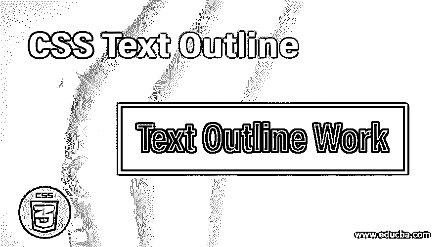

# CSS 文本轮廓

> 原文：<https://www.educba.com/css-text-outline/>




## CSS 文本大纲介绍

CSS 中的文本轮廓也称为文本笔划。如 CSS 中的 [text-shadow，这也可以用在文本内容中，突出一些重要的部分，或者使其看起来与常规文本不同，以吸引各自页面受众的注意。这是一个正在试验中的属性，只有扩展支持“WebKit”的浏览器才支持它。因此，当在代码中使用时，语法也使用 WebKit 的前缀。(-WebKit-text-笔画)。](https://www.educba.com/css-for-text-shadow/)

### CSS 中文本笔划的语法

Text-stroke 可以用作内部 CSS、内联 CSS 或外部 CSS。文本笔划的语法是:

<small>网页开发、编程语言、软件测试&其他</small>

**语法:**

```
-webkit-text-stroke: length | color
```

这里，参数 length 定义了笔画的宽度，而 color 定义了轮廓的颜色。如前所述，这是一个实验性质，受支持 WebKit 的浏览器支持。此外，当包含在 CSS 代码中时，出于同样的目的，该属性以关键字“WebKit”为前缀。

**语法:**

```
-webkit-text-stroke: initial
```

Text-stroke 是两个不同属性的简写属性，即 text-stroke-width 和 text-stroke-color。CSS 中的简写属性可以定义为允许用户通过单个属性为多个属性设置值的属性。这是一个全局值，宽度将默认为 0，没有颜色或当前颜色。上面提到的是一个全局值；宽度默认为 0，没有颜色或当前颜色。

### 文本轮廓在 CSS 中是如何工作的？

让我们来看一些基本示例，以便更全面地了解该特性:

#### 示例#1

通过文本笔画宽度和颜色属性实现文本轮廓。

*   对于这个例子，我们将使用外部 CSS。首先，我们将创建一个. css 文件。这个文件将定义我们期望在页面中使用的所有样式。
*   一旦。css 文件创建后，我们将定义段落标签的样式，即

    。由于我们使用的是基本属性，我们将分别定义“文本-笔画-宽度”和“文本-笔画-颜色”的值。代码应该是这样的:

```
p{
font-size: 30px;
color: white;
-webkit-text-stroke-width: 1px;
-webkit-text-stroke-color: blueviolet;
}
```

我们还定义了一个名为 outline 的类，只是为了以不同的方式设置值，并将该类用于任何需要的标签。

```
.outline{
font-size: 20px;
color: white;
font-family: Cambria, Cochin, Georgia, Times, 'Times New Roman', serif;
-webkit-text-stroke-width: 1px;
-webkit-text-stroke-color: red;
}
```

结合这两段代码，最终的 CSS 文件应该如下所示:

**CSS 代码:**

```
p{
font-size: 30px;
color: white;
-webkit-text-stroke-width: 1px;
-webkit-text-stroke-color: blueviolet;
}
.outline{
font-size: 20px;
color: white;
font-family: Cambria, Cochin, Georgia, Times, 'Times New Roman', serif;
-webkit-text-stroke-width: 1px;
-webkit-text-stroke-color: red;
}
```

现在，我们将创建一个具有基本结构的 HTML 页面。因为我们使用外部样式表，所以我们将在 HTML 页面上调用它，并相应地定义不同的标签来使用样式。HTML 页面的编码应该如下所示:

**HTML 代码:**

```
<html>
<head>
<title>Text-Shadow property</title>
<link rel = "stylesheet" href = "textProp2.css">
</head>
<body>
<p>Testing text outline properties</p>
<p class = "outline">testing text outline properties with the class 'outline'</p>
</body>
```

**输出:**


#### 实施例 2

利用速记属性 text-stroke 实现文本轮廓。

*   与上一个例子相似，我们也将在这个例子中使用外部 CSS。我们将创建/修改 CSS 文件。
*   我们将使用速记属性'-webkit-text-stroke '并将这两个属性定义为参数，而不是使用两个单独的属性来定义文本轮廓的宽度和颜色。
*   首先，我们将为标题标签编写样式，即

    ## 。代码应该是:

```
h2{
font-size: 50px;
color: white;
font-family: 'Franklin Gothic Medium', 'Arial Narrow', Arial, sans-serif;
-webkit-text-stroke: 1px gold;
}
```

与前面的例子类似，我们可以定义一个额外的 CSS 类，用于任何需要样式化的标签:

```
.outline{
font-size: 40px;
color: white;
font-family: Cambria, Cochin, Georgia, Times, 'Times New Roman', serif;
-webkit-text-stroke: 1.5px blueviolet;
}
```

最终的 CSS 文件应该如下所示:

**CSS 代码:**

```
h2{
font-size: 30px;
color: white;
font-family: 'Franklin Gothic Medium', 'Arial Narrow', Arial, sans-serif;
-webkit-text-stroke: 1px gold;
}
.outline{
font-size: 30px;
color: white;
font-family: Cambria, Cochin, Georgia, Times, 'Times New Roman', serif;
-webkit-text-stroke: 1.5px blueviolet;
}
```

最后，我们将创建一个 HTML 页面并调用外部样式表。我们将利用在。css 文件。最终的 HTML 代码应该是这样的:

**HTML 代码:**

```
<html>
<head>
<title>Text-Shadow property</title>
<link rel = "stylesheet" href = "textProp2.css">
</head>
<body>
<h2>Testing text outline properties</h2>
<p class = "outline">testing text outline properties with the class 'outline'</p>
</body>
```

**输出:**


#### 实施例 3

使用内联 CSS 显示文本轮廓。

*   我们在这个例子中使用内联 CSS，所以[不需要创建一个单独的 CSS 文件](https://www.educba.com/css-blinking-text/)。我们将创建一个新的 HTML 页面，并使用 style 参数设置元素的样式。
*   创建 HTML 文件并添加基本的结构标签。完成后，使用 text-stroke 属性确定要设置样式的元素。对于这个例子，标题和段落标签将使用不同的文本笔划。
*   我们将首先设计风格。造型应按如下方式进行:

```
<h1 style="-webkit-text-stroke: 1.5px red; color: black; font-size: 50px;">HEADING OUTLINE USING INLINE</h1>
```

我们将首先设计风格。造型应按如下方式进行:

```
<p style="-webkit-text-stroke: 1px blue; color:gold; font-size: 30px;">Outlining paragraph text using text-stroke property</p>
```

最终的 HTML 代码应该是这样的:

**HTML 代码:**

```
<html>
<head>
<title>Text-Outline in CSS</title>
</head>
<body>
<h1 style="-webkit-text-stroke: 1.5px red; color: black; font-size: 30px;">HEADING OUTLINE USING INLINE</h1>
<p style="-webkit-text-stroke: 1px blue; color:gold; font-size: 20px;">Outlining paragraph text using text-stroke property</p>
</body>
</html>
```

**输出:**


### 结论

这是文本笔划功能的一些基本用法。对好奇的人来说，到处做实验的选择总是敞开的。然而，该功能的缺点是它仅在启用了 webkit 的浏览器中受支持，例如，如果我们尝试通过 internet explorer 打开这些 HTML 文件，文本的轮廓功能将会丢失。这是因为 IE 不支持 webkit。因此，建议使用没有任何此类约束或条件的属性和功能。

### 推荐文章

这是一个 CSS 文本大纲的指南。在这里，我们讨论介绍和文本大纲如何在 CSS 中工作，以及不同的例子和代码实现。您也可以看看以下文章，了解更多信息–

1.  [CSS 中的文本对齐](https://www.educba.com/text-align-in-css/)
2.  [CSS 填充](https://www.educba.com/css-padding/)
3.  [CSS 文本下划线](https://www.educba.com/css-text-underline/)
4.  [菜单图标 CSS](https://www.educba.com/menu-icon-css/)


