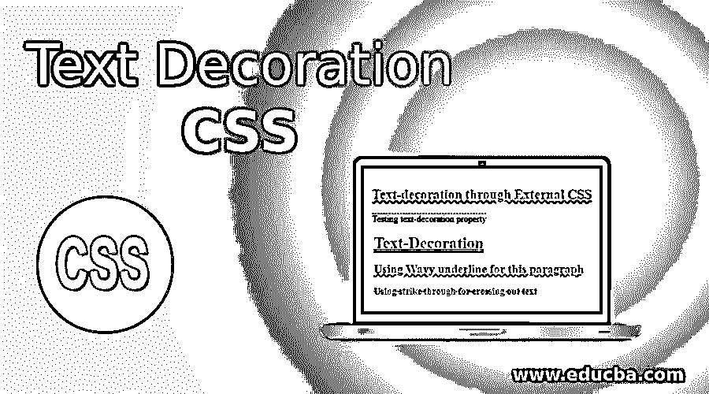

# 文本装饰 CSS

> 原文：<https://www.educba.com/text-decoration-css/>




## 文本装饰 CSS 概述

CSS 是关于表现的。如果页面的第一个视图吸引了用户，那么工作已经完成了一半。展示你的文本内容，让所有重要的部分立即吸引最终用户的注意力，这是非常重要的。层叠样式表或者说 [CSS 为](https://www.educba.com/how-to-add-css-in-html/)提供了很多选项来改善网页上文本内容的表现。它不仅为我们提供了各种组织文本的方法，还提供了许多突出重要文本的选项。一个这样的属性是文本装饰。用户可以利用这个属性，自定义文本应该如何划线，即加下划线、多线或交叉(删除线)。这是一个提供大量参数的属性，这些参数可用于根据需要修饰文本。然而，需要注意的是，并非所有的浏览器都支持这一特性或属性，并且可能不会给出类似的结果。因此，在运行最终代码之前检查浏览器兼容性将会很有帮助。让我们看看 CSS 中的语法和文本修饰是如何工作的。

### CSS 中的文本装饰是如何工作的？

CSS 中的文本修饰可以用作内联 CSS、外部 CSS 或内部 CSS，这取决于开发人员的选择。

<small>网页开发、编程语言、软件测试&其他</small>

**语法:**

文本修饰的语法如下:

```
text-decoration:  line | color  | style;
```

这里，line 定义了文本所需的线条类型，是下划线、上划线还是删除线。色彩定义了装饰的颜色。样式定义线条的样式，即它是点线还是波浪线。

属性 text-decoration 是三个父属性的简写属性，它们是:

*   文本装饰线
*   文本装饰样式
*   文本-装饰-颜色

为不同的元素分别定义这三个属性可能是一项冗长的任务，因此属性 text-decoration(简称 text-decoration)涵盖了所有三个元素。

### CSS 中文本装饰的例子

让我们来看一些文本修饰的例子:

#### 1.使用所有三个父属性的文本装饰

对于这个例子，我们将使用外部 css 方法，所以我们将从创建一个 CSS 文件开始。

我们将为标题元素

## 定义三个属性，即 text-decoration-line、text-decoration-style、text-decoration-color。代码应该是这样的:

**代码:**

```
h2{
text-decoration-line: underline;
text-decoration-style: wavy;
text-decoration-color: red;
}
```

对于这个例子，我们将定义一个名为“overline”的类。代码应该是这样的:

**代码:**

```
.overline{
text-decoration-line: overline;
text-decoration-style: dashed;
text-decoration-color: darkgreen;
}
```

结合这两者，最终的 CSS 代码应该如下所示:

**代码:**

```
h2{
text-decoration-line: underline;
text-decoration-style: wavy;
text-decoration-color: red;
}
.overline{
text-decoration-line: overline;
text-decoration-style: dashed;
text-decoration-color: darkgreen;
}
```

现在 CSS 文件已经完成，我们将创建一个相应的 [HTML 文件](https://www.educba.com/what-is-xhtml/)，并调用外部样式表。我们将使用我们为其编写样式的< h2 >元素，并使用段落元素< p >的类。网页中生成的 HTML 文件应该如下所示:

**代码:**

```
<html>
<head>
<title>Text-decoration property</title>
<link rel = "stylesheet" href = "decoration.css">
</head>
<body>
<h2>Text-decoration through External CSS</h2>
<p class="overline">Testing text-decoration property</p>
</body>
</html>
```

**最终输出:**


#### 2.使用速记属性的文本修饰

在这个例子中，我们将利用速记属性来演示文本修饰。

由于我们在这个例子中也使用了外部 CSS，我们将从创建和定义样式开始。我们将首先为标题元素

## 定义文本装饰样式，如下所示:

**代码:**

```
h2{
text-decoration: underline wavy turquoise;
}
```

接下来，我们将定义一个通用类，如果需要，任何元素都可以使用它。CSS 类的编码应该如下所示:

**代码:**

```
.overline{
font-size: 20px;
text-decoration: overline underline dashed red;
}
```

CSS 代码最终应该如下所示。请注意，可以根据需要添加更多功能和参数。

**代码:**

```
h2{
text-decoration: underline wavy turquoise;
}
.overline{
font-size: 20px;
text-decoration: overline underline dashed red;
}
```

接下来，我们将编写 HTML 代码，同时使用 heading 元素和 overline 类，我们在外部样式表中为其设置了样式。由于它是一个外部表，我们将在页面的 head 部分调用它。最终组合的 HTML 页面编码应该类似于:

**代码:**

```
<html>
<head>
<title>Text-decoration property</title>
<link rel = "stylesheet" href = "decoration.css">
</head>
<body>
<h2>This is demonstration of text-decoration shorthand Property</h2>
<p class="overline">Testing text-decoration property</p>
</body>
</html>
```

保存这段代码，并通过浏览器打开 HTML 文件。

**输出:**


#### 3.使用内联 CSS 的不同类型的文本修饰

我们将为这个例子创建一个 HTML 页面，因为我们使用内联样式 CSS 来尝试不同的文本修饰参数。

首先，我们将为

# 元素设置样式。我们将定义文本修饰并设置参数，这样

# 中的任何内容都应该用蓝色加双下划线。我们将以类似的方式设计元素

## 和

### 。

代码应该如下所示:

**代码:**

```
<h1 style="text-decoration: underline double blue ;">Text-Decoration</h1>
```

```
<h2 style="text-decoration: underline wavy olive;">Using Wavy underline for this paragraph</h2>
<h3 style="text-decoration: line-through red;">Using strike through for crossing out text</h3>
```

将这些样式代码与基本的 HTML 页面结构结合起来，最终的代码应该是这样的:

**代码:**

```
<html>
<head>
<title>Text-decoration using inline css</title>
</head>
<body>
<h1 style="text-decoration: underline double blue ;">Text-Decoration</h1>
<h2 style="text-decoration: underline wavy olive;">Using Wavy underline for this paragraph</h2>
<h3 style="text-decoration: line-through red;">Using strike through for crossing out text</h3>
</body>
</html>
```

保存此页面并通过浏览器打开它。

**最终输出:**


这些例子演示了文本装饰是如何工作的。然而，并非所有的浏览器都支持该属性，所以请记住在运行最终代码之前检查浏览器的支持。在很多情况下，当通过文本阴影或轮廓突出显示文本是不够的时候，文本装饰会有所帮助。这个特性有助于做一些小的改变来提高用户界面的质量。毕竟，页面的第一印象是如何呈现给用户的。

### 推荐文章

这是一个文本装饰的 CSS 指南。在这里，我们讨论了导言，CSS 中的文本装饰是如何工作的，以及语法和输出的例子。您也可以浏览我们推荐的其他文章，了解更多信息——

1.  [CSS 文本下划线](https://www.educba.com/css-text-underline/)
2.  [CSS 形状生成器](https://www.educba.com/css-shape-generator/)
3.  [CSS 布局](https://www.educba.com/css-layout/)
4.  [CSS 三角形生成器](https://www.educba.com/css-triangle-generator/)


