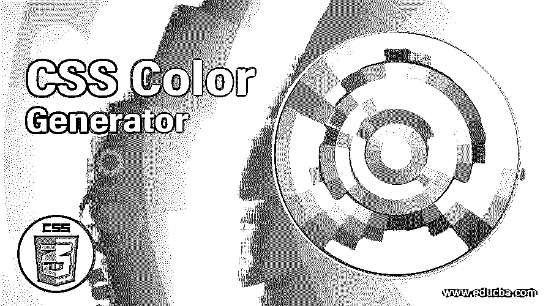
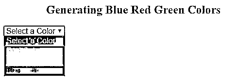
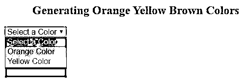

# CSS 颜色生成器

> 原文：<https://www.educba.com/css-color-generator/>




## CSS 颜色生成器简介

CSS 中的颜色生成器用于通过选择不同的颜色来生成随机的颜色。颜色生成器可以动态显示从下拉框、按钮、复选框中选择的颜色。纯 CSS 不能直接提供颜色生成器，因为对于动态值我们必须写动作，所以用 JavaScript 可以[准确。颜色发生器用于为色盲人群改变背景的颜色。因为他们只能看到特定的颜色，所以如果我们根据他们的舒适度改变背景，他们可以很容易地阅读内容。颜色生成器还用于从一个地方获取颜色代码，如#fff，以便将该颜色代码用于其他页面需求。](https://www.educba.com/what-is-javascript/)

### CSS 中颜色生成器是如何工作的？

在本教程中，我们将看到如何用 CSS 在 JavaScript 中生成不同的背景颜色生成器。为了清楚地理解，请参考下面的语法和例子:

<small>网页开发、编程语言、软件测试&其他</small>

**语法 1:**

```
color = element.options[element.selectedIndex].value;
if (color == "value from User") {
document.body.style.backgroundColor = "colorValue";
}
```

**语法 1 解释:**

*   选项数组从用户处获取选定的索引值。
*   If 条件检查用户值中是否存在选定的颜色。如果它存在，它给出用户指定的背景颜色。
*   如果条件不满足，背景色只作为以前的颜色。

**语法 2:**

```
.selected option
{
color: value1;
}
```

**语法 2 解释:**

*   一旦我们从下拉列表中选择了任何选项，那么所选框的背景颜色就会变成指定的颜色。

### CSS 颜色生成器的示例

以下是 CSS 颜色生成器的示例:

#### 示例#1

所选下拉颜色列表中的红绿蓝背景色:

**代码:**

```
<!DOCTYPE html>
<html>
<head>
<title>CSS Color Generator</title>
<script>
function choosenColor(element) {
const color = element.options[element.selectedIndex].value;
if (color == "Red") {
document.body.style.backgroundColor = "red";
}
if (color == "Green") {
document.body.style.backgroundColor = "green";
}
if (color == "Blue") {
document.body.style.backgroundColor = "blue";
}
}
</script>
</head>
<style>
.header
{
text-align: center;
}
</style>
<body>
<h2 class="header">Generating Red Green Blue Colors</h2>
<select id="colors" onchange="choosenColor(this)">
<option>Select a Color</option>
<option value="Red">Red Color</option>
<option value="Green">Grren Color</option>
<option value="Blue">Blue Color</option>
</select>
</body>
</html>
```

**输出:**


**说明:**

*   正如您在输出中看到的，当我们没有从下拉框中选择任何颜色时，颜色默认为白色。
*   选定的颜色总是从 choosenColor()方法传递到脚本。
*   当我们选择红色时，背景变成红色。
*   当我们选择绿色时，背景变成绿色。
*   当我们选择蓝色时，背景变成蓝色。

#### 实施例 2

所选下拉颜色列表中的红色、绿色和蓝色背景色。

**代码:**

```
<!DOCTYPE html>
<html>
<head>
<title>CSS Color Generator</title>
<script>
function choosenColor(element) {
const color = element.options[element.selectedIndex].value;
if (color == "Orange") {
document.body.style.backgroundColor = "orange";
}
if (color == "Yellow") {
document.body.style.backgroundColor = "yellow";
}
if (color == "Brown") {
document.body.style.backgroundColor = "brown";
}
}
</script>
</head>
<style>
.header
{
text-align: center;
color: green;
}
</style>
<body>
<h2 class="header">Generating Orange Yellow Brown Colors</h2>
<select id="colors" onchange="choosenColor(this)">
<option>Select a Color</option>
<option value="Orange">Orange Color</option>
<option value="Yellow">Yellow Color</option>
<option value="Brown">Brown Color</option>
</select>
</body>
</html>
```

**输出:**


**说明:**

*   正如您在输出中看到的，当我们没有从下拉框中选择任何颜色时，颜色默认为白色。
*   选定的颜色总是从 choosenColor()方法传递到脚本。
*   当我们选择橙色时，背景变成橙色。
*   当我们选择黄色时，背景变成黄色。
*   当我们选择棕色时，背景变成棕色。

可以只在下拉框部分生成背景色吗？

答案是肯定的。通过使用选中框选项 CSS 属性。

#### 实施例 3

所选下拉颜色列表中的红色、绿色和蓝色背景色。

**代码:**

```
<!DOCTYPE html>
<html>
<head>
<title>CSS Color Generator</title>
</head>
<style>
.colors {
font-size: 1em;
}
.colors option[value="Red"] {
background: Red;
}
.colors option[value="Blue"] {
background: blue;
}
.colors option[value="Green"] {
background: green;
}
.colors option[value="Select a Color"] {
background: white;
}
.header {
text-align: center;
color: brown;
}
</style>
<body>
<h2 class="header">Generating Blue Red Green Colors</h2>
<select class="colors">
<option>Select a Color</option>
<option value="Red">Red Color</option>
<option value="Green">Green Color</option>
<option value="Blue">Blue Color</option>
</select>
</body>
</html>
```

**输出:**




**说明:**

*   正如您在输出中看到的，当我们没有从下拉框中选择任何颜色时，颜色默认为白色。
*   当我们选择红色时，下拉框的背景变成红色。
*   当我们选择绿色时，下拉框的背景变成绿色。
*   当我们选择蓝色时，下拉框的背景变成蓝色。

#### 实施例 4

所选下拉颜色列表中的红色、绿色和蓝色背景色。

**代码:**

```
<!DOCTYPE html>
<html>
<head>
<title>CSS Color Generator</title>
</head>
<style>
.colors {
font-size: 1em;
}
.colors option[value="Orange"] {
background: orange;
}
.colors option[value="Yellow"] {
background: yellow;
}
.colors option[value="Brown"] {
background: brown ;
}
.colors option[value="Select a Color"] {
background: white;
}
.header {
text-align: center;
color: green;
}
</style>
<body>
<h2 class="header">Generating Orange Yellow Brown Colors</h2>
<select class="colors">
<option>Select a Color</option>
<option value="Orange">Orange Color</option>
<option value="Yellow">Yellow Color</option>
<option value="Brown">Brown Color</option>
</select>
</body>
</html>
```

**输出:**




**说明:**

*   正如您在输出中看到的，当我们没有从下拉框中选择任何颜色时，颜色默认为白色。
*   当我们选择橙色时，下拉框的背景会变成橙色。
*   当我们选择黄色时，下拉框的背景变成黄色。
*   当我们选择棕色时，下拉框的背景会变成棕色。

### 推荐文章

这是一个 CSS 颜色生成器的指南。在这里，我们讨论如何使用 CSS 中的颜色生成器，通过使用下拉框、按钮和链接等来生成任意多的颜色。您也可以看看以下文章，了解更多信息–

1.  [CSS 形状生成器](https://www.educba.com/css-shape-generator/)
2.  [CSS 分页](https://www.educba.com/css-pagination/)
3.  [CSS 闪烁文本](https://www.educba.com/css-blinking-text/)
4.  [CSS 梯度发生器](https://www.educba.com/css-gradient-generator/)


