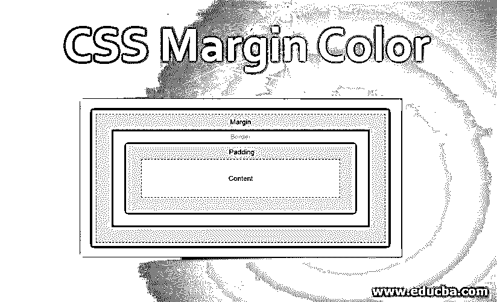
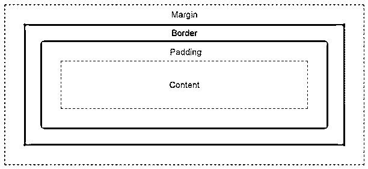
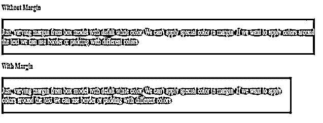
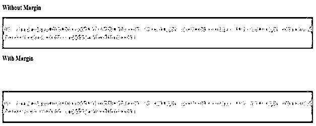
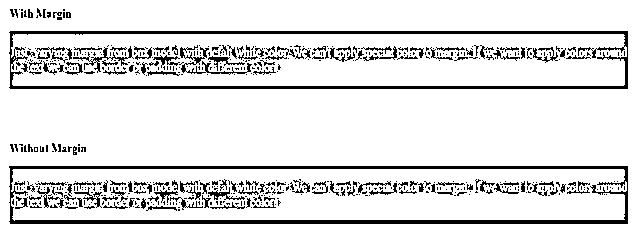

# CSS 边距颜色

> 原文：<https://www.educba.com/css-margin-color/>




## CSS 边距颜色介绍

下面的文章提供了 CSS 边距颜色的概述。HTML 中的 margin 属性在盒状结构的最外层元素的内容周围留出空间。边距是在盒子模型元素之外创建空间。因此，我们不能将颜色应用到页边空白。如果我们的需求仍然是在元素周围应用颜色，你可以使用填充来代替空白。

html 中的 padding 属性在盒状结构的最内部元素的内容周围提供空间。填充和边距周围的空间称为边框。

<small>网页开发、编程语言、软件测试&其他</small>

您可以在下面观察到填充、边距和边框之间的差异:




*   正如我们所知，在所有的页面中，我们总是倾向于使用 CSS 而不是 HTML。
*   因此，在本教程中，所有的公共属性都只在 CSS 中实现。
*   正如我们上面所讨论的，不可能应用不同的颜色，但是可以通过将 html 页面的背景颜色设置为不同的颜色和空白颜色(默认为白色)来改变边框的颜色。

### 句法

```
div
{
margin: 10px;
background: black;
}
```

边距可以应用于顶部、右侧、底部和左侧。

**语法 1:**

```
div
{
margin: 10px,10px,10px,10px; //margin positions
}
```

**解释:**如果我们用 4 个值应用边距，那么第一个值用于顶部，第二个值用于右侧，第三个值用于底部，第四个值用于左侧。

**语法 2:**

```
div
{
margin: 10px,10px,10px; //margin positions
}
```

**解释:**如果我们用 3 个值应用边距，那么第一个值用于顶部，第二个值用于左侧和右侧，第三个值用于底部。

**语法 3:**

```
div
{
margin: 10px,10px; //margin positions
}
```

**解释:**如果我们用 2 个值应用边距，那么第一个值分别用于顶部和底部，第二个值分别用于左侧和右侧。

**语法 4:**

```
div
{
margin: 10px; //margin positions
}
```

**说明:**

*   如果我们只使用单个值来应用边距，那么它将平等地应用于所有四个边。
*   如果我们想只应用页边空白，那么 [CSS](https://www.educba.com/css-drop-shadow/) 提供预定义的属性。
*   左边距:10px:左边距为 10px。

**语法:**

```
div
{
margin-left: 10px;
}
```

右边距:10px:在右侧应用 10px 的边距。

**语法:**

```
div
{
margin-right: 10px;
}
```

上边距:10px:上边距为 10px。

**语法:**

```
div
{
margin-top: 10px;
}
```

下边距:10px:下边应用 10px 的边距。

**语法:**

```
div
{
margin-bottom: 10px;
}
```

### CSS 边距颜色的示例

下面是 CSS 边距颜色的示例:

#### 示例#1:从左侧应用边距

**HTML 代码:**

```
<!DOCTYPE html>
<html>
<head>
<title> Margin Left</title>
<link rel="stylesheet" href="MarginLeft.css"></link>
</head>
<body>
<font color="green" style="align:center">
<h2>Without Margin</h2>
</font>
<div class="margin1">
<font color="white"><p>Just, varying margin from box model
with defalt white color. We can't apply special color to margin. If
we want to apply colors around the text we can use border or padding
with different colors.</p>
</font>
</div>
<font color="green" style="align:center">
<h2>With Margin</h2>
</font>
<div class="margin2">
<font color="white"><p>Just, varying margin from box model
with defalt white color. We can't apply special color to margin. If
we want to apply colors around the text we can use border or padding
with different colors.</p>
</font>
</div>
</body>
</html>
```

**CSS 代码:**

```
.margin2
{
border: 1px solid black;
margin-left:100px;
background: brown;
}
.margin1
{
border: 1px solid black;
background: brown;
}
```

**输出:**


**说明:**

*   在上面的代码中，margin-left 用空白从左侧移动文本。

#### 示例#2:从右侧应用边距

**HTML 代码:**

```
<!DOCTYPE html>
<html>
<head>
<title> Margin Right</title>
<link rel="stylesheet" href="MarginRight.css"></link>
</head>
<body>
<font color="green" style="align:center">
<h2>Without Margin</h2>
</font>
<div class="margin1">
<font color="white"><p>Just, varying margin from box model
with defalt white color. We can't apply special color to margin. If
we want to apply colors around the text we can use border or padding
with different colors.</p>
</font>
</div>
<font color="green" style="align:center">
<h2>With Margin</h2>
</font>
<div class="margin2">
<font color="white"><p>Just, varying margin from box model
with defalt white color. We can't apply special color to margin. If
we want to apply colors around the text we can use border or padding
with different colors.</p>
</font>
</div>
</body>
</html>
```

**CSS 代码:**

```
.margin2
{
border: 1px solid black;
margin-right:100px;
background: fuchsia;
font-size: 25px;
}
.margin1
{
border: 1px solid black;
background: fuchsia;
font-size: 25px;
}
```

**输出:**




**说明:**

*   在上面的代码中，margin-right 使用空白从右侧移动文本。

#### 示例#3:从顶部应用边距

**HTML 代码:**

```
<!DOCTYPE html>
<html>
<head>
<title>Margin Top</title>
<link rel="stylesheet" href="MarginRight.css"></link>
</head>
<body>
<font color="green" style="align:center">
<h2>Without Margin</h2>
</font>
<div class="margin1">
<font color="white"><p>Just, varying margin from box model
with defalt white color. We can't apply special color to margin. If
we want to apply colors around the text we can use border or padding
with different colors.</p>
</font>
</div>
<font color="green" style="align:center">
<h2>With Margin</h2>
</font>
<div class="margin2">
<font color="white"><p>Just, varying margin from box model
with defalt white color. We can't apply special color to margin. If
we want to apply colors around the text we can use border or padding
with different colors.</p>
</font>
</div>
</body&gt
</html>
```

**CSS 代码:**

```
.margin2
{
border: 1px solid black;
margin-top:100px;
background: lime;
font-size: 25px;
}
.margin1
{
border: 1px solid black;
background: lime;
font-size: 25px;
}
```

**输出:**




**说明:**

*   在上面的代码中，margin-top 从带有空白的一侧移动文本。

#### 示例#4:从底边应用边距

**HTML 代码:**

```
<!DOCTYPE html>
<html>
<head>
<title>Margin Bottom</title>
<link rel="stylesheet" href="MarginBottom.css"></link>
</head>
<body>
<font color="green" style="align:center">
<h2>With Margin</h2>
</font>
<div class="margin2">
<font color="white"><p>Just, varying margin from box model
with defalt white color. We can't apply special color to margin. If
we want to apply colors around the text we can use border or padding
with different colors.</p>
</font>
</div>
<font color="green" style="align:center">
<h2>Without Margin</h2>
</font>
<div class="margin1">
<font color="white"><p>Just, varying margin from box model
with defalt white color. We can't apply special color to margin. If
we want to apply colors around the text we can use border or padding
with different colors.</p>
</font>
</div>
</body>
</html>
```

**CSS 代码:**

```
.margin2
{
border: 1px solid black;
margin-bottom:100px;
background: gray;
font-size: 25px;
}
.margin1
{
border: 1px solid black;
background: gray;
font-size: 25px;
}
```

**输出:**




**说明:**

*   在上面的代码中，margin-left 使用空白从底部移动文本。

### 结论

我们不能对边距应用不同的颜色，因为它超出了其元素框。我们只是改变了背景的元素的空白，使之变成不同的颜色，空白变成白色。

### 推荐文章

这是一个 CSS 边距颜色的指南。在这里，我们讨论了 CSS 边距颜色的基本概念和代码实现和输出的不同例子。您也可以看看以下文章，了解更多信息–

1.  [CSS 分页](https://www.educba.com/css-pagination/)
2.  CSS 箭
3.  [CSS 字体颜色](https://www.educba.com/css-font-color/)
4.  [CSS 内边框](https://www.educba.com/css-inner-border/)


