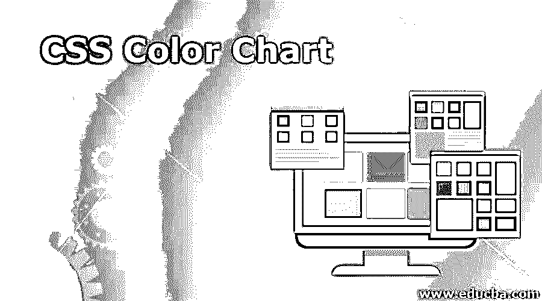

# CSS 颜色图表

> 原文：<https://www.educba.com/css-color-chart/>




## CSS 颜色图表介绍

颜色在任何类型的展示中都很重要。正如我们在关于 CSS 的文章中注意到的，颜色是一个主要元素。无论是边框、背景还是文本，每个开发人员都希望能够根据他们的规划布局来选择颜色。和往常一样，CSS 不会让人失望。它提供了广泛的颜色，人们可以在他们的网页上使用。颜色的使用不仅限于颜色名称。CSS 可以选择使用十六进制代码、短十六进制代码、RGB 值和其他选项来调用特定的颜色。

**语法:**

<small>网页开发、编程语言、软件测试&其他</small>

CSS 中任何元素的颜色都可以使用元素颜色来定义。

```
p{
color: black;
}
```

这里，我们使用了一个关键字来调用所需的颜色。我们可以用十六进制代码来做同样的事情。

语法将是:

```
color: #000000;
```

我们也可以使用短的十六进制代码来调用特定的颜色。黑色的 shot 十六进制代码的语法为:

```
color: #000;
```

除了十六进制代码，我们可以使用 RGB 值或十进制值来调用颜色。对于黑色，如下所示:

```
color: rgb(0,0,0);
```

一些常见的颜色代码如下:

| **颜色** | **十六进制代码** | **短十六进制代码** | **RGB / Decimal** |
| 怀特（姓氏） | #ffffff | #fff | Rgb(255，255，255) |
| 红色 | #ff0000 | #f00 | rgb(255，0，0) |
| 绿色的 | #008000 |  | rgb(0，128，0) |
| 黄色 | #ffff00 | #ff0 | rgb(255，255，0) |
| 蓝色 | #0000ff | #00f | rgb(0，0，255) |
| 粉红色 | #ffc0cb |  | rgb(255，192，203) |
| 紫色 | #800080 |  | rgb(128，0，128) |

### 如何创建 CSS 颜色图表？

让我们看看如何创建颜色图表的例子。

#### 示例#1

使用颜色的关键字，并通过外部 CSS 创建一个倒置的彩虹

*   在这个例子中，我们将使用外部 CSS。因此，我们将首先创建样式表。
*   在这个例子中，我们将使用颜色名称或关键字来调用颜色。我们将创建不同背景颜色的类。可以通过以下方式创建该类:

```
.cl1{
background-color: red;
height: 25px;
width: 70px;
color: #000;
text-align: center;
}
```

*   我们将再增加六个相同类型的类，调用不同颜色的 VIBGYOR。最终的 CSS 代码应该如下所示:

```
.cl1{
background-color: red;
height: 25px;
width: 70px;
color: #000;
text-align: center;
}
.cl2{
background-color: orange;
height: 25px;
width: 70px;
color: #000;
text-align: center;
}
.cl3{
background-color: yellow;
height: 25px;
width: 70px;
color: #000;
text-align: center;
}
.cl4{
background-color: green;
height: 25px;
width: 70px;
color: #000;
text-align: center;
}
.cl5{
background-color: blue;
height: 25px;
width: 70px;
color: #000;
text-align: center;
}
.cl6{
background-color: indigo;
height: 25px;
width: 70px;
color: #000;
text-align: center;
}
.cl7{
background-color: violet;
height: 25px;
width: 70px;
color: #000;
text-align: center;
}
```

*   接下来，我们将为 HTML 文件编码。因为这是一个外部 CSS 示例，我们将在 header 部分调用样式表。在主体部分，我们将创建服务器段落，调用我们在 CSS 文件中创建的所有七个类。代码如下所示:

```
<html>
<head>
<title>Color Chart</title>
<link rel = "stylesheet" href = "colorchart.css">
</head>
<body>
<p class="cl1">Red</p>
<p class="cl2">Orange</p>
<p class="cl3">Yellow</p>
<p class="cl4">Green</p>
<p class="cl5">Blue</p>
<p class="cl6">Indigo</p>
<p class="cl7">Violet</p>
</body>
</html>
```

*   我们可以通过保存 html 文件并通过浏览器打开它来观察输出。它必须类似于下面给出的输出:


#### 实施例 2

通过外部 CSS 使用十六进制代码创建彩色图表

*   我们也将使用外部 CSS 创建这个图表，因此我们将从创建一个样式表开始。
*   与上一个例子相似，我们将创建不同背景颜色的不同类。最终的 CSS 代码应该如下所示:

```
.cl1{
background-color: #add8e6;
height: 40px;
width: 70px;
color: #000;
text-align: center;
}
.cl2{
background-color: #90ee90;
height: 40px;
width: 70px;
color: #000;
text-align: center;
}
.cl3{
background-color: #ffb6c1;
height: 40px;
width: 70px;
color: #000;
text-align: center;
}
.cl4{
background-color: #20b2aa;
height: 40px;
width: 70px;
color: #000;
text-align: center;
}
.cl5{
background-color: #f08080;
height: 40px;
width: 70px;
color: #000;
text-align: center;
}
.cl6{
background-color: #e0ffff;
height: 40px;
width: 70px;
color: #000;
text-align: center;
}
.cl7{
background-color: #ffffe0;
height: 40px;
width: 70px;
color: #000;
text-align: center;
}
```

*   接下来，我们将创建一个 HTML 页面，在 head 部分调用外部样式表，在 body 部分调用 CSS 类。代码如下所示:

```
<html>
<head>
<title>Color Chart</title>
<link rel = "stylesheet" href = "colorchart.css">
</head>
<body>
<p class="cl1">Pastel Blue</p>
<p class="cl2">Pastel Green</p>
<p class="cl3">Pastel Pink</p>
<p class="cl4">Pastel Sea Green</p>
<p class="cl5">Pastel Coral</p>
<p class="cl6">Pastel Cyan</p>
<p class="cl7">Pastel Yellow</p>
</body>
</html>
```

*   保存 html 文件并通过浏览器打开它，将得到以下输出:


#### 实施例 3

使用 RGB/十进制值通过内部 CSS 创建彩色字符

*   因为我们在这个例子中使用了 CSS 的内部样式，所以我们将直接编码 HTML 页面。
*   在 head 部分，我们将定义样式，即不同的类使用不同的背景颜色。请注意，我们将使用十进制代码或颜色的 rgb 值。
*   在正文部分，我们将调用这些类。
*   HTML 页面的最终代码应该如下所示:

```
<html>
<head>
<title>Color Chart</title>
<style>
.cl1{
background-color: rgb(255,0,0);
height: 40px;
width: 70px;
color: #000;
text-align: center;
}
.cl2{
background-color: rgb(0,128,0);
height: 40px;
width: 70px;
color: #000;
text-align: center;
}
.cl3{
background-color: rgb(255,255,0);
height: 40px;
width: 70px;
color: #000;
text-align: center;
}
.cl4{
background-color:rgb(0, 0, 255);
height: 40px;
width: 70px;
color: #000;
text-align: center;
}
.cl5{
background-color: rgb(255,192,203);
height: 40px;
width: 70px;
color: #000;
text-align: center;
}
.cl6{
background-color: rgb(128,0,128);
height: 40px;
width: 70px;
color: #000;
text-align: center;
}
</style>
</head>
<body>
<p class="cl1">Red</p>
<p class="cl2">Green</p>
<p class="cl3">Yellow</p>
<p class="cl4">Blue</p>
<p class="cl5">Pink</p>
<p class="cl6">Purple</p>
</body>
</html>
```

*   通过保存文件并在浏览器中打开它，可以观察到上述代码的输出。应该是这样的:


### 结论

在上面的几个例子中，我们学习了如何使用不同类型的值，在 CSS 中调用不同的颜色。这些是一些有限的颜色，但是 CSS 提供了广泛的范围，开发人员可以根据他们的定制选择来探索。

### 推荐文章

这是一个 CSS 颜色图表的指南。在这里，我们讨论一个 CSS 颜色图表和它的不同的例子及其代码实现的简要概述。您也可以浏览我们推荐的其他文章，了解更多信息——

1.  [CSS 顺序](https://www.educba.com/css-order/)
2.  [CSS 线条高度](https://www.educba.com/css-line-height/)
3.  [CSS 压缩器](https://www.educba.com/css-compressor/)
4.  [CSS 换行](https://www.educba.com/css-line-break/)


