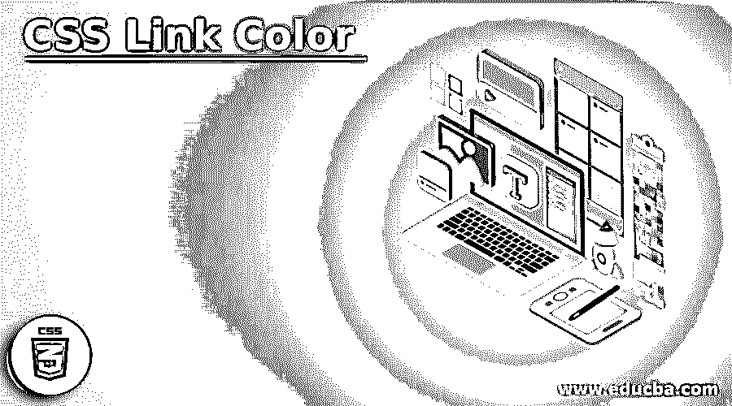

# CSS 链接颜色

> 原文：<https://www.educba.com/css-link-color/>




## CSS 链接颜色介绍

使用级联样式表的优点是它提供了各种样式。用户可以自定义每个元素的样式，以最大限度地方便最终用户的使用。CSS 中还提供了自定义超链接行为的功能。开发人员可以使用各种伪类来控制链接的行为。此外，您可以分配不同的颜色，链接颜色将根据其用途而变化。这种风格有助于终端用户区分不同的链接，比如还没有被点击的链接和已经被点击的链接。让我们来看看 CSS 提供的一些属性，这些属性用于定制页面上的超链接并使之具有动画效果。

### CSS 链接颜色的用法和示例

超链接有多种状态。CSS 为这些状态中的每一个提供了 spseudo 类，开发者可以根据网页的需求定制样式。超链接的上述状态是:链接、已访问、悬停、活动。状态“链接”指的是尚未被访问的未接触的链接。“已访问”是指已被访问的链接。“悬停”是链接的状态，此时用户将悬停在链接上。最后,“活动”是指链接被立即点击时的状态。让我们看看这个例子，看看每个状态是如何设计的，并看看它的演示。

<small>网页开发、编程语言、软件测试&其他</small>

**1。使用外部 CSS 展示不同链接状态的不同颜色**

*   由于我们使用外部 CSS，我们将首先创建 CSS 文件。
*   如上所述，我们将设计超链接元素的样式，每个状态都可以设计为一个伪类。换句话说，我们将样式化
*   我们将定义伪类，并定义每个类的样式。每个类的编码如下所示:

```
a:link{
font-style: normal;
color: blue;
font-family: Arial, Helvetica, sans-serif;
}
```

*   最终的 CSS 代码将如下所示:

```
a:link{
font-style: normal;
color: blue;
font-family: Arial, Helvetica, sans-serif;
}
a:hover{
font-style: italic;
color: darkgreen;
}
a:visited{
font-style: normal;
color: darkred;
font-family: Arial, Helvetica, sans-serif;
}
a:active{
font-style: italic;
color: yellow;
}
```

*   接下来，我们将为 HTML 页面编码。因为这个例子使用了外部 CSS，所以在 header 部分，我们将调用外部 CSS 文件。
*   在 body 部分，我们将使用元素

```
<html>
<head>
<title>Hyperlink Styling</title>
<link rel="stylesheet" type="text/css" href="link.css">
</head>
<body>
<h2>This page demonstrates the various states of hyperlink</h2>
<b><a href="https://www.google.com">This is a hyperlink</a></b>
<ol>
<li>If the link is not used, it will appear Blue and normal</li>
<li>If the link is hovered upon, it will appear Green and Italic </li>
<li>If the link has been used, it will appear Red and normal</li>
<li>If the link is active, it will be Yellow and Italic</li>
</ol>
</body>
</html>
```

*   我们可以通过保存这个页面并通过浏览器打开它来看到最终的结果。
*   该链接最初将显示为蓝色，如第一个屏幕截图所示。


*   当我们将鼠标悬停在它上面时，它会变成绿色和斜体。


*   您可以观察到颜色变为黄色，这正是单击链接的时刻。


*   在最后的截图中，你可以看到链接一旦被访问，就会变成暗红色。


**2。使用内部 CSS 样式化超链接**

*   在这个例子中，我们将使用内部 CSS 演示超链接的样式。
*   由于这个例子使用了内部 CSS，我们将直接为 HTML 页面编码。
*   在 header 部分，我们将在

```
<head>
<title>Hyperlink Styling</title>
<style>
a:link{
font-style: normal;
color: blue;
font-family: Arial, Helvetica, sans-serif;
}
a:hover{
font-style: italic;
color: darkgreen;
}
a:visited{
font-style: normal;
color: darkred;
font-family: Arial, Helvetica, sans-serif;
}
a:active{
font-style: italic;
color: yellow;
}
</style>
</head>
```

*   现在，在主体部分，类似于上面的例子，我们将利用元素

```
<html>
<head>
<title>Hyperlink Styling</title>
<style>
a:link{
font-style: normal;
color: blue;
font-family: Arial, Helvetica, sans-serif;
}
a:hover{
font-style: italic;
color: darkgreen;
}
a:visited{
font-style: normal;
color: darkred;
font-family: Arial, Helvetica, sans-serif;
}
a:active{
font-style: italic;
color: yellow;
}
</style>
</head>
<body>
<h2>This page demonstrates the various states of hyperlink</h2>
<b><a href="https://www.google.com">This is a hyperlink</a></b>
<ol>
<li>If the link is not used, it will appear Blue and normal</li>
<li>If the link is hovered upon, it will appear Green and Italic </li>
<li>If the link has been used, it will appear Red and normal</li>
<li>If the link is active, it will be Yellow and Italic</li>
</ol>
</body>
</html>
```

*   保存此页面并通过浏览器打开它将有助于我们看到类似于下面截图的结果。
*   该链接最初将显示为蓝色，如第一个屏幕截图所示。


*   当我们将鼠标悬停在它上面时，它会变成绿色和斜体。


*   您可以观察到颜色变为黄色，这正是单击链接的时刻。


*   在最后的截图中，你可以看到链接一旦被访问，就会变成暗红色。


### 结论

因此，上面的例子帮助我们了解了如何使用不同的颜色和状态来设置链接的样式，这可以使最终用户更容易地使用页面上的链接。开发人员可以根据页面需要使用这些链接状态。此外，这只是链接如何风格化的少数选项之一。

### 推荐文章

这是一个 CSS 链接颜色的指南。在这里，我们还讨论了 css 链接颜色的介绍和使用，以及一个不同的例子和它的代码实现。您也可以看看以下文章，了解更多信息–

1.  [CSS 父选择器](https://www.educba.com/css-parent-selector/)
2.  [CSS in React](https://www.educba.com/css-in-react/)
3.  [CSS 组合子](https://www.educba.com/css-combinators/)
4.  [CSS 文本颜色](https://www.educba.com/css-text-color/)


