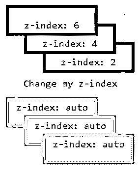
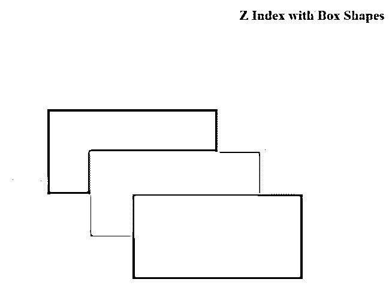

# CSS z 索引

> 原文：<https://www.educba.com/css-z-index/>


## CSS z-index 简介

CSS 中的 z-index 属性决定了元素的堆栈顺序，如图像或框或任何字符内容或按钮等。具有最高或更大堆栈顺序值的元素将始终位于具有较低堆栈顺序值的元素之前。请记住，z-index 仅适用于 position: absolute、position: relative、position: sticky 等位置元素。这明确了 z- index 属性可以应用于以 z 顺序定位的元素。具有较高 z 索引值的元素总是与具有较小值的 z 索引重叠。

**实时示例:**我们需要将图像与内容重叠。一般来说，CSS 属性不能提供这个功能，这样会在文本上显示图像，但我们不希望这样。因此，通过使用 z-index 属性，我们可以在图像上制作内容。

<small>网页开发、编程语言、软件测试&其他</small>

为什么我们在 HTML 中使用 CSS？

*   提供所有页面之间的公共逻辑，而不是在每个 HTML 页面中编写相同风格的逻辑，我们使用 CSS 文件来编写公共逻辑。
*   并且在每个带有<link>标签的 HTML 页面中包含 CSS 页面。

### Z-index 属性在 CSS 中是如何工作的？

Z- index 属性仅适用于位置元素，如:

*   **位置:**绝对
*   **位置:**相对
*   **位置:**粘性

**语法:**

```
positioned element{
position: absolute or relative or sticky;
left: value;
top: value;
z-index: value;
}
```

**具有值的 Z 索引图像:**




### CSS z 索引的示例

下面是一些例子:

#### 示例#1

带有图像的 z 索引。

**代码:**

```
<!DOCTYPE html>
<html>
<head>
<meta charset="ISO-8859-1">
<title>Z index</title>
<link rel="stylesheet" href="ZIndexFile.css">
</head>
<body>
<h1>Z Index with Image</h1>
<div class="content">

<p>The z-index property in CSS decides the stack order of the
element like image or box or any character content or button etc. An
element with highest or greater stack order value will be always in
front of the element with lower stack order value. Keep in mind that
z-index only worked with position elements like position: absolute,
position: relative, position: sticky. This clear a point that z-
index property can be applied with positioned elements in z order.
Element with a higher z index value always overlapped by the z index
with smaller value.</p>
<p>Real Time Example: We have requirement that we want overlap
image with a content. In general CSS properties can't provide this
feature, this all will give the image on top of the text but we don't
want this. So by using z-index property we can make content on top of
the image.</p>
</div>
</body>
</html>
```

**CSS 代码:** **ZIndexFile.css**

```
img {
position: absolute;
left: 0px;
top: 0px;
z-index: -10;
}
h1
{
color:red;
text-align: center;
}
p
{
color:brown;
border: solid 2px yellow;
font-size: 28px;
}
```

**输出:**


**说明:**

*   正如我们在上面看到的，我们在图像上面得到了文本，但是如果去掉 z 索引属性，那么文本就会被图像覆盖。

#### 实施例 2

带有图像的 z 索引。

**HTML 代码:**

```
<!DOCTYPE html>
<html>
<head>
<meta charset="ISO-8859-1">
<title>Z index</title>
<link rel="stylesheet" href="ZIndexFile.css">
</head>
<body>
<h1>Z Index with Content</h1>
<div class="topDiv">
The z-index property in CSS decides the stack order of the element
like image or box or any character content or button etc. An element
with highest or greater stack order value will be always in front of
the element with lower stack order value. Keep in mind that z-index
only worked with position elements like position: absolute, position:
relative, position: sticky. This clear a point that z- index property
can be applied with positioned elements in z order. Element with a
higher z index value always overlapped by the z index with smaller
value. Real Time Example: We have
requirement that we want overlap image with a content. In general CSS
properties can't provide this feature, this all will give the image
on top of the text but we don't want this. So by using z-index
property we can make content on top of the image. Paramesh Box
</div>
<p></p>
<p></p>
</body>
</html>
```

**CSS 代码:ZIndexFile.css**

```
h1 {
color: blue;
text-align: center;
}
.topDiv {
position: relative;
height: 8em;
color: navy;
margin-bottom : 1em;
margin-top : 2em;
z-index: 1;
border: solid;
margin-bottom: 1em;
margin-top: 2em;
font-size: 28px;
}
.spanContent {
position: absolute;
width: 80%;
background : fuchsia;
left: 60px;
top: 3em;
z-index: 3; <!-- z index value is greater so it always on top of all the elements -->
font-size: 28px;
}
.boxSpan {
position: absolute;
z-index: 2; <!-- z index value is greater than topDiv content so it overlaps it -->
width: 20%;
top: -25px;
height: 7em;
opacity: 0.9;
left: 65%;
background : lightgreen;
font-size: 28px;
}
```

**输出:**


**说明:**

*   正如您在上面所看到的，哪个 z 索引值更大，总是与较低的索引值内容重叠。

#### 实施例 3

带有图像的 z 索引。

**HTML 代码:**

```
<!DOCTYPE html>
<html>
<head>
<meta charset="ISO-8859-1">
<title>Z index</title>
<link rel="stylesheet" href="ZIndexFile.css">
</head>
<body>
<h1>Z Index with Box Shapes</h1>
<div class="box1"></div>
<div class="box2"></div>
<div class="box3"></div>
<div class="box4"></div>
<div class="box5"></div>
</body>
</html>
```

**CSS 代码:ZIndexFile.css**

```
h1 {
color: green;
text-align: center;
}
.box1 {
position: relative;
top: 10px;
left: 80px;
z-index: 2 background-color: red;
width: 400px;
height: 200px;
}
.box2 {
position: relative;
top: -60px;
left: 35px;
z-index: 1;
background-color: yellow;
width: 400px;
height: 200px;
}
.box3 {
position: relative;
top: -220px;
left: 120px;
z-index: 3;
background-color: green;
width: 400px;
height: 200px;
}
.box4 {
position: relative;
top: -320px;
left: 220px;
z-index: 4;
background-color: orange;
width: 400px;
height: 200px;
}
.box5 {
position: relative;
top: -420px;
left: 320px;
z-index: 5;
background-color: olive;
width : 400px;
height: 200px;
width: 400px;
}
```

**输出:**




**说明:**

*   正如你在上面看到的，哪个 z 索引值更大，哪个总是重叠较低的索引值框。

### 结论

CSS 属性中的 Z index 用于将任意元素放在另一个元素的顶部。但是 Z 索引只能应用于定位元素，如绝对、相对和粘性等。

### 推荐文章

这是一个 CSS z-index 的指南。这里我们讨论 CSS z-index 的介绍，以及 z-index 属性是如何工作的，并举例说明以便更好地理解。您也可以看看以下文章，了解更多信息–

1.  [CSS 盒子模型](https://www.educba.com/css-box-model/)
2.  [CSS 颜色代码](https://www.educba.com/css-color-codes/)
3.  CSS 中的[按钮](https://www.educba.com/button-in-css/)
4.  [CSS 翻译](https://www.educba.com/css-translate/)


