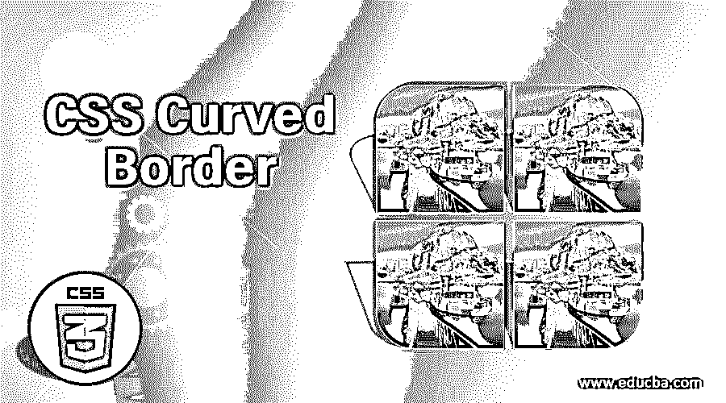
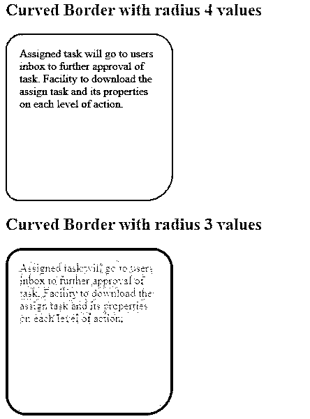
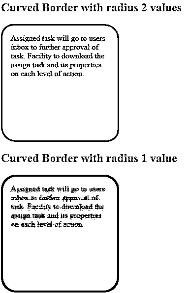
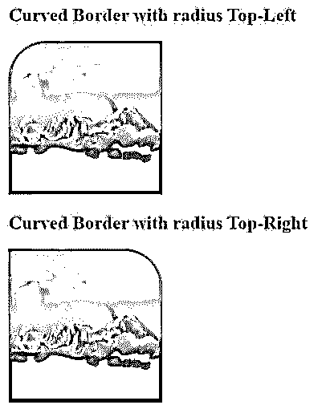
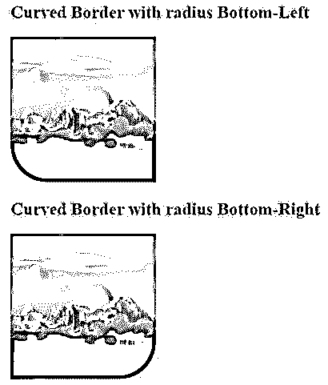
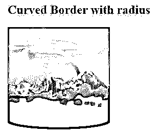

# CSS 弧形边框

> 原文：<https://www.educba.com/css-curved-border/>




## CSS 弧形边框介绍

CSS 中的曲线边框可以通过 border-radius 属性来实现。Border-radius 属性移除元素的角并替换为某个半径。基于给定的边界半径值，曲线边界形状取决于。边框半径值可以是像素或百分比。边框半径可以应用于图像、按钮、段落等元素的所有四个边。您也可以一次应用边界半径 2 边，如顶部、底部、左侧和右侧。

****实时使用:**** 美化图片、按钮、页眉、段落等。具有 border-radius 属性要求的半径。

<small>网页开发、编程语言、软件测试&其他</small>

### CSS 中的弧形边框是如何工作的？

正如我们上面讨论的，弯曲的边界可以用边界半径生成。遵守以下语法:

****语法 1:****

```
div
{
border-radius: 10px;
}
```

******边框-半径:**** 可应用于上、右、下、左四边。**

 ******语法二:****

```
div
{
border-radius: 10px 10px 10px 10px;
}
```

****解释:**** 如果我们用 4 个值应用边框半径，那么第一个值用于左上角，第二个值用于右上角，第三个值用于右下角，第四个值用于左下角。

****语法三:****

```
div
{
border-radius: 10px 10px 10px;
}
```

****解释:**** 如果我们用 3 个值应用边框半径，那么第一个值用于左上角，第二个值用于右上角和右下角，第三个值分别用于左下角。

****语法 4:****

```
div
{
border-radius: 10px 10px;
}
```

**解释:**如果我们用 2 个值应用边框半径，那么第一个值分别用于左上角和右上角，第二个值分别用于右下角和左下角。

****语法五:****

```
div
{
border-radius: 10px;
}
```

****解释:**** 如果我们用一个单一的值应用 border-radius，那么对所有四个边都同样应用它。如果我们想只应用边缘的边框半径，那么 [CSS 提供了](https://www.educba.com/css-border-padding/)预定义的属性。border-top-left-radius:将 border-radius 10px 应用于左上角。

****语法 6:****

```
div
{
border-top-left-radius: 10px;
}
```

******边框-右上-半径:10px:**** 对右上侧应用边框半径 10px。**

 ******语法 7:****

```
div
{
border-top-right-radius: 10px;
}
```

******边框-左下角-半径:10px:**** 将边框半径 10px 应用于左下角。**

 ******语法 8:****

```
div
{
border-bottom-left-radius: 10px;
}
```

******边框-右下角-半径:**** ****10px:**** 应用边框半径 10px 右下角。**

 ******语法 9:****

```
div
{
border-bottom-right-radius: 10px;
}
```

****Note:**** We can apply border-radius 2 side at a time but not one side at a time.

### CSS 弯曲边框的示例

下面是 CSS 曲线边框的不同例子。

#### 示例#1

**段落的边框半径值为 4 和 3:**

 ******代号:****

```
<!DOCTYPE html>
<html>
<head>
<title>Curved Border</title>
</head>
<style>
.values4 {
height: 200px;
width: 200px;
border-radius: 25px 30px 40px 20px;
padding: 20px;
background-color: orange;
}
.values3 {
height: 200px;
width: 200px;
border-radius: 25px 30px 40px;
padding: 20px;
background-color: fuchsia;
}
</style>
<body>
<font color="brown" style=""><h2>Curved Border with radius
4 values</h2></font>
<div class="values4">Assigned task will go to users inbox to
further approval of task. Facility to download the assign task and its
properties on each level of action.</div>
<font color="brown" style=""><h2>Curved Border with radius
3 values</h2></font>
<div class="values3">Assigned task will go to users inbox to
further approval of task. Facility to download the assign task and its
properties on each level of action.</div>
</body>
</html>
```

****输出:****




****解释:**** 在上面的代码中对段落边框半径应用了 4 和 3 值。应用如上所示的弯曲半径输出后。

#### 实施例 2

**段落的边框半径值为 2 和 1:**

 ******代号:****

```
<!DOCTYPE html>
<html>
<head>
<title>Curved Border</title>
</head>
<style>
.values4 {
height: 200px;
width: 200px;
border-radius: 25px 30px;
padding: 20px;
background-color: gray;
}
.values3 {
height: 200px;
width: 200px;
border-radius: 30px;
padding: 20px;
background-color: maroon;
}
</style>
<body>
<font color="brown" style=""><h2>Curved Border with radius
2 values</h2></font>
<div class="values4">Assigned task will go to users inbox to
further approval of task. Facility to download the assign task and its
properties on each level of action.</div>
<font color="brown" style=""><h2>Curved Border with radius
1 value</h2></font>
<div class="values3">Assigned task will go to users inbox to
further approval of task. Facility to download the assign task and its
properties on each level of action.</div>
</body>
</html>
```

****输出:****




****解释:**** 在上面的代码中对段落边框半径应用了 2 和 1 值。应用如上所示的弯曲半径输出后。

#### 实施例 3

**段落的边框半径值为 4 和 3:**

 ******代号:****

```
<!DOCTYPE html>
<html>
<head>
<title>Curved Border</title>
</head>
<style>
.tl {
height: 200px;
width: 200px;
border-top-left-radius: 50px;
background-color: gray;
}
.tr {
height: 200px;
width: 200px;
border-top-right-radius: 50px;
background-color: maroon;
}
</style>
<body>
<font color="brown" style=""><h2>Curved Border with radius
Top-Left</h2></font>
<div >

</div>
<font color="brown" style=""><h2>Curved Border with radius
Top-Right</h2></font>
<div >

</div>
</body>
</html>
```

**输出:**




**说明:**在上面的代码中，border-radius 对图像应用了左上和右上的值。应用如上所示的弯曲半径输出后。

#### 实施例 4

**图像左上和右上值的边框半径:**

 ******代号:****

```
<!DOCTYPE html>
<html>
<head>
<title>Curved Border</title>
</head>
<style>
.tl {
height: 200px;
width: 200px;
border-bottom-left-radius: 50px;
background-color: gray;
}
.tr {
height: 200px;
width: 200px;
border-bottom-right-radius: 50px;
background-color: maroon;
}
</style>
<body>
<font color="brown" style=""><h2>Curved Border with radius
Bottom-Left</h2></font>
<div >

</div>
<font color="brown" style=""><h2>Curved Border with radius
Bottom-Right</h2></font>
<div >

</div>
</body>
</html>
```

****输出:****




****解释:**** 在上面的代码中，border-radius 为图像应用了左下角和右下角的值。应用如上所示的弯曲半径输出后。

#### 实施例 5

**图像带半径的弯曲边框:**

 ******代号:****

```
<!DOCTYPE html>
<html>
<head>
<title>Curved Border</title>
</head>
<style>
.tl {
height: 200px;
width: 200px;
border-radius: 100%/0 0 30px 30px;
background-color: gray;
}
</style>
<body>
<font color="brown" style=""><h2>Curved Border with radius</h2></font>
<div>

</div>
</body>
</html>
```

**输出:**




**说明:**在上面的代码中应用了图像的边框半径。应用如上所示的弯曲半径输出后。

### 推荐文章

这是一个 CSS 曲线边框的指南。在这里，我们讨论了基本的概念以及曲线边框在 CSS 中是如何工作的，并给出了不同的例子和代码实现。您也可以阅读以下文章，了解更多信息——

1.  [CSS 内边框](https://www.educba.com/css-inner-border/)
2.  [CSS 闪烁文本](https://www.educba.com/css-blinking-text/)
3.  [CSS 按钮边框](https://www.educba.com/css-button-border/)
4.  [CSS 边框颜色](https://www.educba.com/css-border-color/)


******************