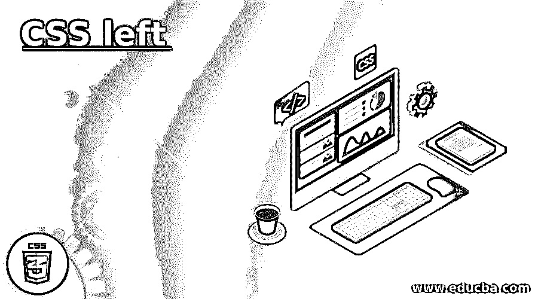
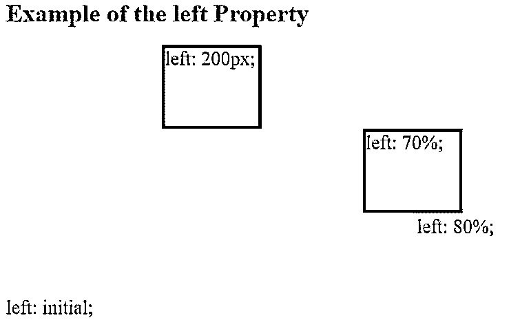
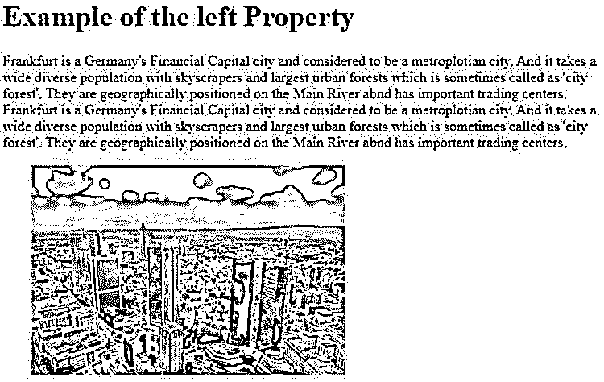
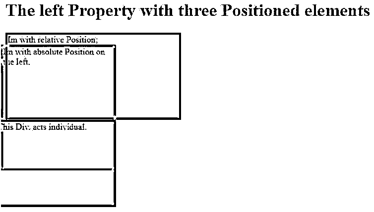
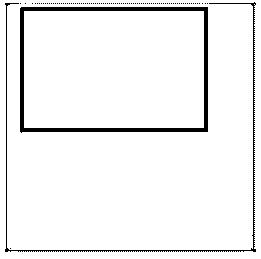

# CSS 左侧

> 原文：<https://www.educba.com/css-left/>




## CSS 简介左

CSS left 属性被定义为声明一个定位元素的左侧或水平位置以及一个 offset 属性。这适用于位置属性值，如固定、绝对和有时相对。这里，左值具有容器从左到右的优先级，因为 CSS 位置与左值结合有助于对齐与文档视窗相关的元素。如果定位的元素是静态的，那么对这个左边的属性没有影响。

**语法和参数:**

<small>网页开发、编程语言、软件测试&其他</small>

```
# box
{ position:relative;
Left: length | percentage | auto | initial ;
}
```

*   **length:** 确定一个元素在 px，pt，em 中左边缘的位置。这里不指定负值。
*   **auto:** 默认值，左边缘的位置由浏览器决定。
*   **百分比:**位置元素以百分比给出。

### 左属性在 CSS 中是如何工作的？

为了有一个好的 CSS web 开发，CSS 附带了对齐元素来使它变得容易。定位为固定或绝对的元素，根据元素的左边距和左容器块计算距离。定位元素是指它们的位置除了静态之外不会改变任何东西的元素。根据祖先容器的不同，左属性的工作原理也不同。

#### 1.相对位置靠左

这里，left 属性向元素的左边缘添加了一个偏移量，它会自动向右移动到原始形式。正值使框位于其右侧

#### 2.在绝对位置向左

对于那些具有绝对定位元素的元素，这个 left 属性将元素的左边缘从具有带有定位的祖先容器的左边缘移动到它的右侧。简单地说，元素从起始位置向右侧移动。

#### 3.静态

这个属性对这个静态位置没有任何影响。为了检查动画效果，我们仍然可以使用这个函数，并获取 px 或 calc()值。

**代码:**

```
@keyframes anim {
40% {
left: 100px;
}
```

### 左 CSS 示例

下面给出了 CSS 中 left 属性的例子，通过观察它对不同位置的元素的影响。

#### 示例#1

一个显示位置“相对”和设置一个值给“左”属性的例子。

**代码:**

```
<!DOCTYPE html>
<html>
<head>
<title>
Demo On CSS left Property
</title>
<style>
div{
position: relative;
width: 120px;
height: 100px;
font-size: 25px;
}
#aa {
left: 200px;
border: 4px solid blue;
}
#bb {
left: 70%;
border: 4px solid green;
}
#cc {
left: 80%;
border: 4px solid yellow;
}
#exap {
left: initial;
border: 4px solid lightbrown;
}
</style>
</head>
<body>
<h1> Example of the left Property </h1>
<div id = "aa"> left: 200px; </div>
<div id = "bb"> left: 70%; </div>
<div id = "cc"> left: 80%; </div>
<div id = "exap"> left: initial; </div>
</body>
</html>
```

**输出:**




#### 实施例 2

**代码:**

```
<!DOCTYPE html>
<html>
<head>
<title>
Demo On CSS left Property With Image on left
</title>
<style>
h1{
color: rose;
}
img {
position :fixed;
left : 40px;
}
</style>
</head>
<body>
<h1> Example of the left Property </h1>
<p> Frankfurt is a Germany's Financial Capital city and considered to be a metroplotian city.
And it takes a wide diverse population with skyscrapers and largest urban forests which is sometimes called as 'city forest'.
They are geographically positioned on the Main River and has important trading centres.
Frankfurt is Germany's Financial Capital city and considered to be a metropolitan city.
And it takes a wide diverse population with skyscrapers and largest urban forests which is sometimes called as 'city forest'.
They are geographically positioned on the Main River  abnd has important trading centers.
</p>
 </img>
</body>
</html>
```

我们也可以使用 right，top，values 来检查 left 方法的工作情况。在上面的例子中，我使用了固定的 CSS 位置，它保持在容器的左边缘。

**输出:**

**

** 

#### 实施例 3

显示了盒子中的两个定位。

**代码:**

```
<!DOCTYPE html>
<html>
<head>
<style>
div{
float:left;
width:350px;
height:150px;
margin:12px;
text-align:center;
border:6px solid maroon;
background:rgba(46, 41, 112, 1);
color:fuchsia;
font-size:34px;
line-height:3.5em;
box-shadow:6px 6px 6px olive;
}
.container1{position:absolute;left:-40px;}
.container2{position:absolute;right:600px;}
</style>
</head>
<body>
<div class="container1"> View1</div>
<div class="container2">View2</div>
</body>
</html>
```

在这个例子中，我们声明两个类有一个绝对位置，右边的值设置为 600px，左边的值为负 px。这里，第一个元素

正在运行，并被移动到左侧。

**输出:**


#### 实施例 4

三个定位元素。

**代码:**

```
<!DOCTYPE html>
<html>
<head>
<style>
div.Base {
position: relative;
width: 310px;
height: 150px;
border: 4px solid teal;
}
div.Derived {
position: absolute;
left: -12px;
width: 200px;
height: 220px;
border: 4px solid aqua;
}
div.Subclass{
position: fixed;
left: -10px;
width: 210px;
height: 150px;
border: 4px solid purple;
}
</style>
</head>
<body>
<h1>The left Property with three Positioned elements</h1>
<div class="Base">Im with relative Position;
<div class="Derived">Im with absolute Position on the left. </div>
</div>
<div class="Subclass">This Div. acts individual. </div>
</body>
</html>
```

上面的代码在没有定位父级的 left 属性上使用负值。最后一个类“Subclass”单独动作，即使它们的位置是固定的，它也将容器移动到左边距。我们可以在输出中看到，所有三个类都是重叠的。

**输出:**




#### 实施例 5

**代码:**

```
<!DOCTYPE html>
<html>
<head>
<style>
.dem-orange {
position: absolute;
background: orange;
width: 200px;
height: 200px;
left: 4px;
top: 4px;
}
.dem-blue
{
position : relative;
background: red;
width: 150px;
height: 100px;
left: 8px;
}
</style>
</head>
<body>
<div class="main">
<div class="dem-orange"></div>
<div class="dem-blue"></div>
</div>
</body>
</html>
```

**输出:**




### 结论

在上面的文章中我们看到了，如何使用名为 left 的属性及其工作原理和例子。它允许用左、右值在不同的方向轻推不同的元素，初始值总是位于文档部分的流程中。

### 推荐文章

这是一个 CSS 左指南。在这里，我们讨论了入门，左属性如何在 CSS 中工作，并分别举例说明。您也可以看看以下文章，了解更多信息–

1.  [CSS calc()](https://www.educba.com/css-calc/)
2.  [CSS 伪元素](https://www.educba.com/css-pseudo-elements/)
3.  [CSS @关键帧](https://www.educba.com/css-keyframes/)
4.  [CSS 标题设计](https://www.educba.com/css-header-design/)


