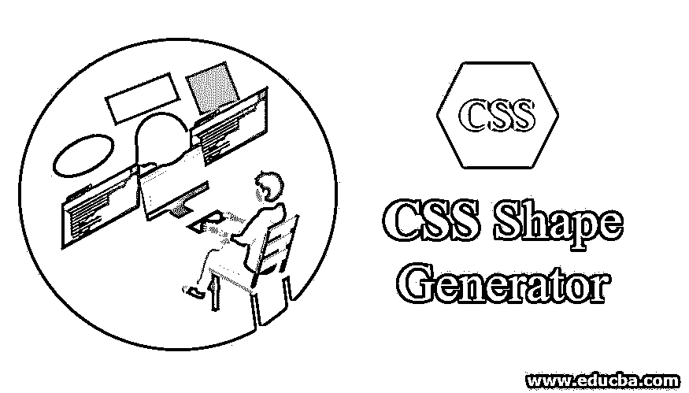
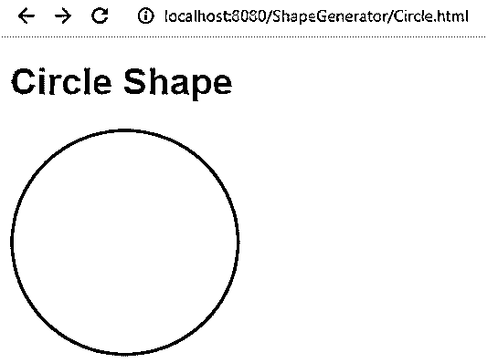
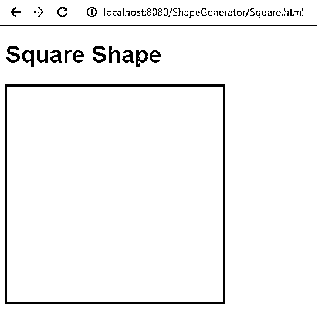
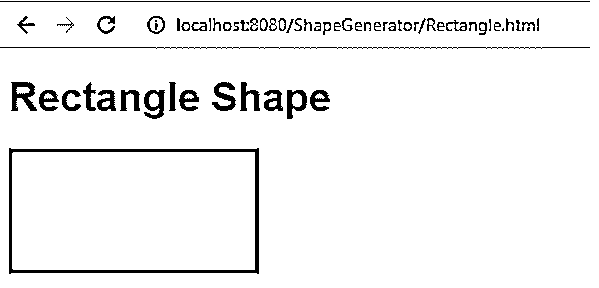
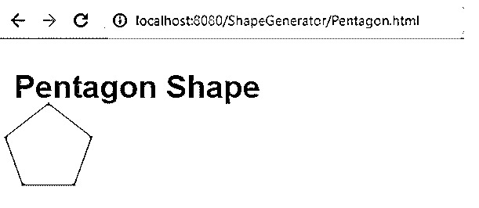
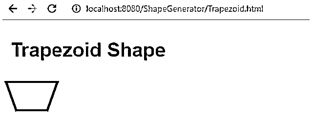
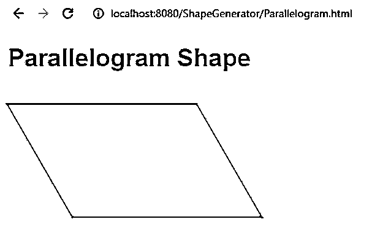

# CSS 形状生成器

> 原文：<https://www.educba.com/css-shape-generator/>




## CSS 形状生成器概述

CSS 形状生成器通常用于生成或形成不同形状的对象。一般来说，我们将在这个“形状生成器”概念中研究下面的形状

1.  圆
2.  椭圆
3.  平方
4.  矩形
5.  多边形
6.  梯形
7.  平行四边形
8.  月球

通常，这些形状的物体用于美化图像的视图。例如，在 whats 应用程序中，个人资料图片周围最初是方形，现在是圆形或圆形。未来可能是椭圆形或其他形状。

<small>网页开发、编程语言、软件测试&其他</small>

### CSS 中的 Shape Generator 是如何工作的？

圆形、椭圆形、正方形、矩形和多边形形状**、**我们可以使用 clip-path 属性。基于这个剪辑路径属性，这些将工作。但是 clip-path 属性不能[处理 HTML 元素](https://www.educba.com/html-form-elements/)，但是可以处理可缩放的矢量图形。因此，我们将使用普通的 CSS 属性来实现所有的 8 个形状。

其余的形状，如梯形，平行四边形和月亮形状，我们将改变边界半径，框阴影和变换属性，因为每个需要的形状。无论如何，我们将使用普通的 CSS 属性来获取所有的形状。

为了使这些形状发挥作用，我们必须并行处理以下属性。

*   高度和宽度
*   填料
*   旋转
*   斜交
*   配置
*   颜色；色彩；色调
*   边境

我们将在下面的 8 个例子中处理上面的 8 个形状。

### 带有代码的 CSS 形状生成器示例

CSS 形状生成器的示例如下:

#### 1.圆

我们将通过分配边界半径:50%来得到圆形。

**语法:**

```
.class
{
width: 200px;
height: 200px;
border-radius: 50%
}
```

**HTML 代码:**Circle.html

```
<!DOCTYPE html>
<html>
<head>
<meta charset="ISO-8859-1">
<link rel="stylesheet"  type="text/css" href="Circle.css">
<title>Circle</title>
</head>
<body>
<h1>Circle Shape</h1>
<div class="circle"></div>
</body>
</html>
```

**CSS 代码:** Circle.css

```
h1{
font-family: sans-serif;;
color: green;
}
.circle{
width: 200px;
height: 200px;
background: Brown;
border-radius: 50%
}
```

**输出:**




#### 2.椭圆

我们将得到椭圆形状，通过分配边界半径正好是宽度和高度的一半，例如宽度= 400 像素，高度= 200 像素，然后边界半径:200 像素/100 像素。

**语法:**

```
.class
{
width: 400px;
height: 200px;
border-radius: 200px/100px;
}
```

**HTML 代码:**Eclipse.html

```
<!DOCTYPE html>
<html>
<head>
<meta charset="ISO-8859-1">
<link rel="stylesheet"  type="text/css" href="Ellipse.css">
<title>Circle</title>
</head>
<body>
<h1>Ellipse Shape</h1>
<div class="ellipse"></div>
</body>
</html>
```

**CSS 代码:** Ellipse.css

```
.ellipse {
width: 400px;
height: 200px;
background: blue;
border-radius: 200px/100px;
}
h1 {
font-family: sans-serif;;
color: green;
}
```

**输出:**

**T2】**


 **#### 3.平方

我们将通过分配宽度和高度来得到正方形，宽度= 100 像素，高度= 100 像素。

**语法:**

```
.class
{
width:100px;
height:100px;
}
```

**HTML 代码:**Square.html

```
<!DOCTYPE html>
<html>
<head>
<meta charset="ISO-8859-1">
<link rel="stylesheet"  type="text/css" href="Square.css">
<title>Square</title>
</head>
<body>
<h1>Square Shape</h1>
<div class="square"></div>
</body>
</html>
```

**CSS 代码:** Square.css

```
.square {
width: 300px;
height: 300px;
background: gray;
}
h1 {
font-family: sans-serif;;
color: green;
}
```

**输出:**




#### 4.矩形

我们将通过分配宽度和高度来得到正方形，宽度= 200 像素，高度= 100 像素，或者宽度= 100 像素，高度= 200 像素，反之亦然。

**语法:**

```
.class
{
width:200px;
height:100px;
}
```

**HTML 代码:**Rectangle.html

```
<!DOCTYPE html>
<html>
<head>
<meta charset="ISO-8859-1">
<link rel="stylesheet"  type="text/css" href="Rectangle.css">
<title>Rectangle</title>
</head>
<body>
<h1>Rectangle Shape</h1>
<div class="rectangle"></div>
</body>
</html>
```

**CSS 代码:** Rectangle.css

```
.rectangle {
width: 200px;
height: 100px;
background: olive;
}
h1 {
font-family: sans-serif;;
color: green;
}
```

**输出:**




#### 5.多边形

边数超过 5 的称为多边形。五边形示例

五边形:我们将通过如下赋值得到五边形

在类属性中:

```
width: 54px;
box-sizing: content-box;
border-width: 50px 18px 0;
```

在类属性之前:

```
top: -85px;
left: -18px;
border-width: 0 45px 35px;
```

**语法:**

```
.class{
width: 54px;
box-sizing: content-box; //default box sizing behavior in CSS
border-width: 50px 18px 0;
position: relative;//position is relative to normal position
border-color: silver transparent;
}
```

```
.class:before
{
top: -85px;//this negative margin values pulls element in top direction
left: -18px; //this negative margin values pulls element in left direction
border-width: 0 45px 35px;
content: "";
position: absolute;
border-color: transparent transparent silver;
}
```

**HTML 代码:**Pentgon.html

```
<!DOCTYPE html>
<html>
<head>
<meta charset="ISO-8859-1">
<link rel="stylesheet"  type="text/css" href="Pentagon.css">
<title>Pentagon</title>
</head>
<body>
<h1>Pentagon Shape</h1>
<div class="pentagon"></div>
</body>
</html>
```

**CSS 代码:** Pentagon.css

```
.pentagon {
border-style: solid;
position: relative;
width: 54px;
box-sizing: content-box;
border-width: 50px 18px 0;
border-color: orange transparent;
box-sizing: content-box;
border-width: 50px 18px 0;
}
```

```
.pentagon:before {
border-width: 0 45px 35px;
border-style: solid;
content: ""; position : absolute; height : 0; width : 0; top : -85px;
left : -18px;
border-color: transparent transparent orange;
position: absolute;
height: 0;
width: 0;
top: -85px;
left: -18px;
}
h1 {
font-family: sans-serif;;
color: green;
padding: 10px;
}
```

**输出:**




#### 6.梯形

只需删除五边形的顶部(意味着不需要 CSS 代码之前的类)，我们将得到

**语法:**

```
.class{
width: 54px;
box-sizing: content-box; //default box sizing behavior in CSS
border-width: 50px 18px 0;
position: relative;//position is relative to normal position
border-color: silver transparent;
}
```

**HTML 代码:**Trapezoid.html

```
<!DOCTYPE html>
<html>
<head>
<meta charset="ISO-8859-1">
<link rel="stylesheet"  type="text/css" href="Trapezoid.css">
<title>Trapezoid</title>
</head>
<body>
<h1>Trapezoid Shape</h1>
<div class="trapezoid"></div>
</body>
</html>
```

**CSS 代码:**梯形. CSS

```
.trapezoid {
border-style: solid;
position: relative;
width: 54px;
box-sizing: content-box;
border-width: 50px 18px 0;
border-color: orange transparent;
box-sizing: content-box;
border-width: 50px 18px 0;
}
h1 {
font-family: sans-serif;;
color: green;
padding: 10px;
}
```

**输出:**




#### 7.平行四边形

它就像一个长方形，但在垂直和水平平面上倾斜了一些角度。我们将通过分配宽度:250 像素，高度:150 像素，转换:倾斜(30 度)。倾斜会给你一个 CSS 中的 2D 角。

**语法:**

```
.class{
width: 250px,
height: 150px,
transform: skew(30deg)
}
```

**HTML 代码:**Parallelogram.html

```
<!DOCTYPE html>
<html>
<head>
<meta charset="ISO-8859-1">
<link rel="stylesheet"  type="text/css" href="Parallelogram.css">
<title>Parallelogram</title>
</head>
<body>
<h1>Parallelogram Shape</h1>
<div class="parlgrm"></div>
</body>
</html>
```

**CSS 代码:**平行四边形. CSS

```
.parlgrm {
width: 250px;
height: 150px;
transform: skew(30deg);
background: lime;
margin:40px;
}
h1 {
font-family: sans-serif;;
color: green;
}
```

**输出:**




#### 8.月球

如果我们仔细观察，我们将从圆形中得到它，只要用阴影覆盖 80%的部分。在这里，我们将做同样的事情，用一些阴影覆盖圆圈。通过将 box-shadow: 15px 15px 0 0 red 分配给圆来获得。

**语法:**

```
.class{
border-radius: 50%;
box-shadow: 15px 15px 0 0 red; //it will cover the top portion of the circle
}
```

**HTML 代码:**Moon.htm

```
<!DOCTYPE html>
<html>
<head>
<meta charset="ISO-8859-1">
<link rel="stylesheet"  type="text/css" href="Moon.css">
<title>Moon</title>
</head>
<body>
<h1>Moon Shape</h1>
<div class="moon"></div>
</body>
</html>
```

**CSS 代码:** Moon.css

```
h1 {
font-family: sans-serif;;
color: green;
}
.moon {
width: 150px;
height: 150px;
border-radius: 50%;
box-shadow: 25px 25px 0 0 fuchsia;
}
```

**输出:**

**T2】**


 **### 结论

我们将通过改变高度、宽度、变换、边框半径、位置、框大小等属性来获得所有形状，而不需要使用 clip-path 属性。

### 推荐文章

这是一个 CSS 形状生成器的指南。在这里，我们讨论的介绍，形状生成器如何在 CSS 中工作的例子和代码。你也可以看看下面的文章来了解更多-

1.  [CSS 分页](https://www.educba.com/css-pagination/)
2.  [CSS 文本格式](https://www.educba.com/css-text-formatting/)
3.  [CSS 框尺寸](https://www.educba.com/css-box-sizing/)
4.  [CSS 文本下划线](https://www.educba.com/css-text-underline/)


****