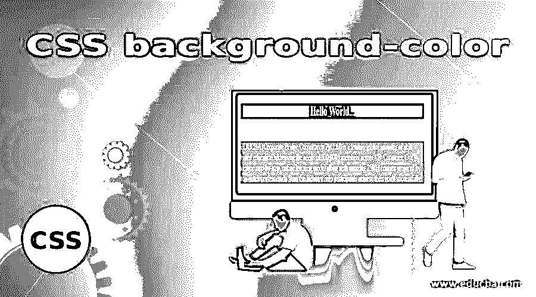

# CSS 背景色

> 原文：<https://www.educba.com/css-background-color/>




## CSS 背景色属性介绍

CSS 背景色属性有助于设置元素的背景色。元素的背景是元素的整体大小，包括填充和边框，但不包括边距。可以使用 CSS 背景色属性来确定背景色。这与 color 属性的用法相同，表示用户可以键入颜色名称，以十六进制表示法输入或再次使用 RGB 方法。

要确定网页的背景颜色，必须用标签操作。另外，指的是整个网页，所以你可以通过改变它的背景色来改变页面的背景色。

<small>网页开发、编程语言、软件测试&其他</small>

使用标签，您可以将背景颜色指定为:

```
body{
background-color: grey;
}
```

这里，HTML 页面的主体将有一个灰色的背景颜色。

**语法:**

背景色属性的语法可以写成如下所示:

```
element_name{
background-color: name_of_color_value;
}
```

举个例子，

```
background-color: red; // this is keyword value
background-color: #FFFFFF; // this is HEXA color value
background-color: hsl(0, 0%, 100%); // this is HSL(hue, saturation, lightness)representation of color keyword value
background-color: rgb(255, 255, 255); // this is keyword value
background-color: transparent; // this is special keyword value
For example, we can set background color of the HTML page as shown below:
body {
background-color: grey;
}
```

### 背景色属性在 CSS 中是如何工作的？

为固定大小的 HTML 元素添加背景颜色很简单——无论是像素、单位还是百分比。HTML5 不认可标签的 bgcolor 属性，所以 CSS 样式被用来应用背景色。在此属性的帮助下，用户可以使用十六进制值、rgb 值、命名颜色和透明值。CSS 背景色属性可以支持各种 web 浏览器，比如 Google Chrome、Mozilla Firefox、IE 等等。

### 实现 CSS 背景色的例子

现在，我们将通过下面描述的例子来查看 CSS 背景色属性:

#### 示例#1

**代码:**

```
<!DOCTYPE html>
<html lang="en">
<head>
<meta charset="utf-8">
<title> CSS background-color Example </title>
<style>
h2 {
background-color: coral;
color: white;
text-align: center;
}
.text {
background-color: deepskyblue;
color: white;
}
</style>
</head>
<body>
<h2> Hello World... </h2>
<br>
<div class = "text">
EDUCBA(Corporate Bridge Consultancy Pvt Ltd) is a leading global provider of skill based education addressing the needs of 500,000+ members across 40+ Countries. Our unique step-by-step, online learning model along with amazing 2500+ courses prepared by top-notch professionals from the Industry help participants achieve their goals successfully.
</div>
</body>
</html>
```

**输出:**

在浏览器中打开该文件，它将产生以下结果:


**解释:**在上面的例子中，我们使用了带有关键字值的背景色属性。它被写成“背景色:深蓝”对于以天蓝色显示的文本，标题显示为“背景色:珊瑚色”财产。在这里，deepskyblue 和 coralcolors 被称为关键字值。

#### 实施例 2

**代码:**

```
<!DOCTYPE html>
<html lang="en">
<head>
<meta charset="utf-8">
<title> CSS background-color Example </title>
<style>
h2 {
background-color: #DC143C;
color: white;
text-align: center;
}
.text {
background-color: #FF8C00;
color: white;
}
</style>
</head>
<body>
<h2> Hello World... </h2>
<br>
<div class = "text">
EDUCBA (Corporate Bridge Consultancy Pvt Ltd) is a leading global provider of skill based education addressing the needs of 500,000+ members across 40+ Countries. Our unique step-by-step, online learning model along with amazing 2500+ courses prepared by top-notch professionals from the Industry help participants achieve their goals successfully.
</div>
</body>
</html>
```

**输出:**


**解释:**在上面的例子中，我们使用了带有十六进制颜色值的背景色属性。它被写成“背景色:# FF8C00”对于以深橙色显示的文本，标题显示为“背景色:# DC143C”深红色的财产。这里，# ff 8 c 00 和#DC143Ccolors 称为十六进制值。

#### 实施例 3

**代码:**

```
<!DOCTYPE html>
<html lang="en">
<head>
<meta charset="utf-8">
<title> CSS background-color Example </title>
<style>
h2 {
background-color: rgb(165,42,42);
color: white;
text-align: center;
}
.text {
background-color: rgb(50,205,50);
color: white;
}
</style>
</head>
<body>
<h2> Hello World... </h2>
<br>
<div class = "text">
EDUCBA (Corporate Bridge Consultancy Pvt Ltd) is a leading global provider of skill based education addressing the needs of 500,000+ members across 40+ Countries. Our unique step-by-step, online learning model along with amazing 2500+ courses prepared by top-notch professionals from the Industry help participants achieve their goals successfully.
</div>
</body>
</html>
```

**输出:**


**解释:**在上面的例子中，我们使用了 RGB 颜色的背景色属性。它被写成“背景色:rgb(165，42，42)；”对于以棕色显示的文本，标题显示为“背景色:rgb(50，205，50)；”石灰绿色的属性。这里，rgb(165，42，42)和 rgb(50，205，50)颜色被称为产生宽范围颜色的 rgb 颜色模型。

#### 实施例 4

**代码:**

```
<!DOCTYPE html>
<html lang="en">
<head>
<meta charset="utf-8">
<title> CSS background-color Example </title>
<style>
h2 {
background-color: hsl(19,56%,40%);
color: white;
text-align: center;
}
.text {
background-color: hsl(32, 100%, 43%);
color: white;
}
</style>
</head>
<body>
<h2> Hello World... </h2>
<br>
<div class = "text">
EDUCBA (Corporate Bridge Consultancy Pvt Ltd) is a leading global provider of skill based education addressing the needs of 500,000+ members across 40+ Countries. Our unique step-by-step, online learning model along with amazing 2500+ courses prepared by top-notch professionals from the Industry help participants achieve their goals successfully.
</div>
</body>
</html>
```

**输出:**


**解释:**在上面的例子中，我们使用了带有 HSL 值的背景颜色属性。它被写成“背景色:HSL(19.56%，40%)；”对于以锡耶纳颜色显示的文本，标题显示为“背景色:hsl(32，100%，43%)；”橙色标志的属性。这里，hsl(19，56%，40%)；和 hsl(32，100%，43%)；颜色被称为 HSL 值，它产生 RGB 颜色模型的色调、饱和度和亮度。

### 结论

在本文中，我们讨论了使用 CSS 对固定和可变宽度的元素应用背景色的基础知识。有必要确保背景颜色和文本颜色之间的对比度足够好，以使视力低下的人能够理解页面内容。

### 推荐文章

这是一个 CSS 背景颜色的指南。在这里，我们讨论了 CSS 背景颜色和它的不同例子以及它的代码实现的简要概述。您也可以浏览我们推荐的其他文章，了解更多信息——

1.  [什么是 CSS？](https://www.educba.com/what-is-css/)
2.  [CSS 命令](https://www.educba.com/css-commands/)
3.  [CSS 的优势](https://www.educba.com/advantages-of-css/)
4.  [CSS 标题设计](https://www.educba.com/css-header-design/)


