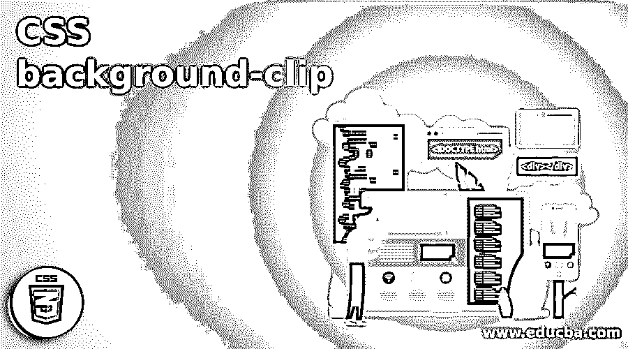

# CSS 背景-剪辑

> 原文：<https://www.educba.com/css-background-clip/>




## CSS 背景简介-剪辑

下面的文章提供了 CSS 背景剪辑的概要。在 HTML 中对页面进行样式化和编码时，您可能希望修改页面所有或部分组件的背景区域。CSS 背景剪辑是 CSS 代码的背景剪辑组件中应用的范围的度量，通过调整参数的不同值来实现 HTML UI 设计的更好外观，这符合您项目中的设计要求，最终增加您网页的更多用户参与。在这篇文章中，我们将通过许多例子看到利用 CSS 背景剪辑属性来改变 HTML 页面背景元素区域的过程。

### CSS 背景剪辑的语法和参数

下面给出了 CSS 背景剪辑的语法:

<small>网页开发、编程语言、软件测试&其他</small>

```
background-clip: border-box|padding-box|content-box|initial|inherit;
```

现在查询的是参数有多少不同的值？这些是表示元素背景范围的各种类型的属性。

下表详细列出了提到的各种参数值:

| **值** | **描述** |
| 边框 | 这是背景剪辑的默认值。在这种情况下，背景的延伸在边界区域之后。 |
| 填充盒 | 在这种情况下，背景的延伸在边界区域内。 |
| 内容盒 | 在这种情况下，背景的延伸一直到内容区域。 |
| 最初的 | 在这种情况下，背景的延伸覆盖整个区域。 |
| 继承 | 在这种情况下，子元素从其父元素继承该属性。 |

### 背景剪辑属性在 CSS 中是如何工作的？

*   您必须在 HTML 代码中按照 CSS 的基本语法提及背景剪辑参数的期望值，以便您可以在输出中获得扩展的背景。
*   您可以查看 HTML 代码示例，了解如何通过在 CSS 中使用不同的背景剪辑属性值来扩展元素的背景区域。

### CSS 背景剪辑的例子

下面是提到的例子:

#### 示例#1

在第一个例子中，我们将看到默认的背景剪辑属性是边框。在这种情况下，背景区域位于元素边界区域的后面。在这个例子中，我们用不同的颜色保持边框(边框是蓝色，区域是黄色)，这样你就可以看到背景区域相对于边框的延伸。

**代码:**

```
<!DOCTYPE html>
<html>
<head>
<title>Example of Border Box</title>
<style>
.scrpt {
background-color: yellow;
background-clip:border-box; // defines parameter value
text-align:center;
border:9px dashed blue; //defines border color
}
</style>
</head>
<body>
<div class = "scrpt">
<h2>
Example of Border box back ground clip
</h2>
<p>
In this case, the extension of background is behind the area of border
</p>
</div>
</body>
</html>
```

**输出:**

正如你在下面看到的，边界是蓝色的，区域是黄色的。蓝色边框在黄色背景内。


#### 实施例 2

在第二个例子中，我们将看到另一个背景剪辑属性是填充框。在这种情况下，元素的背景区域位于边框区域内。在这个例子中，我们用不同于背景颜色的颜色来保持边框，这样你就可以区分它们，看到背景区域相对于边框的延伸。

**代码:**

```
<!DOCTYPE html>
<html>
<head>
<title>Example of padding box </title>
<style>
.scrpt {
background-color: yellow;
background-clip:padding-box;
padding: 20px;
border: 9px dashed blue; }
</style>
</head>
<body style = "text-align:center">
<div class = "scrpt">
<h2>
Example of Padding box back ground clip
</h2>
<p>
In this case, the extension of background is inside the area of border
</p>
</div>
</body>
</html>
```

**输出:**

这里你也可以看到下面的边界是蓝色的，区域是黄色的。蓝色边框在黄色背景之外。


#### 实施例 3

在这个例子中，我们将看到背景剪辑属性的另一个例子，即内容框。在这种情况下，顾名思义，背景区域是 till 元素的边界区域。在这个例子中，我们用不同的颜色保持边界，这样你就可以看到背景区域相对于边界的延伸。

**代码:**

```
<!DOCTYPE html>
<html>
<head>
<title>Example of content box </title>
<style>
.scrpt {
background-color: yellow;
background-clip:content-box;
padding: 20px;
border: 9px dashed blue;
}
</style>
</head>
<body style = "text-align:center">
<div class = "scrpt">
<h2>
Example of Content box back ground clip
</h2>
<p>
In this case, the extension of background is till the content area
</p>
</div>
</body>
</html>
```

**输出:**

在这里，蓝色边框远离黄色背景。背景仅延伸到内容区域，不超出内容区域。


#### 实施例 4

在第四个例子中，我们将看到另一个背景剪辑属性的说明，它是初始框。在这种情况下，背景区域覆盖了元素的整个边框区域。在这个例子中，我们用不同于背景颜色的颜色来保持边框，这样你就可以看到背景区域相对于边框的跨度。

**代码:**

```
<!DOCTYPE html>
<html>
<head>
<title>Example of intial box </title>
<style>
.scrpt {
background-color: yellow;
background-clip:initial;
padding: 20px;
border: 9px dashed blue;
}
</style>
</head>
<body style = "text-align:center">
<div class = "scrpt">
<h2>
Example of Initial box back ground clip
</h2>
<p>
In this case, the extension of background is over the entire area
</p>
</div>
</body>
</html>
```

**输出:**

蓝色边框扩展到整个黄色背景区域。


### 结论

在这篇文章中，我们向你展示了各种各样的例子，关于我们如何在 CSS 的帮助下使用 HTML 页面的背景剪辑参数的不同值。这篇文章将对那些通过 HTML 和 CSS 从事前端设计的人非常有益。

### 推荐文章

这是一个 CSS 背景剪辑的指南。在这里，我们讨论 CSS 背景剪辑的介绍，背景剪辑属性如何与各自的例子。您也可以看看以下文章，了解更多信息–

1.  [粘滞页脚 CSS](https://www.educba.com/sticky-footer-css/)
2.  [CSS 换行](https://www.educba.com/css-line-break/)
3.  [CSS 中的不透明度](https://www.educba.com/opacity-in-css/)
4.  [CSS 招数](https://www.educba.com/css-tricks/)


